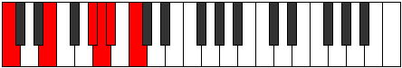
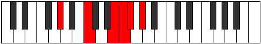

# Mode Ranitonic

## Links

- [Documentation](index.md)
- [Scales Index](Scales.md)
- [Modes Index](Modes.md)
- [Chords Index](Chords.md)

## Parent Scale

[Ranitonic](ScaleRanitonic.md)

## Number

[1809](https://ianring.com/musictheory/scales/1809)

## Perfection

- 1 Perfect notes
- 4 Perfect notes

## Perfection Profile

[false false false true false]

## Permutations

| Tonic | Notes | Signature | Illustration | Audio |
|-------|-------|-----------|--------------|-------|
| [C](ModeCNaturalRanitonic.md) | **C**, **E**, **G#**, A, **A#**, **C** | C |  | [midi](ModeCNaturalRanitonic.mid) [ogg](ModeCNaturalRanitonic.ogg) |
| [C#](ModeCSharpRanitonic.md) | **C#**, **F**, **A**, A#, **B**, **C#** | C |  | [midi](ModeCSharpRanitonic.mid) [ogg](ModeCSharpRanitonic.ogg) |
| [Db](ModeDFlatRanitonic.md) | **Db**, **F**, **A**, Bb, **B**, **Db** | C |  | [midi](ModeDFlatRanitonic.mid) [ogg](ModeDFlatRanitonic.ogg) |
| [D](ModeDNaturalRanitonic.md) | **D**, **F#**, **A#**, B, **C**, **D** | C |  | [midi](ModeDNaturalRanitonic.mid) [ogg](ModeDNaturalRanitonic.ogg) |
| [D#](ModeDSharpRanitonic.md) | **D#**, **G**, **B**, C, **C#**, **D#** | C |  | [midi](ModeDSharpRanitonic.mid) [ogg](ModeDSharpRanitonic.ogg) |
| [Eb](ModeEFlatRanitonic.md) | **Eb**, **G**, **B**, C, **Db**, **Eb** | C |  | [midi](ModeEFlatRanitonic.mid) [ogg](ModeEFlatRanitonic.ogg) |
| [E](ModeENaturalRanitonic.md) | **E**, **G#**, **C**, C#, **D**, **E** | C |  | [midi](ModeENaturalRanitonic.mid) [ogg](ModeENaturalRanitonic.ogg) |
| [F](ModeFNaturalRanitonic.md) | **F**, **A**, **C#**, D, **D#**, **F** | C |  | [midi](ModeFNaturalRanitonic.mid) [ogg](ModeFNaturalRanitonic.ogg) |
| [F#](ModeFSharpRanitonic.md) | **F#**, **A#**, **D**, D#, **E**, **F#** | C |  | [midi](ModeFSharpRanitonic.mid) [ogg](ModeFSharpRanitonic.ogg) |
| [Gb](ModeGFlatRanitonic.md) | **Gb**, **Bb**, **D**, Eb, **E**, **Gb** | C |  | [midi](ModeGFlatRanitonic.mid) [ogg](ModeGFlatRanitonic.ogg) |
| [G](ModeGNaturalRanitonic.md) | **G**, **B**, **D#**, E, **F**, **G** | C |  | [midi](ModeGNaturalRanitonic.mid) [ogg](ModeGNaturalRanitonic.ogg) |
| [G#](ModeGSharpRanitonic.md) | **G#**, **C**, **E**, F, **F#**, **G#** | C |  | [midi](ModeGSharpRanitonic.mid) [ogg](ModeGSharpRanitonic.ogg) |
| [Ab](ModeAFlatRanitonic.md) | **Ab**, **C**, **E**, F, **Gb**, **Ab** | C |  | [midi](ModeAFlatRanitonic.mid) [ogg](ModeAFlatRanitonic.ogg) |
| [A](ModeANaturalRanitonic.md) | **A**, **C#**, **F**, F#, **G**, **A** | C |  | [midi](ModeANaturalRanitonic.mid) [ogg](ModeANaturalRanitonic.ogg) |
| [A#](ModeASharpRanitonic.md) | **A#**, **D**, **F#**, G, **G#**, **A#** | C |  | [midi](ModeASharpRanitonic.mid) [ogg](ModeASharpRanitonic.ogg) |
| [Bb](ModeBFlatRanitonic.md) | **Bb**, **D**, **Gb**, G, **Ab**, **Bb** | C |  | [midi](ModeBFlatRanitonic.mid) [ogg](ModeBFlatRanitonic.ogg) |
| [B](ModeBNaturalRanitonic.md) | **B**, **D#**, **G**, G#, **A**, **B** | C |  | [midi](ModeBNaturalRanitonic.mid) [ogg](ModeBNaturalRanitonic.ogg) |
