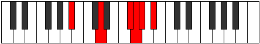

# Mode Ranitonic

## Links

- [Documentation](index.md)
- [Scales Index](Scales.md)
- [Modes Index](Modes.md)
- [Chords Index](Chords.md)

## Parent Scale

[Ranitonic](ScaleRanitonic.md)

## Number

[1809](https://ianring.com/musictheory/scales/1809)

## Interval Pattern

4, 4, 1, 1, 2

## Chord Pattern

## Perfection

- 1 Perfect notes
- 4 Perfect notes

## Perfection Profile

[false false false true false]

## Permutations

| Tonic | Notes | Signature | Illustration | Audio |
|-------|-------|-----------|--------------|-------|
| [C](ModeCNaturalRanitonic.md) | **C**, **E**, **G#**, A, **A#**, **C** | C |  | [midi](https://github.com/edipermadi/music/blob/main/docs/ModeCNaturalRanitonic.mid?raw=true) |
| [C#](ModeCSharpRanitonic.md) | **C#**, **F**, **A**, A#, **B**, **C#** | C |  | [midi](https://github.com/edipermadi/music/blob/main/docs/ModeCSharpRanitonic.mid?raw=true) |
| [Db](ModeDFlatRanitonic.md) | **Db**, **F**, **A**, Bb, **B**, **Db** | C |  | [midi](https://github.com/edipermadi/music/blob/main/docs/ModeDFlatRanitonic.mid?raw=true) |
| [D](ModeDNaturalRanitonic.md) | **D**, **F#**, **A#**, B, **C**, **D** | C |  | [midi](https://github.com/edipermadi/music/blob/main/docs/ModeDNaturalRanitonic.mid?raw=true) |
| [D#](ModeDSharpRanitonic.md) | **D#**, **G**, **B**, C, **C#**, **D#** | C |  | [midi](https://github.com/edipermadi/music/blob/main/docs/ModeDSharpRanitonic.mid?raw=true) |
| [Eb](ModeEFlatRanitonic.md) | **Eb**, **G**, **B**, C, **Db**, **Eb** | C |  | [midi](https://github.com/edipermadi/music/blob/main/docs/ModeEFlatRanitonic.mid?raw=true) |
| [E](ModeENaturalRanitonic.md) | **E**, **G#**, **C**, C#, **D**, **E** | C |  | [midi](https://github.com/edipermadi/music/blob/main/docs/ModeENaturalRanitonic.mid?raw=true) |
| [F](ModeFNaturalRanitonic.md) | **F**, **A**, **C#**, D, **D#**, **F** | C |  | [midi](https://github.com/edipermadi/music/blob/main/docs/ModeFNaturalRanitonic.mid?raw=true) |
| [F#](ModeFSharpRanitonic.md) | **F#**, **A#**, **D**, D#, **E**, **F#** | C |  | [midi](https://github.com/edipermadi/music/blob/main/docs/ModeFSharpRanitonic.mid?raw=true) |
| [Gb](ModeGFlatRanitonic.md) | **Gb**, **Bb**, **D**, Eb, **E**, **Gb** | C |  | [midi](https://github.com/edipermadi/music/blob/main/docs/ModeGFlatRanitonic.mid?raw=true) |
| [G](ModeGNaturalRanitonic.md) | **G**, **B**, **D#**, E, **F**, **G** | C |  | [midi](https://github.com/edipermadi/music/blob/main/docs/ModeGNaturalRanitonic.mid?raw=true) |
| [G#](ModeGSharpRanitonic.md) | **G#**, **C**, **E**, F, **F#**, **G#** | C |  | [midi](https://github.com/edipermadi/music/blob/main/docs/ModeGSharpRanitonic.mid?raw=true) |
| [Ab](ModeAFlatRanitonic.md) | **Ab**, **C**, **E**, F, **Gb**, **Ab** | C |  | [midi](https://github.com/edipermadi/music/blob/main/docs/ModeAFlatRanitonic.mid?raw=true) |
| [A](ModeANaturalRanitonic.md) | **A**, **C#**, **F**, F#, **G**, **A** | C |  | [midi](https://github.com/edipermadi/music/blob/main/docs/ModeANaturalRanitonic.mid?raw=true) |
| [A#](ModeASharpRanitonic.md) | **A#**, **D**, **F#**, G, **G#**, **A#** | C |  | [midi](https://github.com/edipermadi/music/blob/main/docs/ModeASharpRanitonic.mid?raw=true) |
| [Bb](ModeBFlatRanitonic.md) | **Bb**, **D**, **Gb**, G, **Ab**, **Bb** | C |  | [midi](https://github.com/edipermadi/music/blob/main/docs/ModeBFlatRanitonic.mid?raw=true) |
| [B](ModeBNaturalRanitonic.md) | **B**, **D#**, **G**, G#, **A**, **B** | C |  | [midi](https://github.com/edipermadi/music/blob/main/docs/ModeBNaturalRanitonic.mid?raw=true) |
