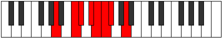
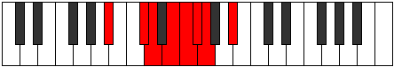

# Mode Raptian

## Links

- [Documentation](index.md)
- [Scales Index](Scales.md)
- [Modes Index](Modes.md)
- [Chords Index](Chords.md)

## Parent Scale

[Epagian](ScaleEpagian.md)

## Number

[985](https://ianring.com/musictheory/scales/985)

## Perfection

- 3 Perfect notes
- 4 Perfect notes

## Perfection Profile

[true false false false false true true]

## Permutations

| Tonic | Notes | Signature | Illustration | Audio |
|-------|-------|-----------|--------------|-------|
| [C](ModeCNaturalRaptian.md) | C, **D#**, **E**, **F#**, **G**, Ab, Bbb, C | C |  | [midi](https://github.com/edipermadi/music/blob/main/docs/ModeCNaturalRaptian.mid?raw=true) |
| [C#](ModeCSharpRaptian.md) | C#, **D##**, **E#**, **F##**, **G#**, A, Bb, C# | C |  | [midi](https://github.com/edipermadi/music/blob/main/docs/ModeCSharpRaptian.mid?raw=true) |
| [Db](ModeDFlatRaptian.md) | Db, **E**, **F**, **G**, **Ab**, Bbb, Cbb, Db | C |  | [midi](https://github.com/edipermadi/music/blob/main/docs/ModeDFlatRaptian.mid?raw=true) |
| [D](ModeDNaturalRaptian.md) | D, **E#**, **F#**, **G#**, **A**, Bb, Cb, D | C |  | [midi](https://github.com/edipermadi/music/blob/main/docs/ModeDNaturalRaptian.mid?raw=true) |
| [D#](ModeDSharpRaptian.md) | D#, **E##**, **F##**, **G##**, **A#**, B, C, D# | C |  | [midi](https://github.com/edipermadi/music/blob/main/docs/ModeDSharpRaptian.mid?raw=true) |
| [Eb](ModeEFlatRaptian.md) | Eb, **F#**, **G**, **A**, **Bb**, Cb, Dbb, Eb | C |  | [midi](https://github.com/edipermadi/music/blob/main/docs/ModeEFlatRaptian.mid?raw=true) |
| [E](ModeENaturalRaptian.md) | E, **F##**, **G#**, **A#**, **B**, C, Db, E | C |  | [midi](https://github.com/edipermadi/music/blob/main/docs/ModeENaturalRaptian.mid?raw=true) |
| [F](ModeFNaturalRaptian.md) | F, **G#**, **A**, **B**, **C**, Db, Ebb, F | C |  | [midi](https://github.com/edipermadi/music/blob/main/docs/ModeFNaturalRaptian.mid?raw=true) |
| [F#](ModeFSharpRaptian.md) | F#, **G##**, **A#**, **B#**, **C#**, D, Eb, F# | C |  | [midi](https://github.com/edipermadi/music/blob/main/docs/ModeFSharpRaptian.mid?raw=true) |
| [Gb](ModeGFlatRaptian.md) | Gb, **A**, **Bb**, **C**, **Db**, Ebb, Fbb, Gb | C |  | [midi](https://github.com/edipermadi/music/blob/main/docs/ModeGFlatRaptian.mid?raw=true) |
| [G](ModeGNaturalRaptian.md) | G, **A#**, **B**, **C#**, **D**, Eb, Fb, G | C |  | [midi](https://github.com/edipermadi/music/blob/main/docs/ModeGNaturalRaptian.mid?raw=true) |
| [G#](ModeGSharpRaptian.md) | G#, **A##**, **B#**, **C##**, **D#**, E, F, G# | C |  | [midi](https://github.com/edipermadi/music/blob/main/docs/ModeGSharpRaptian.mid?raw=true) |
| [Ab](ModeAFlatRaptian.md) | Ab, **B**, **C**, **D**, **Eb**, Fb, Gbb, Ab | C |  | [midi](https://github.com/edipermadi/music/blob/main/docs/ModeAFlatRaptian.mid?raw=true) |
| [A](ModeANaturalRaptian.md) | A, **B#**, **C#**, **D#**, **E**, F, Gb, A | C |  | [midi](https://github.com/edipermadi/music/blob/main/docs/ModeANaturalRaptian.mid?raw=true) |
| [A#](ModeASharpRaptian.md) | A#, **B##**, **C##**, **D##**, **E#**, F#, G, A# | C |  | [midi](https://github.com/edipermadi/music/blob/main/docs/ModeASharpRaptian.mid?raw=true) |
| [Bb](ModeBFlatRaptian.md) | Bb, **C#**, **D**, **E**, **F**, Gb, Abb, Bb | C |  | [midi](https://github.com/edipermadi/music/blob/main/docs/ModeBFlatRaptian.mid?raw=true) |
| [B](ModeBNaturalRaptian.md) | B, **C##**, **D#**, **E#**, **F#**, G, Ab, B | C |  | [midi](https://github.com/edipermadi/music/blob/main/docs/ModeBNaturalRaptian.mid?raw=true) |
