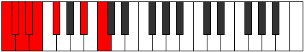
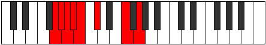

# Mode Rarian

## Links

- [Documentation](index.md)
- [Scales Index](Scales.md)
- [Modes Index](Modes.md)
- [Chords Index](Chords.md)

## Parent Scale

[Gydian](ScaleGydian.md)

## Number

[1119](https://ianring.com/musictheory/scales/1119)

## Perfection

- 2 Perfect notes
- 5 Perfect notes

## Perfection Profile

[false false false true false true false]

## Permutations

| Tonic | Notes | Signature | Illustration | Audio |
|-------|-------|-----------|--------------|-------|
| [C](ModeCNaturalRarian.md) | **C**, **Db**, **Ebb**, Fbb, **Gbbb**, Abbb, **Bb**, **C** | C |  | [midi](ModeCNaturalRarian.mid) [ogg](ModeCNaturalRarian.ogg) |
| [C#](ModeCSharpRarian.md) | **C#**, **D**, **Eb**, Fb, **Gbb**, Abb, **B**, **C#** | C |  | [midi](ModeCSharpRarian.mid) [ogg](ModeCSharpRarian.ogg) |
| [Db](ModeDFlatRarian.md) | **Db**, **Ebb**, **Fbb**, Gbbb, **D###**, E###, **Cb**, **Db** | C |  | [midi](ModeDFlatRarian.mid) [ogg](ModeDFlatRarian.ogg) |
| [D](ModeDNaturalRarian.md) | **D**, **Eb**, **Fb**, Gbb, **Abbb**, Bbbb, **C**, **D** | C |  | [midi](ModeDNaturalRarian.mid) [ogg](ModeDNaturalRarian.ogg) |
| [D#](ModeDSharpRarian.md) | **D#**, **E**, **F**, Gb, **Abb**, Bbb, **C#**, **D#** | C |  | [midi](ModeDSharpRarian.mid) [ogg](ModeDSharpRarian.ogg) |
| [Eb](ModeEFlatRarian.md) | **Eb**, **Fb**, **Gbb**, Abbb, **E###**, Cbbb, **Db**, **Eb** | C |  | [midi](ModeEFlatRarian.mid) [ogg](ModeEFlatRarian.ogg) |
| [E](ModeENaturalRarian.md) | **E**, **F**, **Gb**, Abb, **Bbbb**, Cbb, **D**, **E** | C |  | [midi](ModeENaturalRarian.mid) [ogg](ModeENaturalRarian.ogg) |
| [F](ModeFNaturalRarian.md) | **F**, **Gb**, **Abb**, Bbbb, **Cbbb**, Dbbb, **Eb**, **F** | C |  | [midi](ModeFNaturalRarian.mid) [ogg](ModeFNaturalRarian.ogg) |
| [F#](ModeFSharpRarian.md) | **F#**, **G**, **Ab**, Bbb, **Cbb**, Dbb, **E**, **F#** | C |  | [midi](ModeFSharpRarian.mid) [ogg](ModeFSharpRarian.ogg) |
| [Gb](ModeGFlatRarian.md) | **Gb**, **Abb**, **Bbbb**, Cbbb, **Cbb**, Dbb, **E**, **Gb** | C |  | [midi](ModeGFlatRarian.mid) [ogg](ModeGFlatRarian.ogg) |
| [G](ModeGNaturalRarian.md) | **G**, **Ab**, **Bbb**, Cbb, **Dbbb**, Ebbb, **F**, **G** | C |  | [midi](ModeGNaturalRarian.mid) [ogg](ModeGNaturalRarian.ogg) |
| [G#](ModeGSharpRarian.md) | **G#**, **A**, **Bb**, Cb, **Dbb**, Ebb, **F#**, **G#** | C |  | [midi](ModeGSharpRarian.mid) [ogg](ModeGSharpRarian.ogg) |
| [Ab](ModeAFlatRarian.md) | **Ab**, **Bbb**, **Cbb**, Dbbb, **Dbb**, Ebb, **F#**, **Ab** | C |  | [midi](ModeAFlatRarian.mid) [ogg](ModeAFlatRarian.ogg) |
| [A](ModeANaturalRarian.md) | **A**, **Bb**, **Cb**, Dbb, **Ebbb**, Fbb, **G**, **A** | C |  | [midi](ModeANaturalRarian.mid) [ogg](ModeANaturalRarian.ogg) |
| [A#](ModeASharpRarian.md) | **A#**, **B**, **C**, Db, **Ebb**, Fb, **G#**, **A#** | C |  | [midi](ModeASharpRarian.mid) [ogg](ModeASharpRarian.ogg) |
| [Bb](ModeBFlatRarian.md) | **Bb**, **Cb**, **Dbb**, Ebbb, **Fbbb**, Gbbb, **Ab**, **Bb** | C |  | [midi](ModeBFlatRarian.mid) [ogg](ModeBFlatRarian.ogg) |
| [B](ModeBNaturalRarian.md) | **B**, **C**, **Db**, Ebb, **Fbb**, Gbb, **A**, **B** | C |  | [midi](ModeBNaturalRarian.mid) [ogg](ModeBNaturalRarian.ogg) |
