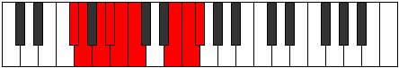

# Mode Raryllic

## Links

- [Documentation](index.md)
- [Scales Index](Scales.md)
- [Modes Index](Modes.md)
- [Chords Index](Chords.md)

## Parent Scale

[Pynyllic](ScalePynyllic.md)

## Number

[3195](https://ianring.com/musictheory/scales/3195)

## Perfection

- 6 Perfect notes
- 2 Perfect notes

## Perfection Profile

[false false true true true true true true]

## Permutations

| Tonic | Notes | Signature | Illustration | Audio |
|-------|-------|-----------|--------------|-------|
| [C](ModeCNaturalRaryllic.md) | **C**, **C#**, D#, E, F, F#, A#, B, **C** | C |  | [midi](ModeCNaturalRaryllic.mid) [ogg](ModeCNaturalRaryllic.ogg) |
| [C#](ModeCSharpRaryllic.md) | **C#**, **D**, E, F, F#, G, B, C, **C#** | C |  | [midi](ModeCSharpRaryllic.mid) [ogg](ModeCSharpRaryllic.ogg) |
| [Db](ModeDFlatRaryllic.md) | **Db**, **D**, E, F, Gb, G, B, C, **Db** | C |  | [midi](ModeDFlatRaryllic.mid) [ogg](ModeDFlatRaryllic.ogg) |
| [D](ModeDNaturalRaryllic.md) | **D**, **D#**, F, F#, G, G#, C, C#, **D** | C |  | [midi](ModeDNaturalRaryllic.mid) [ogg](ModeDNaturalRaryllic.ogg) |
| [D#](ModeDSharpRaryllic.md) | **D#**, **E**, F#, G, G#, A, C#, D, **D#** | C |  | [midi](ModeDSharpRaryllic.mid) [ogg](ModeDSharpRaryllic.ogg) |
| [Eb](ModeEFlatRaryllic.md) | **Eb**, **E**, Gb, G, Ab, A, Db, D, **Eb** | C |  | [midi](ModeEFlatRaryllic.mid) [ogg](ModeEFlatRaryllic.ogg) |
| [E](ModeENaturalRaryllic.md) | **E**, **F**, G, G#, A, A#, D, D#, **E** | C |  | [midi](ModeENaturalRaryllic.mid) [ogg](ModeENaturalRaryllic.ogg) |
| [F](ModeFNaturalRaryllic.md) | **F**, **F#**, G#, A, A#, B, D#, E, **F** | C |  | [midi](ModeFNaturalRaryllic.mid) [ogg](ModeFNaturalRaryllic.ogg) |
| [F#](ModeFSharpRaryllic.md) | **F#**, **G**, A, A#, B, C, E, F, **F#** | C |  | [midi](ModeFSharpRaryllic.mid) [ogg](ModeFSharpRaryllic.ogg) |
| [Gb](ModeGFlatRaryllic.md) | **Gb**, **G**, A, Bb, B, C, E, F, **Gb** | C |  | [midi](ModeGFlatRaryllic.mid) [ogg](ModeGFlatRaryllic.ogg) |
| [G](ModeGNaturalRaryllic.md) | **G**, **G#**, A#, B, C, C#, F, F#, **G** | C |  | [midi](ModeGNaturalRaryllic.mid) [ogg](ModeGNaturalRaryllic.ogg) |
| [G#](ModeGSharpRaryllic.md) | **G#**, **A**, B, C, C#, D, F#, G, **G#** | C |  | [midi](ModeGSharpRaryllic.mid) [ogg](ModeGSharpRaryllic.ogg) |
| [Ab](ModeAFlatRaryllic.md) | **Ab**, **A**, B, C, Db, D, Gb, G, **Ab** | C |  | [midi](ModeAFlatRaryllic.mid) [ogg](ModeAFlatRaryllic.ogg) |
| [A](ModeANaturalRaryllic.md) | **A**, **A#**, C, C#, D, D#, G, G#, **A** | C |  | [midi](ModeANaturalRaryllic.mid) [ogg](ModeANaturalRaryllic.ogg) |
| [A#](ModeASharpRaryllic.md) | **A#**, **B**, C#, D, D#, E, G#, A, **A#** | C |  | [midi](ModeASharpRaryllic.mid) [ogg](ModeASharpRaryllic.ogg) |
| [Bb](ModeBFlatRaryllic.md) | **Bb**, **B**, Db, D, Eb, E, Ab, A, **Bb** | C |  | [midi](ModeBFlatRaryllic.mid) [ogg](ModeBFlatRaryllic.ogg) |
| [B](ModeBNaturalRaryllic.md) | **B**, **C**, D, D#, E, F, A, A#, **B** | C |  | [midi](ModeBNaturalRaryllic.mid) [ogg](ModeBNaturalRaryllic.ogg) |
