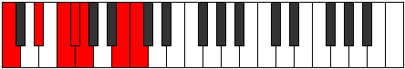
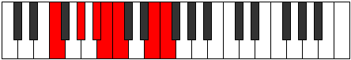
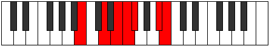

# Mode Rathimic

## Links

- [Documentation](index.md)
- [Scales Index](Scales.md)
- [Modes Index](Modes.md)
- [Chords Index](Chords.md)

## Parent Scale

[Phralimic](ScalePhralimic.md)

## Number

[2281](https://ianring.com/musictheory/scales/2281)

## Perfection

- 3 Perfect notes
- 3 Perfect notes

## Perfection Profile

[true false true false false true]

## Permutations

| Tonic | Notes | Signature | Illustration | Audio |
|-------|-------|-----------|--------------|-------|
| [C](ModeCNaturalRathimic.md) | C, **D#**, E#, **F#**, **G**, A##, C | C |  | [midi](ModeCNaturalRathimic.mid) [ogg](ModeCNaturalRathimic.ogg) |
| [C#](ModeCSharpRathimic.md) | C#, **D##**, E##, **F##**, **G#**, A###, C# | C |  | [midi](ModeCSharpRathimic.mid) [ogg](ModeCSharpRathimic.ogg) |
| [Db](ModeDFlatRathimic.md) | Db, **E**, F#, **G**, **Ab**, B#, Db | C |  | [midi](ModeDFlatRathimic.mid) [ogg](ModeDFlatRathimic.ogg) |
| [D](ModeDNaturalRathimic.md) | D, **E#**, F##, **G#**, **A**, B##, D | C |  | [midi](ModeDNaturalRathimic.mid) [ogg](ModeDNaturalRathimic.ogg) |
| [D#](ModeDSharpRathimic.md) | D#, **E##**, F###, **G##**, **A#**, B###, D# | C |  | [midi](ModeDSharpRathimic.mid) [ogg](ModeDSharpRathimic.ogg) |
| [Eb](ModeEFlatRathimic.md) | Eb, **F#**, G#, **A**, **Bb**, C##, Eb | C |  | [midi](ModeEFlatRathimic.mid) [ogg](ModeEFlatRathimic.ogg) |
| [E](ModeENaturalRathimic.md) | E, **F##**, G##, **A#**, **B**, C###, E | C |  | [midi](ModeENaturalRathimic.mid) [ogg](ModeENaturalRathimic.ogg) |
| [F](ModeFNaturalRathimic.md) | F, **G#**, A#, **B**, **C**, D##, F | C |  | [midi](ModeFNaturalRathimic.mid) [ogg](ModeFNaturalRathimic.ogg) |
| [F#](ModeFSharpRathimic.md) | F#, **G##**, A##, **B#**, **C#**, D###, F# | C |  | [midi](ModeFSharpRathimic.mid) [ogg](ModeFSharpRathimic.ogg) |
| [Gb](ModeGFlatRathimic.md) | Gb, **A**, B, **C**, **Db**, E#, Gb | C |  | [midi](ModeGFlatRathimic.mid) [ogg](ModeGFlatRathimic.ogg) |
| [G](ModeGNaturalRathimic.md) | G, **A#**, B#, **C#**, **D**, E##, G | C |  | [midi](ModeGNaturalRathimic.mid) [ogg](ModeGNaturalRathimic.ogg) |
| [G#](ModeGSharpRathimic.md) | G#, **A##**, B##, **C##**, **D#**, E###, G# | C |  | [midi](ModeGSharpRathimic.mid) [ogg](ModeGSharpRathimic.ogg) |
| [Ab](ModeAFlatRathimic.md) | Ab, **B**, C#, **D**, **Eb**, F##, Ab | C |  | [midi](ModeAFlatRathimic.mid) [ogg](ModeAFlatRathimic.ogg) |
| [A](ModeANaturalRathimic.md) | A, **B#**, C##, **D#**, **E**, F###, A | C |  | [midi](ModeANaturalRathimic.mid) [ogg](ModeANaturalRathimic.ogg) |
| [A#](ModeASharpRathimic.md) | A#, **B##**, C###, **D##**, **E#**, Cbbb, A# | C |  | [midi](ModeASharpRathimic.mid) [ogg](ModeASharpRathimic.ogg) |
| [Bb](ModeBFlatRathimic.md) | Bb, **C#**, D#, **E**, **F**, G##, Bb | C |  | [midi](ModeBFlatRathimic.mid) [ogg](ModeBFlatRathimic.ogg) |
| [B](ModeBNaturalRathimic.md) | B, **C##**, D##, **E#**, **F#**, G###, B | C |  | [midi](ModeBNaturalRathimic.mid) [ogg](ModeBNaturalRathimic.ogg) |
