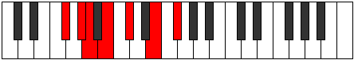

# Mode Rocrimic

## Links

- [Documentation](index.md)
- [Scales Index](Scales.md)
- [Modes Index](Modes.md)
- [Chords Index](Chords.md)

## Parent Scale

[Epathimic](ScaleEpathimic.md)

## Number

[1197](https://ianring.com/musictheory/scales/1197)

## Perfection

- 5 Perfect notes
- 1 Perfect notes

## Interval Pattern

2, 1, 2, 2, 3, 2

## Perfection Profile

[true false true true true true]

## Permutations

| Tonic | Notes | Signature | Illustration | Audio |
|-------|-------|-----------|--------------|-------|
| [C](ModeCNaturalRocrimic.md) | C, **D**, Eb, F, G, A#, C | C |  | [midi](https://github.com/edipermadi/music/blob/main/docs/ModeCNaturalRocrimic.mid?raw=true) |
| [C#](ModeCSharpRocrimic.md) | C#, **D#**, E, F#, G#, A##, C# | C |  | [midi](https://github.com/edipermadi/music/blob/main/docs/ModeCSharpRocrimic.mid?raw=true) |
| [Db](ModeDFlatRocrimic.md) | Db, **Eb**, Fb, Gb, Ab, B, Db | C |  | [midi](https://github.com/edipermadi/music/blob/main/docs/ModeDFlatRocrimic.mid?raw=true) |
| [D](ModeDNaturalRocrimic.md) | D, **E**, F, G, A, B#, D | C |  | [midi](https://github.com/edipermadi/music/blob/main/docs/ModeDNaturalRocrimic.mid?raw=true) |
| [D#](ModeDSharpRocrimic.md) | D#, **E#**, F#, G#, A#, B##, D# | C |  | [midi](https://github.com/edipermadi/music/blob/main/docs/ModeDSharpRocrimic.mid?raw=true) |
| [Eb](ModeEFlatRocrimic.md) | Eb, **F**, Gb, Ab, Bb, C#, Eb | C |  | [midi](https://github.com/edipermadi/music/blob/main/docs/ModeEFlatRocrimic.mid?raw=true) |
| [E](ModeENaturalRocrimic.md) | E, **F#**, G, A, B, C##, E | C |  | [midi](https://github.com/edipermadi/music/blob/main/docs/ModeENaturalRocrimic.mid?raw=true) |
| [F](ModeFNaturalRocrimic.md) | F, **G**, Ab, Bb, C, D#, F | C |  | [midi](https://github.com/edipermadi/music/blob/main/docs/ModeFNaturalRocrimic.mid?raw=true) |
| [F#](ModeFSharpRocrimic.md) | F#, **G#**, A, B, C#, D##, F# | C |  | [midi](https://github.com/edipermadi/music/blob/main/docs/ModeFSharpRocrimic.mid?raw=true) |
| [Gb](ModeGFlatRocrimic.md) | Gb, **Ab**, Bbb, Cb, Db, E, Gb | C |  | [midi](https://github.com/edipermadi/music/blob/main/docs/ModeGFlatRocrimic.mid?raw=true) |
| [G](ModeGNaturalRocrimic.md) | G, **A**, Bb, C, D, E#, G | C |  | [midi](https://github.com/edipermadi/music/blob/main/docs/ModeGNaturalRocrimic.mid?raw=true) |
| [G#](ModeGSharpRocrimic.md) | G#, **A#**, B, C#, D#, E##, G# | C |  | [midi](https://github.com/edipermadi/music/blob/main/docs/ModeGSharpRocrimic.mid?raw=true) |
| [Ab](ModeAFlatRocrimic.md) | Ab, **Bb**, Cb, Db, Eb, F#, Ab | C |  | [midi](https://github.com/edipermadi/music/blob/main/docs/ModeAFlatRocrimic.mid?raw=true) |
| [A](ModeANaturalRocrimic.md) | A, **B**, C, D, E, F##, A | C |  | [midi](https://github.com/edipermadi/music/blob/main/docs/ModeANaturalRocrimic.mid?raw=true) |
| [A#](ModeASharpRocrimic.md) | A#, **B#**, C#, D#, E#, F###, A# | C |  | [midi](https://github.com/edipermadi/music/blob/main/docs/ModeASharpRocrimic.mid?raw=true) |
| [Bb](ModeBFlatRocrimic.md) | Bb, **C**, Db, Eb, F, G#, Bb | C |  | [midi](https://github.com/edipermadi/music/blob/main/docs/ModeBFlatRocrimic.mid?raw=true) |
| [B](ModeBNaturalRocrimic.md) | B, **C#**, D, E, F#, G##, B | C |  | [midi](https://github.com/edipermadi/music/blob/main/docs/ModeBNaturalRocrimic.mid?raw=true) |
