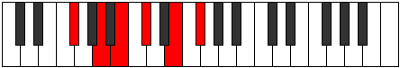

# Mode Rocritonic

## Links

- [Documentation](index.md)
- [Scales Index](Scales.md)
- [Modes Index](Modes.md)
- [Chords Index](Chords.md)

## Parent Scale

[Epathitonic](ScaleEpathitonic.md)

## Number

[1193](https://ianring.com/musictheory/scales/1193)

## Perfection

- 4 Perfect notes
- 1 Perfect notes

## Perfection Profile

[true true true false true]

## Permutations

| Tonic | Notes | Signature | Illustration | Audio |
|-------|-------|-----------|--------------|-------|
| [C](ModeCNaturalRocritonic.md) | C, D#, F, **G**, A#, C | C |  | [midi](ModeCNaturalRocritonic.mid) [ogg](ModeCNaturalRocritonic.ogg) |
| [C#](ModeCSharpRocritonic.md) | C#, E, F#, **G#**, B, C# | C |  | [midi](ModeCSharpRocritonic.mid) [ogg](ModeCSharpRocritonic.ogg) |
| [Db](ModeDFlatRocritonic.md) | Db, E, Gb, **Ab**, B, Db | C |  | [midi](ModeDFlatRocritonic.mid) [ogg](ModeDFlatRocritonic.ogg) |
| [D](ModeDNaturalRocritonic.md) | D, F, G, **A**, C, D | C |  | [midi](ModeDNaturalRocritonic.mid) [ogg](ModeDNaturalRocritonic.ogg) |
| [D#](ModeDSharpRocritonic.md) | D#, F#, G#, **A#**, C#, D# | C |  | [midi](ModeDSharpRocritonic.mid) [ogg](ModeDSharpRocritonic.ogg) |
| [Eb](ModeEFlatRocritonic.md) | Eb, Gb, Ab, **Bb**, Db, Eb | C |  | [midi](ModeEFlatRocritonic.mid) [ogg](ModeEFlatRocritonic.ogg) |
| [E](ModeENaturalRocritonic.md) | E, G, A, **B**, D, E | C |  | [midi](ModeENaturalRocritonic.mid) [ogg](ModeENaturalRocritonic.ogg) |
| [F](ModeFNaturalRocritonic.md) | F, G#, A#, **C**, D#, F | C |  | [midi](ModeFNaturalRocritonic.mid) [ogg](ModeFNaturalRocritonic.ogg) |
| [F#](ModeFSharpRocritonic.md) | F#, A, B, **C#**, E, F# | C |  | [midi](ModeFSharpRocritonic.mid) [ogg](ModeFSharpRocritonic.ogg) |
| [Gb](ModeGFlatRocritonic.md) | Gb, A, B, **Db**, E, Gb | C |  | [midi](ModeGFlatRocritonic.mid) [ogg](ModeGFlatRocritonic.ogg) |
| [G](ModeGNaturalRocritonic.md) | G, A#, C, **D**, F, G | C |  | [midi](ModeGNaturalRocritonic.mid) [ogg](ModeGNaturalRocritonic.ogg) |
| [G#](ModeGSharpRocritonic.md) | G#, B, C#, **D#**, F#, G# | C |  | [midi](ModeGSharpRocritonic.mid) [ogg](ModeGSharpRocritonic.ogg) |
| [Ab](ModeAFlatRocritonic.md) | Ab, B, Db, **Eb**, Gb, Ab | C |  | [midi](ModeAFlatRocritonic.mid) [ogg](ModeAFlatRocritonic.ogg) |
| [A](ModeANaturalRocritonic.md) | A, C, D, **E**, G, A | C |  | [midi](ModeANaturalRocritonic.mid) [ogg](ModeANaturalRocritonic.ogg) |
| [A#](ModeASharpRocritonic.md) | A#, C#, D#, **F**, G#, A# | C |  | [midi](ModeASharpRocritonic.mid) [ogg](ModeASharpRocritonic.ogg) |
| [Bb](ModeBFlatRocritonic.md) | Bb, Db, Eb, **F**, Ab, Bb | C |  | [midi](ModeBFlatRocritonic.mid) [ogg](ModeBFlatRocritonic.ogg) |
| [B](ModeBNaturalRocritonic.md) | B, D, E, **F#**, A, B | C |  | [midi](ModeBNaturalRocritonic.mid) [ogg](ModeBNaturalRocritonic.ogg) |
