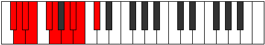

# Mode Rocrygic

## Links

- [Documentation](index.md)
- [Scales Index](Scales.md)
- [Modes Index](Modes.md)
- [Chords Index](Chords.md)

## Parent Scale

[Epyrygic](ScaleEpyrygic.md)

## Number

[1903](https://ianring.com/musictheory/scales/1903)

## Perfection

- 7 Perfect notes
- 2 Perfect notes

## Perfection Profile

[false true true true true true true false true]

## Permutations

| Tonic | Notes | Signature | Illustration | Audio |
|-------|-------|-----------|--------------|-------|
| [C](ModeCNaturalRocrygic.md) | **C**, C#, D, D#, F, F#, G#, **A**, A#, **C** | C |  | [midi](ModeCNaturalRocrygic.mid) [ogg](ModeCNaturalRocrygic.ogg) |
| [C#](ModeCSharpRocrygic.md) | **C#**, D, D#, E, F#, G, A, **A#**, B, **C#** | C |  | [midi](ModeCSharpRocrygic.mid) [ogg](ModeCSharpRocrygic.ogg) |
| [Db](ModeDFlatRocrygic.md) | **Db**, D, Eb, E, Gb, G, A, **Bb**, B, **Db** | C |  | [midi](ModeDFlatRocrygic.mid) [ogg](ModeDFlatRocrygic.ogg) |
| [D](ModeDNaturalRocrygic.md) | **D**, D#, E, F, G, G#, A#, **B**, C, **D** | C |  | [midi](ModeDNaturalRocrygic.mid) [ogg](ModeDNaturalRocrygic.ogg) |
| [D#](ModeDSharpRocrygic.md) | **D#**, E, F, F#, G#, A, B, **C**, C#, **D#** | C |  | [midi](ModeDSharpRocrygic.mid) [ogg](ModeDSharpRocrygic.ogg) |
| [Eb](ModeEFlatRocrygic.md) | **Eb**, E, F, Gb, Ab, A, B, **C**, Db, **Eb** | C |  | [midi](ModeEFlatRocrygic.mid) [ogg](ModeEFlatRocrygic.ogg) |
| [E](ModeENaturalRocrygic.md) | **E**, F, F#, G, A, A#, C, **C#**, D, **E** | C |  | [midi](ModeENaturalRocrygic.mid) [ogg](ModeENaturalRocrygic.ogg) |
| [F](ModeFNaturalRocrygic.md) | **F**, F#, G, G#, A#, B, C#, **D**, D#, **F** | C |  | [midi](ModeFNaturalRocrygic.mid) [ogg](ModeFNaturalRocrygic.ogg) |
| [F#](ModeFSharpRocrygic.md) | **F#**, G, G#, A, B, C, D, **D#**, E, **F#** | C |  | [midi](ModeFSharpRocrygic.mid) [ogg](ModeFSharpRocrygic.ogg) |
| [Gb](ModeGFlatRocrygic.md) | **Gb**, G, Ab, A, B, C, D, **Eb**, E, **Gb** | C |  | [midi](ModeGFlatRocrygic.mid) [ogg](ModeGFlatRocrygic.ogg) |
| [G](ModeGNaturalRocrygic.md) | **G**, G#, A, A#, C, C#, D#, **E**, F, **G** | C |  | [midi](ModeGNaturalRocrygic.mid) [ogg](ModeGNaturalRocrygic.ogg) |
| [G#](ModeGSharpRocrygic.md) | **G#**, A, A#, B, C#, D, E, **F**, F#, **G#** | C |  | [midi](ModeGSharpRocrygic.mid) [ogg](ModeGSharpRocrygic.ogg) |
| [Ab](ModeAFlatRocrygic.md) | **Ab**, A, Bb, B, Db, D, E, **F**, Gb, **Ab** | C |  | [midi](ModeAFlatRocrygic.mid) [ogg](ModeAFlatRocrygic.ogg) |
| [A](ModeANaturalRocrygic.md) | **A**, A#, B, C, D, D#, F, **F#**, G, **A** | C |  | [midi](ModeANaturalRocrygic.mid) [ogg](ModeANaturalRocrygic.ogg) |
| [A#](ModeASharpRocrygic.md) | **A#**, B, C, C#, D#, E, F#, **G**, G#, **A#** | C |  | [midi](ModeASharpRocrygic.mid) [ogg](ModeASharpRocrygic.ogg) |
| [Bb](ModeBFlatRocrygic.md) | **Bb**, B, C, Db, Eb, E, Gb, **G**, Ab, **Bb** | C |  | [midi](ModeBFlatRocrygic.mid) [ogg](ModeBFlatRocrygic.ogg) |
| [B](ModeBNaturalRocrygic.md) | **B**, C, C#, D, E, F, G, **G#**, A, **B** | C |  | [midi](ModeBNaturalRocrygic.mid) [ogg](ModeBNaturalRocrygic.ogg) |
