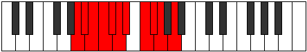

# Mode Rocryllian

## Links

- [Documentation](README.md)
- [Scales Index](Scales.md)
- [Modes Index](Modes.md)
- [Chords Index](Chords.md)

## Parent Scale

[Staptyllian](ScaleStaptyllian.md)

## Number

[1919](https://ianring.com/musictheory/scales/1919)

## Transposition

1, 1, 1, 1, 1, 1, 2, 1, 1, 2

## Chord Pattern

vii⁰

## Perfection

- 8 Perfect notes
- 2 Perfect notes

## Perfection Profile

[false true true true false true true true true true]

## Permutations

| Tonic | Notes | Signature | Illustration | Audio |
|-------|-------|-----------|--------------|-------|
| [C](ModeCNaturalRocryllian.md) | **C**, C#, D, D#, **E**, F, F#, G#, A, A#, **C** | C |  | [midi](https://github.com/edipermadi/music/blob/main/docs/ModeCNaturalRocryllian.mid?raw=true) |
| [C#](ModeCSharpRocryllian.md) | **C#**, D, D#, E, **F**, F#, G, A, A#, B, **C#** | C |  | [midi](https://github.com/edipermadi/music/blob/main/docs/ModeCSharpRocryllian.mid?raw=true) |
| [Db](ModeDFlatRocryllian.md) | **Db**, D, Eb, E, **F**, Gb, G, A, Bb, B, **Db** | C |  | [midi](https://github.com/edipermadi/music/blob/main/docs/ModeDFlatRocryllian.mid?raw=true) |
| [D](ModeDNaturalRocryllian.md) | **D**, D#, E, F, **F#**, G, G#, A#, B, C, **D** | C |  | [midi](https://github.com/edipermadi/music/blob/main/docs/ModeDNaturalRocryllian.mid?raw=true) |
| [D#](ModeDSharpRocryllian.md) | **D#**, E, F, F#, **G**, G#, A, B, C, C#, **D#** | C |  | [midi](https://github.com/edipermadi/music/blob/main/docs/ModeDSharpRocryllian.mid?raw=true) |
| [Eb](ModeEFlatRocryllian.md) | **Eb**, E, F, Gb, **G**, Ab, A, B, C, Db, **Eb** | C |  | [midi](https://github.com/edipermadi/music/blob/main/docs/ModeEFlatRocryllian.mid?raw=true) |
| [E](ModeENaturalRocryllian.md) | **E**, F, F#, G, **G#**, A, A#, C, C#, D, **E** | C |  | [midi](https://github.com/edipermadi/music/blob/main/docs/ModeENaturalRocryllian.mid?raw=true) |
| [F](ModeFNaturalRocryllian.md) | **F**, F#, G, G#, **A**, A#, B, C#, D, D#, **F** | C |  | [midi](https://github.com/edipermadi/music/blob/main/docs/ModeFNaturalRocryllian.mid?raw=true) |
| [F#](ModeFSharpRocryllian.md) | **F#**, G, G#, A, **A#**, B, C, D, D#, E, **F#** | C |  | [midi](https://github.com/edipermadi/music/blob/main/docs/ModeFSharpRocryllian.mid?raw=true) |
| [Gb](ModeGFlatRocryllian.md) | **Gb**, G, Ab, A, **Bb**, B, C, D, Eb, E, **Gb** | C |  | [midi](https://github.com/edipermadi/music/blob/main/docs/ModeGFlatRocryllian.mid?raw=true) |
| [G](ModeGNaturalRocryllian.md) | **G**, G#, A, A#, **B**, C, C#, D#, E, F, **G** | C |  | [midi](https://github.com/edipermadi/music/blob/main/docs/ModeGNaturalRocryllian.mid?raw=true) |
| [G#](ModeGSharpRocryllian.md) | **G#**, A, A#, B, **C**, C#, D, E, F, F#, **G#** | C |  | [midi](https://github.com/edipermadi/music/blob/main/docs/ModeGSharpRocryllian.mid?raw=true) |
| [Ab](ModeAFlatRocryllian.md) | **Ab**, A, Bb, B, **C**, Db, D, E, F, Gb, **Ab** | C |  | [midi](https://github.com/edipermadi/music/blob/main/docs/ModeAFlatRocryllian.mid?raw=true) |
| [A](ModeANaturalRocryllian.md) | **A**, A#, B, C, **C#**, D, D#, F, F#, G, **A** | C |  | [midi](https://github.com/edipermadi/music/blob/main/docs/ModeANaturalRocryllian.mid?raw=true) |
| [A#](ModeASharpRocryllian.md) | **A#**, B, C, C#, **D**, D#, E, F#, G, G#, **A#** | C |  | [midi](https://github.com/edipermadi/music/blob/main/docs/ModeASharpRocryllian.mid?raw=true) |
| [Bb](ModeBFlatRocryllian.md) | **Bb**, B, C, Db, **D**, Eb, E, Gb, G, Ab, **Bb** | C |  | [midi](https://github.com/edipermadi/music/blob/main/docs/ModeBFlatRocryllian.mid?raw=true) |
| [B](ModeBNaturalRocryllian.md) | **B**, C, C#, D, **D#**, E, F, G, G#, A, **B** | C |  | [midi](https://github.com/edipermadi/music/blob/main/docs/ModeBNaturalRocryllian.mid?raw=true) |
