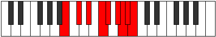

# Mode Rocryllic

## Links

- [Documentation](index.md)
- [Scales Index](Scales.md)
- [Modes Index](Modes.md)
- [Chords Index](Chords.md)

## Parent Scale

[Rocryllic](ScaleRocryllic.md)

## Number

[3797](https://ianring.com/musictheory/scales/3797)

## Perfection

- 6 Perfect notes
- 2 Perfect notes

## Perfection Profile

[true true true false true true false true]

## Permutations

| Tonic | Notes | Signature | Illustration | Audio |
|-------|-------|-----------|--------------|-------|
| [C](ModeCNaturalRocryllic.md) | C, D, E, **F#**, G, A, **A#**, B, C | C |  | [midi](ModeCNaturalRocryllic.mid) [ogg](ModeCNaturalRocryllic.ogg) |
| [C#](ModeCSharpRocryllic.md) | C#, D#, F, **G**, G#, A#, **B**, C, C# | C |  | [midi](ModeCSharpRocryllic.mid) [ogg](ModeCSharpRocryllic.ogg) |
| [Db](ModeDFlatRocryllic.md) | Db, Eb, F, **G**, Ab, Bb, **B**, C, Db | C |  | [midi](ModeDFlatRocryllic.mid) [ogg](ModeDFlatRocryllic.ogg) |
| [D](ModeDNaturalRocryllic.md) | D, E, F#, **G#**, A, B, **C**, C#, D | C |  | [midi](ModeDNaturalRocryllic.mid) [ogg](ModeDNaturalRocryllic.ogg) |
| [D#](ModeDSharpRocryllic.md) | D#, F, G, **A**, A#, C, **C#**, D, D# | C |  | [midi](ModeDSharpRocryllic.mid) [ogg](ModeDSharpRocryllic.ogg) |
| [Eb](ModeEFlatRocryllic.md) | Eb, F, G, **A**, Bb, C, **Db**, D, Eb | C |  | [midi](ModeEFlatRocryllic.mid) [ogg](ModeEFlatRocryllic.ogg) |
| [E](ModeENaturalRocryllic.md) | E, F#, G#, **A#**, B, C#, **D**, D#, E | C |  | [midi](ModeENaturalRocryllic.mid) [ogg](ModeENaturalRocryllic.ogg) |
| [F](ModeFNaturalRocryllic.md) | F, G, A, **B**, C, D, **D#**, E, F | C |  | [midi](ModeFNaturalRocryllic.mid) [ogg](ModeFNaturalRocryllic.ogg) |
| [F#](ModeFSharpRocryllic.md) | F#, G#, A#, **C**, C#, D#, **E**, F, F# | C |  | [midi](ModeFSharpRocryllic.mid) [ogg](ModeFSharpRocryllic.ogg) |
| [Gb](ModeGFlatRocryllic.md) | Gb, Ab, Bb, **C**, Db, Eb, **E**, F, Gb | C |  | [midi](ModeGFlatRocryllic.mid) [ogg](ModeGFlatRocryllic.ogg) |
| [G](ModeGNaturalRocryllic.md) | G, A, B, **C#**, D, E, **F**, F#, G | C |  | [midi](ModeGNaturalRocryllic.mid) [ogg](ModeGNaturalRocryllic.ogg) |
| [G#](ModeGSharpRocryllic.md) | G#, A#, C, **D**, D#, F, **F#**, G, G# | C |  | [midi](ModeGSharpRocryllic.mid) [ogg](ModeGSharpRocryllic.ogg) |
| [Ab](ModeAFlatRocryllic.md) | Ab, Bb, C, **D**, Eb, F, **Gb**, G, Ab | C |  | [midi](ModeAFlatRocryllic.mid) [ogg](ModeAFlatRocryllic.ogg) |
| [A](ModeANaturalRocryllic.md) | A, B, C#, **D#**, E, F#, **G**, G#, A | C |  | [midi](ModeANaturalRocryllic.mid) [ogg](ModeANaturalRocryllic.ogg) |
| [A#](ModeASharpRocryllic.md) | A#, C, D, **E**, F, G, **G#**, A, A# | C |  | [midi](ModeASharpRocryllic.mid) [ogg](ModeASharpRocryllic.ogg) |
| [Bb](ModeBFlatRocryllic.md) | Bb, C, D, **E**, F, G, **Ab**, A, Bb | C |  | [midi](ModeBFlatRocryllic.mid) [ogg](ModeBFlatRocryllic.ogg) |
| [B](ModeBNaturalRocryllic.md) | B, C#, D#, **F**, F#, G#, **A**, A#, B | C |  | [midi](ModeBNaturalRocryllic.mid) [ogg](ModeBNaturalRocryllic.ogg) |
