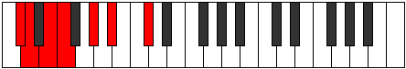
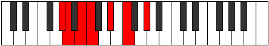

# Mode Rodimic

## Links

- [Documentation](index.md)
- [Scales Index](Scales.md)
- [Modes Index](Modes.md)
- [Chords Index](Chords.md)

## Parent Scale

[Stythimic](ScaleStythimic.md)

## Number

[667](https://ianring.com/musictheory/scales/667)

## Perfection

- 2 Perfect notes
- 4 Perfect notes

## Perfection Profile

[true false false false false true]

## Permutations

| Tonic | Notes | Signature | Illustration | Audio |
|-------|-------|-----------|--------------|-------|
| [C](ModeCNaturalRodimic.md) | C, **Db**, **Eb**, **Fb**, **G**, A, C | C |  | [midi](ModeCNaturalRodimic.mid) [ogg](ModeCNaturalRodimic.ogg) |
| [C#](ModeCSharpRodimic.md) | C#, **D**, **E**, **F**, **G#**, A#, C# | C |  | [midi](ModeCSharpRodimic.mid) [ogg](ModeCSharpRodimic.ogg) |
| [Db](ModeDFlatRodimic.md) | Db, **Ebb**, **Fb**, **Gbb**, **Ab**, Bb, Db | C |  | [midi](ModeDFlatRodimic.mid) [ogg](ModeDFlatRodimic.ogg) |
| [D](ModeDNaturalRodimic.md) | D, **Eb**, **F**, **Gb**, **A**, B, D | C |  | [midi](ModeDNaturalRodimic.mid) [ogg](ModeDNaturalRodimic.ogg) |
| [D#](ModeDSharpRodimic.md) | D#, **E**, **F#**, **G**, **A#**, B#, D# | C |  | [midi](ModeDSharpRodimic.mid) [ogg](ModeDSharpRodimic.ogg) |
| [Eb](ModeEFlatRodimic.md) | Eb, **Fb**, **Gb**, **Abb**, **Bb**, C, Eb | C |  | [midi](ModeEFlatRodimic.mid) [ogg](ModeEFlatRodimic.ogg) |
| [E](ModeENaturalRodimic.md) | E, **F**, **G**, **Ab**, **B**, C#, E | C |  | [midi](ModeENaturalRodimic.mid) [ogg](ModeENaturalRodimic.ogg) |
| [F](ModeFNaturalRodimic.md) | F, **Gb**, **Ab**, **Bbb**, **C**, D, F | C |  | [midi](ModeFNaturalRodimic.mid) [ogg](ModeFNaturalRodimic.ogg) |
| [F#](ModeFSharpRodimic.md) | F#, **G**, **A**, **Bb**, **C#**, D#, F# | C |  | [midi](ModeFSharpRodimic.mid) [ogg](ModeFSharpRodimic.ogg) |
| [Gb](ModeGFlatRodimic.md) | Gb, **Abb**, **Bbb**, **Cbb**, **Db**, Eb, Gb | C |  | [midi](ModeGFlatRodimic.mid) [ogg](ModeGFlatRodimic.ogg) |
| [G](ModeGNaturalRodimic.md) | G, **Ab**, **Bb**, **Cb**, **D**, E, G | C |  | [midi](ModeGNaturalRodimic.mid) [ogg](ModeGNaturalRodimic.ogg) |
| [G#](ModeGSharpRodimic.md) | G#, **A**, **B**, **C**, **D#**, E#, G# | C |  | [midi](ModeGSharpRodimic.mid) [ogg](ModeGSharpRodimic.ogg) |
| [Ab](ModeAFlatRodimic.md) | Ab, **Bbb**, **Cb**, **Dbb**, **Eb**, F, Ab | C |  | [midi](ModeAFlatRodimic.mid) [ogg](ModeAFlatRodimic.ogg) |
| [A](ModeANaturalRodimic.md) | A, **Bb**, **C**, **Db**, **E**, F#, A | C |  | [midi](ModeANaturalRodimic.mid) [ogg](ModeANaturalRodimic.ogg) |
| [A#](ModeASharpRodimic.md) | A#, **B**, **C#**, **D**, **E#**, F##, A# | C |  | [midi](ModeASharpRodimic.mid) [ogg](ModeASharpRodimic.ogg) |
| [Bb](ModeBFlatRodimic.md) | Bb, **Cb**, **Db**, **Ebb**, **F**, G, Bb | C |  | [midi](ModeBFlatRodimic.mid) [ogg](ModeBFlatRodimic.ogg) |
| [B](ModeBNaturalRodimic.md) | B, **C**, **D**, **Eb**, **F#**, G#, B | C |  | [midi](ModeBNaturalRodimic.mid) [ogg](ModeBNaturalRodimic.ogg) |
