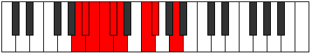

# Mode Rodyllic

## Links

- [Documentation](README.md)
- [Scales Index](Scales.md)
- [Modes Index](Modes.md)
- [Chords Index](Chords.md)

## Parent Scale

[Ioniptyllic](ScaleIoniptyllic.md)

## Number

[831](https://ianring.com/musictheory/scales/831)

## Luminosity

7

## Transposition

1, 1, 1, 1, 1, 3, 1, 3

## Chord Pattern

iii⁰b3, iv⁰b3, V⁺, VI⁺, VIIb5, VIIIb5

## Perfection

- 5 Perfect notes
- 3 Perfect notes

## Perfection Profile

false, true, true, false, false, true, true, true

## Permutations

| Tonic | Notes | Signature | Illustration | Audio |
|-------|-------|-----------|--------------|-------|
| [C](ModeCNaturalRodyllic.md) | **C**, C#, D, **D#**, **E**, F, G#, A, **C** | C |  | [midi](https://github.com/edipermadi/music/blob/main/docs/ModeCNaturalRodyllic.mid?raw=true) |
| [C#](ModeCSharpRodyllic.md) | **C#**, D, D#, **E**, **F**, F#, A, A#, **C#** | C |  | [midi](https://github.com/edipermadi/music/blob/main/docs/ModeCSharpRodyllic.mid?raw=true) |
| [Db](ModeDFlatRodyllic.md) | **Db**, D, Eb, **E**, **F**, Gb, A, Bb, **Db** | C |  | [midi](https://github.com/edipermadi/music/blob/main/docs/ModeDFlatRodyllic.mid?raw=true) |
| [D](ModeDNaturalRodyllic.md) | **D**, D#, E, **F**, **F#**, G, A#, B, **D** | C |  | [midi](https://github.com/edipermadi/music/blob/main/docs/ModeDNaturalRodyllic.mid?raw=true) |
| [D#](ModeDSharpRodyllic.md) | **D#**, E, F, **F#**, **G**, G#, B, C, **D#** | C |  | [midi](https://github.com/edipermadi/music/blob/main/docs/ModeDSharpRodyllic.mid?raw=true) |
| [Eb](ModeEFlatRodyllic.md) | **Eb**, E, F, **Gb**, **G**, Ab, B, C, **Eb** | C |  | [midi](https://github.com/edipermadi/music/blob/main/docs/ModeEFlatRodyllic.mid?raw=true) |
| [E](ModeENaturalRodyllic.md) | **E**, F, F#, **G**, **G#**, A, C, C#, **E** | C |  | [midi](https://github.com/edipermadi/music/blob/main/docs/ModeENaturalRodyllic.mid?raw=true) |
| [F](ModeFNaturalRodyllic.md) | **F**, F#, G, **G#**, **A**, A#, C#, D, **F** | C |  | [midi](https://github.com/edipermadi/music/blob/main/docs/ModeFNaturalRodyllic.mid?raw=true) |
| [F#](ModeFSharpRodyllic.md) | **F#**, G, G#, **A**, **A#**, B, D, D#, **F#** | C |  | [midi](https://github.com/edipermadi/music/blob/main/docs/ModeFSharpRodyllic.mid?raw=true) |
| [Gb](ModeGFlatRodyllic.md) | **Gb**, G, Ab, **A**, **Bb**, B, D, Eb, **Gb** | C |  | [midi](https://github.com/edipermadi/music/blob/main/docs/ModeGFlatRodyllic.mid?raw=true) |
| [G](ModeGNaturalRodyllic.md) | **G**, G#, A, **A#**, **B**, C, D#, E, **G** | C |  | [midi](https://github.com/edipermadi/music/blob/main/docs/ModeGNaturalRodyllic.mid?raw=true) |
| [G#](ModeGSharpRodyllic.md) | **G#**, A, A#, **B**, **C**, C#, E, F, **G#** | C |  | [midi](https://github.com/edipermadi/music/blob/main/docs/ModeGSharpRodyllic.mid?raw=true) |
| [Ab](ModeAFlatRodyllic.md) | **Ab**, A, Bb, **B**, **C**, Db, E, F, **Ab** | C |  | [midi](https://github.com/edipermadi/music/blob/main/docs/ModeAFlatRodyllic.mid?raw=true) |
| [A](ModeANaturalRodyllic.md) | **A**, A#, B, **C**, **C#**, D, F, F#, **A** | C |  | [midi](https://github.com/edipermadi/music/blob/main/docs/ModeANaturalRodyllic.mid?raw=true) |
| [A#](ModeASharpRodyllic.md) | **A#**, B, C, **C#**, **D**, D#, F#, G, **A#** | C |  | [midi](https://github.com/edipermadi/music/blob/main/docs/ModeASharpRodyllic.mid?raw=true) |
| [Bb](ModeBFlatRodyllic.md) | **Bb**, B, C, **Db**, **D**, Eb, Gb, G, **Bb** | C |  | [midi](https://github.com/edipermadi/music/blob/main/docs/ModeBFlatRodyllic.mid?raw=true) |
| [B](ModeBNaturalRodyllic.md) | **B**, C, C#, **D**, **D#**, E, G, G#, **B** | C |  | [midi](https://github.com/edipermadi/music/blob/main/docs/ModeBNaturalRodyllic.mid?raw=true) |
