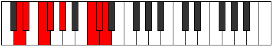
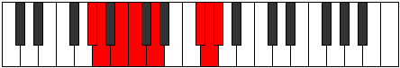

# Mode Rogian

## Links

- [Documentation](index.md)
- [Scales Index](Scales.md)
- [Modes Index](Modes.md)
- [Chords Index](Chords.md)

## Parent Scale

[Saptian](ScaleSaptian.md)

## Number

[3163](https://ianring.com/musictheory/scales/3163)

## Perfection

- 4 Perfect notes
- 3 Perfect notes

## Perfection Profile

[false false true true true false true]

## Permutations

| Tonic | Notes | Signature | Illustration | Audio |
|-------|-------|-----------|--------------|-------|
| [C](ModeCNaturalRogian.md) | **C**, **Db**, Eb, Fb, Gb, **A#**, B, **C** | C |  | [midi](ModeCNaturalRogian.mid) [ogg](ModeCNaturalRogian.ogg) |
| [C#](ModeCSharpRogian.md) | **C#**, **D**, E, F, G, **A##**, B#, **C#** | C |  | [midi](ModeCSharpRogian.mid) [ogg](ModeCSharpRogian.ogg) |
| [Db](ModeDFlatRogian.md) | **Db**, **Ebb**, Fb, Gbb, Abb, **B**, C, **Db** | C |  | [midi](ModeDFlatRogian.mid) [ogg](ModeDFlatRogian.ogg) |
| [D](ModeDNaturalRogian.md) | **D**, **Eb**, F, Gb, Ab, **B#**, C#, **D** | C |  | [midi](ModeDNaturalRogian.mid) [ogg](ModeDNaturalRogian.ogg) |
| [D#](ModeDSharpRogian.md) | **D#**, **E**, F#, G, A, **B##**, C##, **D#** | C |  | [midi](ModeDSharpRogian.mid) [ogg](ModeDSharpRogian.ogg) |
| [Eb](ModeEFlatRogian.md) | **Eb**, **Fb**, Gb, Abb, Bbb, **C#**, D, **Eb** | C |  | [midi](ModeEFlatRogian.mid) [ogg](ModeEFlatRogian.ogg) |
| [E](ModeENaturalRogian.md) | **E**, **F**, G, Ab, Bb, **C##**, D#, **E** | C |  | [midi](ModeENaturalRogian.mid) [ogg](ModeENaturalRogian.ogg) |
| [F](ModeFNaturalRogian.md) | **F**, **Gb**, Ab, Bbb, Cb, **D#**, E, **F** | C |  | [midi](ModeFNaturalRogian.mid) [ogg](ModeFNaturalRogian.ogg) |
| [F#](ModeFSharpRogian.md) | **F#**, **G**, A, Bb, C, **D##**, E#, **F#** | C |  | [midi](ModeFSharpRogian.mid) [ogg](ModeFSharpRogian.ogg) |
| [Gb](ModeGFlatRogian.md) | **Gb**, **Abb**, Bbb, Cbb, Dbb, **E**, F, **Gb** | C |  | [midi](ModeGFlatRogian.mid) [ogg](ModeGFlatRogian.ogg) |
| [G](ModeGNaturalRogian.md) | **G**, **Ab**, Bb, Cb, Db, **E#**, F#, **G** | C |  | [midi](ModeGNaturalRogian.mid) [ogg](ModeGNaturalRogian.ogg) |
| [G#](ModeGSharpRogian.md) | **G#**, **A**, B, C, D, **E##**, F##, **G#** | C |  | [midi](ModeGSharpRogian.mid) [ogg](ModeGSharpRogian.ogg) |
| [Ab](ModeAFlatRogian.md) | **Ab**, **Bbb**, Cb, Dbb, Ebb, **F#**, G, **Ab** | C |  | [midi](ModeAFlatRogian.mid) [ogg](ModeAFlatRogian.ogg) |
| [A](ModeANaturalRogian.md) | **A**, **Bb**, C, Db, Eb, **F##**, G#, **A** | C |  | [midi](ModeANaturalRogian.mid) [ogg](ModeANaturalRogian.ogg) |
| [A#](ModeASharpRogian.md) | **A#**, **B**, C#, D, E, **F###**, G##, **A#** | C |  | [midi](ModeASharpRogian.mid) [ogg](ModeASharpRogian.ogg) |
| [Bb](ModeBFlatRogian.md) | **Bb**, **Cb**, Db, Ebb, Fb, **G#**, A, **Bb** | C |  | [midi](ModeBFlatRogian.mid) [ogg](ModeBFlatRogian.ogg) |
| [B](ModeBNaturalRogian.md) | **B**, **C**, D, Eb, F, **G##**, A#, **B** | C |  | [midi](ModeBNaturalRogian.mid) [ogg](ModeBNaturalRogian.ogg) |
