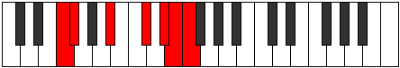

# Mode Rogimic

## Links

- [Documentation](index.md)
- [Scales Index](Scales.md)
- [Modes Index](Modes.md)
- [Chords Index](Chords.md)

## Parent Scale

[Starimic](ScaleStarimic.md)

## Number

[3363](https://ianring.com/musictheory/scales/3363)

## Perfection

- 3 Perfect notes
- 3 Perfect notes

## Perfection Profile

[false true true false true false]

## Permutations

| Tonic | Notes | Signature | Illustration | Audio |
|-------|-------|-----------|--------------|-------|
| [C](ModeCNaturalRogimic.md) | **C**, Db, E#, **F###**, G###, **A##**, **C** | C |  | [midi](ModeCNaturalRogimic.mid) [ogg](ModeCNaturalRogimic.ogg) |
| [C#](ModeCSharpRogimic.md) | **C#**, D, E##, **Cbbb**, Dbbb, **Dbb**, **C#** | C |  | [midi](ModeCSharpRogimic.mid) [ogg](ModeCSharpRogimic.ogg) |
| [Db](ModeDFlatRogimic.md) | **Db**, Ebb, F#, **G##**, A##, **B#**, **Db** | C |  | [midi](ModeDFlatRogimic.mid) [ogg](ModeDFlatRogimic.ogg) |
| [D](ModeDNaturalRogimic.md) | **D**, Eb, F##, **G###**, A###, **B##**, **D** | C |  | [midi](ModeDNaturalRogimic.mid) [ogg](ModeDNaturalRogimic.ogg) |
| [D#](ModeDSharpRogimic.md) | **D#**, E, F###, **Cb**, Db, **Ebb**, **D#** | C |  | [midi](ModeDSharpRogimic.mid) [ogg](ModeDSharpRogimic.ogg) |
| [Eb](ModeEFlatRogimic.md) | **Eb**, Fb, G#, **A##**, B##, **C##**, **Eb** | C |  | [midi](ModeEFlatRogimic.mid) [ogg](ModeEFlatRogimic.ogg) |
| [E](ModeENaturalRogimic.md) | **E**, F, G##, **A###**, B###, **C###**, **E** | C |  | [midi](ModeENaturalRogimic.mid) [ogg](ModeENaturalRogimic.ogg) |
| [F](ModeFNaturalRogimic.md) | **F**, Gb, A#, **B##**, C###, **D##**, **F** | C |  | [midi](ModeFNaturalRogimic.mid) [ogg](ModeFNaturalRogimic.ogg) |
| [F#](ModeFSharpRogimic.md) | **F#**, G, A##, **B###**, D##, **E#**, **F#** | C |  | [midi](ModeFSharpRogimic.mid) [ogg](ModeFSharpRogimic.ogg) |
| [Gb](ModeGFlatRogimic.md) | **Gb**, Abb, B, **C##**, D##, **E#**, **Gb** | C |  | [midi](ModeGFlatRogimic.mid) [ogg](ModeGFlatRogimic.ogg) |
| [G](ModeGNaturalRogimic.md) | **G**, Ab, B#, **C###**, D###, **E##**, **G** | C |  | [midi](ModeGNaturalRogimic.mid) [ogg](ModeGNaturalRogimic.ogg) |
| [G#](ModeGSharpRogimic.md) | **G#**, A, B##, **D##**, E##, **F##**, **G#** | C |  | [midi](ModeGSharpRogimic.mid) [ogg](ModeGSharpRogimic.ogg) |
| [Ab](ModeAFlatRogimic.md) | **Ab**, Bbb, C#, **D##**, E##, **F##**, **Ab** | C |  | [midi](ModeAFlatRogimic.mid) [ogg](ModeAFlatRogimic.ogg) |
| [A](ModeANaturalRogimic.md) | **A**, Bb, C##, **D###**, E###, **F###**, **A** | C |  | [midi](ModeANaturalRogimic.mid) [ogg](ModeANaturalRogimic.ogg) |
| [A#](ModeASharpRogimic.md) | **A#**, B, C###, **E##**, F###, **G##**, **A#** | C |  | [midi](ModeASharpRogimic.mid) [ogg](ModeASharpRogimic.ogg) |
| [Bb](ModeBFlatRogimic.md) | **Bb**, Cb, D#, **E##**, F###, **G##**, **Bb** | C |  | [midi](ModeBFlatRogimic.mid) [ogg](ModeBFlatRogimic.ogg) |
| [B](ModeBNaturalRogimic.md) | **B**, C, D##, **E###**, Cbbb, **Cbb**, **B** | C |  | [midi](ModeBNaturalRogimic.mid) [ogg](ModeBNaturalRogimic.ogg) |
