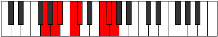

# Mode Rolian

## Links

- [Documentation](index.md)
- [Scales Index](Scales.md)
- [Modes Index](Modes.md)
- [Chords Index](Chords.md)

## Parent Scale

[Aeolathian](ScaleAeolathian.md)

## Number

[3181](https://ianring.com/musictheory/scales/3181)

## Interval Pattern

2, 1, 2, 1, 4, 1, 1

## Chord Pattern

i⁰, II⁺, iii, V⁺, VI, VI⁺, vii⁰, vii, VII

## Perfection

- 4 Perfect notes
- 3 Perfect notes

## Perfection Profile

[false false true true false true true]

## Permutations

| Tonic | Notes | Signature | Illustration | Audio |
|-------|-------|-----------|--------------|-------|
| [C](ModeCNaturalRolian.md) | **C**, **D**, Eb, F, **Gb**, A#, B, **C** | C |  | [midi](https://github.com/edipermadi/music/blob/main/docs/ModeCNaturalRolian.mid?raw=true) |
| [C#](ModeCSharpRolian.md) | **C#**, **D#**, E, F#, **G**, A##, B#, **C#** | C |  | [midi](https://github.com/edipermadi/music/blob/main/docs/ModeCSharpRolian.mid?raw=true) |
| [Db](ModeDFlatRolian.md) | **Db**, **Eb**, Fb, Gb, **Abb**, B, C, **Db** | C |  | [midi](https://github.com/edipermadi/music/blob/main/docs/ModeDFlatRolian.mid?raw=true) |
| [D](ModeDNaturalRolian.md) | **D**, **E**, F, G, **Ab**, B#, C#, **D** | C |  | [midi](https://github.com/edipermadi/music/blob/main/docs/ModeDNaturalRolian.mid?raw=true) |
| [D#](ModeDSharpRolian.md) | **D#**, **E#**, F#, G#, **A**, B##, C##, **D#** | C |  | [midi](https://github.com/edipermadi/music/blob/main/docs/ModeDSharpRolian.mid?raw=true) |
| [Eb](ModeEFlatRolian.md) | **Eb**, **F**, Gb, Ab, **Bbb**, C#, D, **Eb** | C |  | [midi](https://github.com/edipermadi/music/blob/main/docs/ModeEFlatRolian.mid?raw=true) |
| [E](ModeENaturalRolian.md) | **E**, **F#**, G, A, **Bb**, C##, D#, **E** | C |  | [midi](https://github.com/edipermadi/music/blob/main/docs/ModeENaturalRolian.mid?raw=true) |
| [F](ModeFNaturalRolian.md) | **F**, **G**, Ab, Bb, **Cb**, D#, E, **F** | C |  | [midi](https://github.com/edipermadi/music/blob/main/docs/ModeFNaturalRolian.mid?raw=true) |
| [F#](ModeFSharpRolian.md) | **F#**, **G#**, A, B, **C**, D##, E#, **F#** | C |  | [midi](https://github.com/edipermadi/music/blob/main/docs/ModeFSharpRolian.mid?raw=true) |
| [Gb](ModeGFlatRolian.md) | **Gb**, **Ab**, Bbb, Cb, **Dbb**, E, F, **Gb** | C |  | [midi](https://github.com/edipermadi/music/blob/main/docs/ModeGFlatRolian.mid?raw=true) |
| [G](ModeGNaturalRolian.md) | **G**, **A**, Bb, C, **Db**, E#, F#, **G** | C |  | [midi](https://github.com/edipermadi/music/blob/main/docs/ModeGNaturalRolian.mid?raw=true) |
| [G#](ModeGSharpRolian.md) | **G#**, **A#**, B, C#, **D**, E##, F##, **G#** | C |  | [midi](https://github.com/edipermadi/music/blob/main/docs/ModeGSharpRolian.mid?raw=true) |
| [Ab](ModeAFlatRolian.md) | **Ab**, **Bb**, Cb, Db, **Ebb**, F#, G, **Ab** | C |  | [midi](https://github.com/edipermadi/music/blob/main/docs/ModeAFlatRolian.mid?raw=true) |
| [A](ModeANaturalRolian.md) | **A**, **B**, C, D, **Eb**, F##, G#, **A** | C |  | [midi](https://github.com/edipermadi/music/blob/main/docs/ModeANaturalRolian.mid?raw=true) |
| [A#](ModeASharpRolian.md) | **A#**, **B#**, C#, D#, **E**, F###, G##, **A#** | C |  | [midi](https://github.com/edipermadi/music/blob/main/docs/ModeASharpRolian.mid?raw=true) |
| [Bb](ModeBFlatRolian.md) | **Bb**, **C**, Db, Eb, **Fb**, G#, A, **Bb** | C |  | [midi](https://github.com/edipermadi/music/blob/main/docs/ModeBFlatRolian.mid?raw=true) |
| [B](ModeBNaturalRolian.md) | **B**, **C#**, D, E, **F**, G##, A#, **B** | C |  | [midi](https://github.com/edipermadi/music/blob/main/docs/ModeBNaturalRolian.mid?raw=true) |
