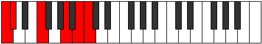

# Mode Rolitonic

## Links

- [Documentation](README.md)
- [Scales Index](Scales.md)
- [Modes Index](Modes.md)
- [Chords Index](Chords.md)

## Parent Scale

[Zylitonic](ScaleZylitonic.md)

## Number

[2595](https://ianring.com/musictheory/scales/2595)

## Interval Pattern

1, 4, 4, 2, 1

## Chord Pattern

## Perfection

- 1 Perfect notes
- 4 Perfect notes

## Perfection Profile

[false false true false false]

## Permutations

| Tonic | Notes | Signature | Illustration | Audio |
|-------|-------|-----------|--------------|-------|
| [C](ModeCNaturalRolitonic.md) | **C**, **C#**, F, **A**, **B**, **C** | C |  | [midi](https://github.com/edipermadi/music/blob/main/docs/ModeCNaturalRolitonic.mid?raw=true) |
| [C#](ModeCSharpRolitonic.md) | **C#**, **D**, F#, **A#**, **C**, **C#** | C |  | [midi](https://github.com/edipermadi/music/blob/main/docs/ModeCSharpRolitonic.mid?raw=true) |
| [Db](ModeDFlatRolitonic.md) | **Db**, **D**, Gb, **Bb**, **C**, **Db** | C |  | [midi](https://github.com/edipermadi/music/blob/main/docs/ModeDFlatRolitonic.mid?raw=true) |
| [D](ModeDNaturalRolitonic.md) | **D**, **D#**, G, **B**, **C#**, **D** | C |  | [midi](https://github.com/edipermadi/music/blob/main/docs/ModeDNaturalRolitonic.mid?raw=true) |
| [D#](ModeDSharpRolitonic.md) | **D#**, **E**, G#, **C**, **D**, **D#** | C |  | [midi](https://github.com/edipermadi/music/blob/main/docs/ModeDSharpRolitonic.mid?raw=true) |
| [Eb](ModeEFlatRolitonic.md) | **Eb**, **E**, Ab, **C**, **D**, **Eb** | C |  | [midi](https://github.com/edipermadi/music/blob/main/docs/ModeEFlatRolitonic.mid?raw=true) |
| [E](ModeENaturalRolitonic.md) | **E**, **F**, A, **C#**, **D#**, **E** | C |  | [midi](https://github.com/edipermadi/music/blob/main/docs/ModeENaturalRolitonic.mid?raw=true) |
| [F](ModeFNaturalRolitonic.md) | **F**, **F#**, A#, **D**, **E**, **F** | C |  | [midi](https://github.com/edipermadi/music/blob/main/docs/ModeFNaturalRolitonic.mid?raw=true) |
| [F#](ModeFSharpRolitonic.md) | **F#**, **G**, B, **D#**, **F**, **F#** | C |  | [midi](https://github.com/edipermadi/music/blob/main/docs/ModeFSharpRolitonic.mid?raw=true) |
| [Gb](ModeGFlatRolitonic.md) | **Gb**, **G**, B, **Eb**, **F**, **Gb** | C |  | [midi](https://github.com/edipermadi/music/blob/main/docs/ModeGFlatRolitonic.mid?raw=true) |
| [G](ModeGNaturalRolitonic.md) | **G**, **G#**, C, **E**, **F#**, **G** | C |  | [midi](https://github.com/edipermadi/music/blob/main/docs/ModeGNaturalRolitonic.mid?raw=true) |
| [G#](ModeGSharpRolitonic.md) | **G#**, **A**, C#, **F**, **G**, **G#** | C |  | [midi](https://github.com/edipermadi/music/blob/main/docs/ModeGSharpRolitonic.mid?raw=true) |
| [Ab](ModeAFlatRolitonic.md) | **Ab**, **A**, Db, **F**, **G**, **Ab** | C |  | [midi](https://github.com/edipermadi/music/blob/main/docs/ModeAFlatRolitonic.mid?raw=true) |
| [A](ModeANaturalRolitonic.md) | **A**, **A#**, D, **F#**, **G#**, **A** | C |  | [midi](https://github.com/edipermadi/music/blob/main/docs/ModeANaturalRolitonic.mid?raw=true) |
| [A#](ModeASharpRolitonic.md) | **A#**, **B**, D#, **G**, **A**, **A#** | C |  | [midi](https://github.com/edipermadi/music/blob/main/docs/ModeASharpRolitonic.mid?raw=true) |
| [Bb](ModeBFlatRolitonic.md) | **Bb**, **B**, Eb, **G**, **A**, **Bb** | C |  | [midi](https://github.com/edipermadi/music/blob/main/docs/ModeBFlatRolitonic.mid?raw=true) |
| [B](ModeBNaturalRolitonic.md) | **B**, **C**, E, **G#**, **A#**, **B** | C |  | [midi](https://github.com/edipermadi/music/blob/main/docs/ModeBNaturalRolitonic.mid?raw=true) |
