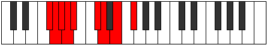

# Mode Rolyllic

## Links

- [Documentation](README.md)
- [Scales Index](Scales.md)
- [Modes Index](Modes.md)
- [Chords Index](Chords.md)

## Parent Scale

[Aeolothyllic](ScaleAeolothyllic.md)

## Number

[1439](https://ianring.com/musictheory/scales/1439)

## Transposition

1, 1, 1, 1, 3, 1, 2, 2

## Chord Pattern

ii⁰b3, ii⁰b3, iii⁰b3, IV, IV, V⁺, vi⁰, VIIb5, VIIb5

## Perfection

- 5 Perfect notes
- 3 Perfect notes

## Perfection Profile

[true true false true false true true false]

## Permutations

| Tonic | Notes | Signature | Illustration | Audio |
|-------|-------|-----------|--------------|-------|
| [C](ModeCNaturalRolyllic.md) | C, C#, **D**, D#, **E**, G, G#, **A#**, C | C |  | [midi](https://github.com/edipermadi/music/blob/main/docs/ModeCNaturalRolyllic.mid?raw=true) |
| [C#](ModeCSharpRolyllic.md) | C#, D, **D#**, E, **F**, G#, A, **B**, C# | C |  | [midi](https://github.com/edipermadi/music/blob/main/docs/ModeCSharpRolyllic.mid?raw=true) |
| [Db](ModeDFlatRolyllic.md) | Db, D, **Eb**, E, **F**, Ab, A, **B**, Db | C |  | [midi](https://github.com/edipermadi/music/blob/main/docs/ModeDFlatRolyllic.mid?raw=true) |
| [D](ModeDNaturalRolyllic.md) | D, D#, **E**, F, **F#**, A, A#, **C**, D | C |  | [midi](https://github.com/edipermadi/music/blob/main/docs/ModeDNaturalRolyllic.mid?raw=true) |
| [D#](ModeDSharpRolyllic.md) | D#, E, **F**, F#, **G**, A#, B, **C#**, D# | C |  | [midi](https://github.com/edipermadi/music/blob/main/docs/ModeDSharpRolyllic.mid?raw=true) |
| [Eb](ModeEFlatRolyllic.md) | Eb, E, **F**, Gb, **G**, Bb, B, **Db**, Eb | C |  | [midi](https://github.com/edipermadi/music/blob/main/docs/ModeEFlatRolyllic.mid?raw=true) |
| [E](ModeENaturalRolyllic.md) | E, F, **F#**, G, **G#**, B, C, **D**, E | C |  | [midi](https://github.com/edipermadi/music/blob/main/docs/ModeENaturalRolyllic.mid?raw=true) |
| [F](ModeFNaturalRolyllic.md) | F, F#, **G**, G#, **A**, C, C#, **D#**, F | C |  | [midi](https://github.com/edipermadi/music/blob/main/docs/ModeFNaturalRolyllic.mid?raw=true) |
| [F#](ModeFSharpRolyllic.md) | F#, G, **G#**, A, **A#**, C#, D, **E**, F# | C |  | [midi](https://github.com/edipermadi/music/blob/main/docs/ModeFSharpRolyllic.mid?raw=true) |
| [Gb](ModeGFlatRolyllic.md) | Gb, G, **Ab**, A, **Bb**, Db, D, **E**, Gb | C |  | [midi](https://github.com/edipermadi/music/blob/main/docs/ModeGFlatRolyllic.mid?raw=true) |
| [G](ModeGNaturalRolyllic.md) | G, G#, **A**, A#, **B**, D, D#, **F**, G | C |  | [midi](https://github.com/edipermadi/music/blob/main/docs/ModeGNaturalRolyllic.mid?raw=true) |
| [G#](ModeGSharpRolyllic.md) | G#, A, **A#**, B, **C**, D#, E, **F#**, G# | C |  | [midi](https://github.com/edipermadi/music/blob/main/docs/ModeGSharpRolyllic.mid?raw=true) |
| [Ab](ModeAFlatRolyllic.md) | Ab, A, **Bb**, B, **C**, Eb, E, **Gb**, Ab | C |  | [midi](https://github.com/edipermadi/music/blob/main/docs/ModeAFlatRolyllic.mid?raw=true) |
| [A](ModeANaturalRolyllic.md) | A, A#, **B**, C, **C#**, E, F, **G**, A | C |  | [midi](https://github.com/edipermadi/music/blob/main/docs/ModeANaturalRolyllic.mid?raw=true) |
| [A#](ModeASharpRolyllic.md) | A#, B, **C**, C#, **D**, F, F#, **G#**, A# | C |  | [midi](https://github.com/edipermadi/music/blob/main/docs/ModeASharpRolyllic.mid?raw=true) |
| [Bb](ModeBFlatRolyllic.md) | Bb, B, **C**, Db, **D**, F, Gb, **Ab**, Bb | C |  | [midi](https://github.com/edipermadi/music/blob/main/docs/ModeBFlatRolyllic.mid?raw=true) |
| [B](ModeBNaturalRolyllic.md) | B, C, **C#**, D, **D#**, F#, G, **A**, B | C |  | [midi](https://github.com/edipermadi/music/blob/main/docs/ModeBNaturalRolyllic.mid?raw=true) |
