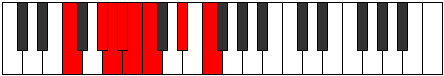

# Mode Ronian

## Links

- [Documentation](index.md)
- [Scales Index](Scales.md)
- [Modes Index](Modes.md)
- [Chords Index](Chords.md)

## Parent Scale

[Morian](ScaleMorian.md)

## Number

[1273](https://ianring.com/musictheory/scales/1273)

## Perfection

- 4 Perfect notes
- 3 Perfect notes

## Perfection Profile

[true true false true false false true]

## Permutations

| Tonic | Notes | Signature | Illustration | Audio |
|-------|-------|-----------|--------------|-------|
| [C](ModeCNaturalRonian.md) | C, D#, **E**, F, **Gb**, **Abb**, Bb, C | C |  | [midi](ModeCNaturalRonian.mid) [ogg](ModeCNaturalRonian.ogg) |
| [C#](ModeCSharpRonian.md) | C#, D##, **E#**, F#, **G**, **Ab**, B, C# | C |  | [midi](ModeCSharpRonian.mid) [ogg](ModeCSharpRonian.ogg) |
| [Db](ModeDFlatRonian.md) | Db, E, **F**, Gb, **Abb**, **Bbbb**, Cb, Db | C |  | [midi](ModeDFlatRonian.mid) [ogg](ModeDFlatRonian.ogg) |
| [D](ModeDNaturalRonian.md) | D, E#, **F#**, G, **Ab**, **Bbb**, C, D | C |  | [midi](ModeDNaturalRonian.mid) [ogg](ModeDNaturalRonian.ogg) |
| [D#](ModeDSharpRonian.md) | D#, E##, **F##**, G#, **A**, **Bb**, C#, D# | C |  | [midi](ModeDSharpRonian.mid) [ogg](ModeDSharpRonian.ogg) |
| [Eb](ModeEFlatRonian.md) | Eb, F#, **G**, Ab, **Bbb**, **Cbb**, Db, Eb | C |  | [midi](ModeEFlatRonian.mid) [ogg](ModeEFlatRonian.ogg) |
| [E](ModeENaturalRonian.md) | E, F##, **G#**, A, **Bb**, **Cb**, D, E | C |  | [midi](ModeENaturalRonian.mid) [ogg](ModeENaturalRonian.ogg) |
| [F](ModeFNaturalRonian.md) | F, G#, **A**, Bb, **Cb**, **Dbb**, Eb, F | C |  | [midi](ModeFNaturalRonian.mid) [ogg](ModeFNaturalRonian.ogg) |
| [F#](ModeFSharpRonian.md) | F#, G##, **A#**, B, **C**, **Db**, E, F# | C |  | [midi](ModeFSharpRonian.mid) [ogg](ModeFSharpRonian.ogg) |
| [Gb](ModeGFlatRonian.md) | Gb, A, **Bb**, Cb, **Dbb**, **Ebbb**, Fb, Gb | C |  | [midi](ModeGFlatRonian.mid) [ogg](ModeGFlatRonian.ogg) |
| [G](ModeGNaturalRonian.md) | G, A#, **B**, C, **Db**, **Ebb**, F, G | C |  | [midi](ModeGNaturalRonian.mid) [ogg](ModeGNaturalRonian.ogg) |
| [G#](ModeGSharpRonian.md) | G#, A##, **B#**, C#, **D**, **Eb**, F#, G# | C |  | [midi](ModeGSharpRonian.mid) [ogg](ModeGSharpRonian.ogg) |
| [Ab](ModeAFlatRonian.md) | Ab, B, **C**, Db, **Ebb**, **Fbb**, Gb, Ab | C |  | [midi](ModeAFlatRonian.mid) [ogg](ModeAFlatRonian.ogg) |
| [A](ModeANaturalRonian.md) | A, B#, **C#**, D, **Eb**, **Fb**, G, A | C |  | [midi](ModeANaturalRonian.mid) [ogg](ModeANaturalRonian.ogg) |
| [A#](ModeASharpRonian.md) | A#, B##, **C##**, D#, **E**, **F**, G#, A# | C |  | [midi](ModeASharpRonian.mid) [ogg](ModeASharpRonian.ogg) |
| [Bb](ModeBFlatRonian.md) | Bb, C#, **D**, Eb, **Fb**, **Gbb**, Ab, Bb | C |  | [midi](ModeBFlatRonian.mid) [ogg](ModeBFlatRonian.ogg) |
| [B](ModeBNaturalRonian.md) | B, C##, **D#**, E, **F**, **Gb**, A, B | C |  | [midi](ModeBNaturalRonian.mid) [ogg](ModeBNaturalRonian.ogg) |
