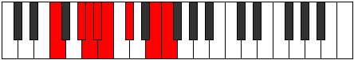

# Mode Rorian

## Links

- [Documentation](index.md)
- [Scales Index](Scales.md)
- [Modes Index](Modes.md)
- [Chords Index](Chords.md)

## Parent Scale

[Zarian](ScaleZarian.md)

## Number

[2425](https://ianring.com/musictheory/scales/2425)

## Perfection

- 4 Perfect notes
- 3 Perfect notes

## Interval Pattern

3, 1, 1, 1, 2, 3, 1

## Perfection Profile

[false false true true false true true]

## Permutations

| Tonic | Notes | Signature | Illustration | Audio |
|-------|-------|-----------|--------------|-------|
| [C](ModeCNaturalRorian.md) | **C**, **D#**, E, F, **Gb**, Ab, B, **C** | C |  | [midi](https://github.com/edipermadi/music/blob/main/docs/ModeCNaturalRorian.mid?raw=true) |
| [C#](ModeCSharpRorian.md) | **C#**, **D##**, E#, F#, **G**, A, B#, **C#** | C |  | [midi](https://github.com/edipermadi/music/blob/main/docs/ModeCSharpRorian.mid?raw=true) |
| [Db](ModeDFlatRorian.md) | **Db**, **E**, F, Gb, **Abb**, Bbb, C, **Db** | C |  | [midi](https://github.com/edipermadi/music/blob/main/docs/ModeDFlatRorian.mid?raw=true) |
| [D](ModeDNaturalRorian.md) | **D**, **E#**, F#, G, **Ab**, Bb, C#, **D** | C |  | [midi](https://github.com/edipermadi/music/blob/main/docs/ModeDNaturalRorian.mid?raw=true) |
| [D#](ModeDSharpRorian.md) | **D#**, **E##**, F##, G#, **A**, B, C##, **D#** | C |  | [midi](https://github.com/edipermadi/music/blob/main/docs/ModeDSharpRorian.mid?raw=true) |
| [Eb](ModeEFlatRorian.md) | **Eb**, **F#**, G, Ab, **Bbb**, Cb, D, **Eb** | C |  | [midi](https://github.com/edipermadi/music/blob/main/docs/ModeEFlatRorian.mid?raw=true) |
| [E](ModeENaturalRorian.md) | **E**, **F##**, G#, A, **Bb**, C, D#, **E** | C |  | [midi](https://github.com/edipermadi/music/blob/main/docs/ModeENaturalRorian.mid?raw=true) |
| [F](ModeFNaturalRorian.md) | **F**, **G#**, A, Bb, **Cb**, Db, E, **F** | C |  | [midi](https://github.com/edipermadi/music/blob/main/docs/ModeFNaturalRorian.mid?raw=true) |
| [F#](ModeFSharpRorian.md) | **F#**, **G##**, A#, B, **C**, D, E#, **F#** | C |  | [midi](https://github.com/edipermadi/music/blob/main/docs/ModeFSharpRorian.mid?raw=true) |
| [Gb](ModeGFlatRorian.md) | **Gb**, **A**, Bb, Cb, **Dbb**, Ebb, F, **Gb** | C |  | [midi](https://github.com/edipermadi/music/blob/main/docs/ModeGFlatRorian.mid?raw=true) |
| [G](ModeGNaturalRorian.md) | **G**, **A#**, B, C, **Db**, Eb, F#, **G** | C |  | [midi](https://github.com/edipermadi/music/blob/main/docs/ModeGNaturalRorian.mid?raw=true) |
| [G#](ModeGSharpRorian.md) | **G#**, **A##**, B#, C#, **D**, E, F##, **G#** | C |  | [midi](https://github.com/edipermadi/music/blob/main/docs/ModeGSharpRorian.mid?raw=true) |
| [Ab](ModeAFlatRorian.md) | **Ab**, **B**, C, Db, **Ebb**, Fb, G, **Ab** | C |  | [midi](https://github.com/edipermadi/music/blob/main/docs/ModeAFlatRorian.mid?raw=true) |
| [A](ModeANaturalRorian.md) | **A**, **B#**, C#, D, **Eb**, F, G#, **A** | C |  | [midi](https://github.com/edipermadi/music/blob/main/docs/ModeANaturalRorian.mid?raw=true) |
| [A#](ModeASharpRorian.md) | **A#**, **B##**, C##, D#, **E**, F#, G##, **A#** | C |  | [midi](https://github.com/edipermadi/music/blob/main/docs/ModeASharpRorian.mid?raw=true) |
| [Bb](ModeBFlatRorian.md) | **Bb**, **C#**, D, Eb, **Fb**, Gb, A, **Bb** | C |  | [midi](https://github.com/edipermadi/music/blob/main/docs/ModeBFlatRorian.mid?raw=true) |
| [B](ModeBNaturalRorian.md) | **B**, **C##**, D#, E, **F**, G, A#, **B** | C |  | [midi](https://github.com/edipermadi/music/blob/main/docs/ModeBNaturalRorian.mid?raw=true) |
