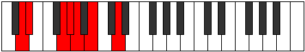

# Mode Rorimic

## Links

- [Documentation](index.md)
- [Scales Index](Scales.md)
- [Modes Index](Modes.md)
- [Chords Index](Chords.md)

## Parent Scale

[Kanimic](ScaleKanimic.md)

## Number

[739](https://ianring.com/musictheory/scales/739)

## Perfection

- 3 Perfect notes
- 3 Perfect notes

## Perfection Profile

[true false true true false false]

## Permutations

| Tonic | Notes | Signature | Illustration | Audio |
|-------|-------|-----------|--------------|-------|
| [C](ModeCNaturalRorimic.md) | C, **Db**, E#, F#, **G**, **A**, C | C |  | [midi](ModeCNaturalRorimic.mid) [ogg](ModeCNaturalRorimic.ogg) |
| [C#](ModeCSharpRorimic.md) | C#, **D**, E##, F##, **G#**, **A#**, C# | C |  | [midi](ModeCSharpRorimic.mid) [ogg](ModeCSharpRorimic.ogg) |
| [Db](ModeDFlatRorimic.md) | Db, **Ebb**, F#, G, **Ab**, **Bb**, Db | C |  | [midi](ModeDFlatRorimic.mid) [ogg](ModeDFlatRorimic.ogg) |
| [D](ModeDNaturalRorimic.md) | D, **Eb**, F##, G#, **A**, **B**, D | C |  | [midi](ModeDNaturalRorimic.mid) [ogg](ModeDNaturalRorimic.ogg) |
| [D#](ModeDSharpRorimic.md) | D#, **E**, F###, G##, **A#**, **B#**, D# | C |  | [midi](ModeDSharpRorimic.mid) [ogg](ModeDSharpRorimic.ogg) |
| [Eb](ModeEFlatRorimic.md) | Eb, **Fb**, G#, A, **Bb**, **C**, Eb | C |  | [midi](ModeEFlatRorimic.mid) [ogg](ModeEFlatRorimic.ogg) |
| [E](ModeENaturalRorimic.md) | E, **F**, G##, A#, **B**, **C#**, E | C |  | [midi](ModeENaturalRorimic.mid) [ogg](ModeENaturalRorimic.ogg) |
| [F](ModeFNaturalRorimic.md) | F, **Gb**, A#, B, **C**, **D**, F | C |  | [midi](ModeFNaturalRorimic.mid) [ogg](ModeFNaturalRorimic.ogg) |
| [F#](ModeFSharpRorimic.md) | F#, **G**, A##, B#, **C#**, **D#**, F# | C |  | [midi](ModeFSharpRorimic.mid) [ogg](ModeFSharpRorimic.ogg) |
| [Gb](ModeGFlatRorimic.md) | Gb, **Abb**, B, C, **Db**, **Eb**, Gb | C |  | [midi](ModeGFlatRorimic.mid) [ogg](ModeGFlatRorimic.ogg) |
| [G](ModeGNaturalRorimic.md) | G, **Ab**, B#, C#, **D**, **E**, G | C |  | [midi](ModeGNaturalRorimic.mid) [ogg](ModeGNaturalRorimic.ogg) |
| [G#](ModeGSharpRorimic.md) | G#, **A**, B##, C##, **D#**, **E#**, G# | C |  | [midi](ModeGSharpRorimic.mid) [ogg](ModeGSharpRorimic.ogg) |
| [Ab](ModeAFlatRorimic.md) | Ab, **Bbb**, C#, D, **Eb**, **F**, Ab | C |  | [midi](ModeAFlatRorimic.mid) [ogg](ModeAFlatRorimic.ogg) |
| [A](ModeANaturalRorimic.md) | A, **Bb**, C##, D#, **E**, **F#**, A | C |  | [midi](ModeANaturalRorimic.mid) [ogg](ModeANaturalRorimic.ogg) |
| [A#](ModeASharpRorimic.md) | A#, **B**, C###, D##, **E#**, **F##**, A# | C |  | [midi](ModeASharpRorimic.mid) [ogg](ModeASharpRorimic.ogg) |
| [Bb](ModeBFlatRorimic.md) | Bb, **Cb**, D#, E, **F**, **G**, Bb | C |  | [midi](ModeBFlatRorimic.mid) [ogg](ModeBFlatRorimic.ogg) |
| [B](ModeBNaturalRorimic.md) | B, **C**, D##, E#, **F#**, **G#**, B | C |  | [midi](ModeBNaturalRorimic.mid) [ogg](ModeBNaturalRorimic.ogg) |
