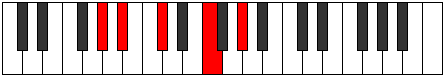
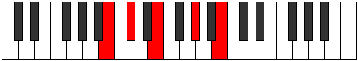

# Mode Rothic

## Links

- [Documentation](index.md)
- [Scales Index](Scales.md)
- [Modes Index](Modes.md)
- [Chords Index](Chords.md)

## Parent Scale

[Epathic](ScaleEpathic.md)

## Number

[549](https://ianring.com/musictheory/scales/549)

## Interval Pattern

2, 3, 4, 3

## Chord Pattern

ii, III

## Perfection

- 2 Perfect notes
- 2 Perfect notes

## Perfection Profile

[false true true false]

## Permutations

| Tonic | Notes | Signature | Illustration | Audio |
|-------|-------|-----------|--------------|-------|
| [C](ModeCNaturalRothic.md) | **C**, D, F, **A**, **C** | C |  | [midi](https://github.com/edipermadi/music/blob/main/docs/ModeCNaturalRothic.mid?raw=true) |
| [C#](ModeCSharpRothic.md) | **C#**, D#, F#, **A#**, **C#** | C |  | [midi](https://github.com/edipermadi/music/blob/main/docs/ModeCSharpRothic.mid?raw=true) |
| [Db](ModeDFlatRothic.md) | **Db**, Eb, Gb, **Bb**, **Db** | C |  | [midi](https://github.com/edipermadi/music/blob/main/docs/ModeDFlatRothic.mid?raw=true) |
| [D](ModeDNaturalRothic.md) | **D**, E, G, **B**, **D** | C |  | [midi](https://github.com/edipermadi/music/blob/main/docs/ModeDNaturalRothic.mid?raw=true) |
| [D#](ModeDSharpRothic.md) | **D#**, F, G#, **C**, **D#** | C |  | [midi](https://github.com/edipermadi/music/blob/main/docs/ModeDSharpRothic.mid?raw=true) |
| [Eb](ModeEFlatRothic.md) | **Eb**, F, Ab, **C**, **Eb** | C |  | [midi](https://github.com/edipermadi/music/blob/main/docs/ModeEFlatRothic.mid?raw=true) |
| [E](ModeENaturalRothic.md) | **E**, F#, A, **C#**, **E** | C |  | [midi](https://github.com/edipermadi/music/blob/main/docs/ModeENaturalRothic.mid?raw=true) |
| [F](ModeFNaturalRothic.md) | **F**, G, A#, **D**, **F** | C |  | [midi](https://github.com/edipermadi/music/blob/main/docs/ModeFNaturalRothic.mid?raw=true) |
| [F#](ModeFSharpRothic.md) | **F#**, G#, B, **D#**, **F#** | C |  | [midi](https://github.com/edipermadi/music/blob/main/docs/ModeFSharpRothic.mid?raw=true) |
| [Gb](ModeGFlatRothic.md) | **Gb**, Ab, B, **Eb**, **Gb** | C |  | [midi](https://github.com/edipermadi/music/blob/main/docs/ModeGFlatRothic.mid?raw=true) |
| [G](ModeGNaturalRothic.md) | **G**, A, C, **E**, **G** | C |  | [midi](https://github.com/edipermadi/music/blob/main/docs/ModeGNaturalRothic.mid?raw=true) |
| [G#](ModeGSharpRothic.md) | **G#**, A#, C#, **F**, **G#** | C |  | [midi](https://github.com/edipermadi/music/blob/main/docs/ModeGSharpRothic.mid?raw=true) |
| [Ab](ModeAFlatRothic.md) | **Ab**, Bb, Db, **F**, **Ab** | C |  | [midi](https://github.com/edipermadi/music/blob/main/docs/ModeAFlatRothic.mid?raw=true) |
| [A](ModeANaturalRothic.md) | **A**, B, D, **F#**, **A** | C |  | [midi](https://github.com/edipermadi/music/blob/main/docs/ModeANaturalRothic.mid?raw=true) |
| [A#](ModeASharpRothic.md) | **A#**, C, D#, **G**, **A#** | C |  | [midi](https://github.com/edipermadi/music/blob/main/docs/ModeASharpRothic.mid?raw=true) |
| [Bb](ModeBFlatRothic.md) | **Bb**, C, Eb, **G**, **Bb** | C |  | [midi](https://github.com/edipermadi/music/blob/main/docs/ModeBFlatRothic.mid?raw=true) |
| [B](ModeBNaturalRothic.md) | **B**, C#, E, **G#**, **B** | C |  | [midi](https://github.com/edipermadi/music/blob/main/docs/ModeBNaturalRothic.mid?raw=true) |
