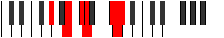

# Mode Rothimic

## Links

- [Documentation](README.md)
- [Scales Index](Scales.md)
- [Modes Index](Modes.md)
- [Chords Index](Chords.md)

## Parent Scale

[Mythimic](ScaleMythimic.md)

## Number

[3177](https://ianring.com/musictheory/scales/3177)

## Interval Pattern

3, 2, 1, 4, 1, 1

## Chord Pattern

VI

## Perfection

- 4 Perfect notes
- 2 Perfect notes

## Perfection Profile

[false true true false true true]

## Permutations

| Tonic | Notes | Signature | Illustration | Audio |
|-------|-------|-----------|--------------|-------|
| [C](ModeCNaturalRothimic.md) | **C**, D#, E#, **F#**, G###, A##, **C** | C |  | [midi](https://github.com/edipermadi/music/blob/main/docs/ModeCNaturalRothimic.mid?raw=true) |
| [C#](ModeCSharpRothimic.md) | **C#**, D##, E##, **F##**, Cb, Dbb, **C#** | C |  | [midi](https://github.com/edipermadi/music/blob/main/docs/ModeCSharpRothimic.mid?raw=true) |
| [Db](ModeDFlatRothimic.md) | **Db**, E, F#, **G**, A##, B#, **Db** | C |  | [midi](https://github.com/edipermadi/music/blob/main/docs/ModeDFlatRothimic.mid?raw=true) |
| [D](ModeDNaturalRothimic.md) | **D**, E#, F##, **G#**, A###, B##, **D** | C |  | [midi](https://github.com/edipermadi/music/blob/main/docs/ModeDNaturalRothimic.mid?raw=true) |
| [D#](ModeDSharpRothimic.md) | **D#**, E##, F###, **G##**, Db, Ebb, **D#** | C |  | [midi](https://github.com/edipermadi/music/blob/main/docs/ModeDSharpRothimic.mid?raw=true) |
| [Eb](ModeEFlatRothimic.md) | **Eb**, F#, G#, **A**, B##, C##, **Eb** | C |  | [midi](https://github.com/edipermadi/music/blob/main/docs/ModeEFlatRothimic.mid?raw=true) |
| [E](ModeENaturalRothimic.md) | **E**, F##, G##, **A#**, B###, C###, **E** | C |  | [midi](https://github.com/edipermadi/music/blob/main/docs/ModeENaturalRothimic.mid?raw=true) |
| [F](ModeFNaturalRothimic.md) | **F**, G#, A#, **B**, C###, D##, **F** | C |  | [midi](https://github.com/edipermadi/music/blob/main/docs/ModeFNaturalRothimic.mid?raw=true) |
| [F#](ModeFSharpRothimic.md) | **F#**, G##, A##, **B#**, D##, E#, **F#** | C |  | [midi](https://github.com/edipermadi/music/blob/main/docs/ModeFSharpRothimic.mid?raw=true) |
| [Gb](ModeGFlatRothimic.md) | **Gb**, A, B, **C**, D##, E#, **Gb** | C |  | [midi](https://github.com/edipermadi/music/blob/main/docs/ModeGFlatRothimic.mid?raw=true) |
| [G](ModeGNaturalRothimic.md) | **G**, A#, B#, **C#**, D###, E##, **G** | C |  | [midi](https://github.com/edipermadi/music/blob/main/docs/ModeGNaturalRothimic.mid?raw=true) |
| [G#](ModeGSharpRothimic.md) | **G#**, A##, B##, **C##**, E##, F##, **G#** | C |  | [midi](https://github.com/edipermadi/music/blob/main/docs/ModeGSharpRothimic.mid?raw=true) |
| [Ab](ModeAFlatRothimic.md) | **Ab**, B, C#, **D**, E##, F##, **Ab** | C |  | [midi](https://github.com/edipermadi/music/blob/main/docs/ModeAFlatRothimic.mid?raw=true) |
| [A](ModeANaturalRothimic.md) | **A**, B#, C##, **D#**, E###, F###, **A** | C |  | [midi](https://github.com/edipermadi/music/blob/main/docs/ModeANaturalRothimic.mid?raw=true) |
| [A#](ModeASharpRothimic.md) | **A#**, B##, C###, **D##**, F###, G##, **A#** | C |  | [midi](https://github.com/edipermadi/music/blob/main/docs/ModeASharpRothimic.mid?raw=true) |
| [Bb](ModeBFlatRothimic.md) | **Bb**, C#, D#, **E**, F###, G##, **Bb** | C |  | [midi](https://github.com/edipermadi/music/blob/main/docs/ModeBFlatRothimic.mid?raw=true) |
| [B](ModeBNaturalRothimic.md) | **B**, C##, D##, **E#**, Cbbb, Cbb, **B** | C |  | [midi](https://github.com/edipermadi/music/blob/main/docs/ModeBNaturalRothimic.mid?raw=true) |
