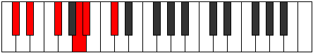

# Mode Rothitonic

## Links

- [Documentation](README.md)
- [Scales Index](Scales.md)
- [Modes Index](Modes.md)
- [Chords Index](Chords.md)

## Parent Scale

[Lyditonic](ScaleLyditonic.md)

## Number

[805](https://ianring.com/musictheory/scales/805)

## Transposition

2, 3, 3, 1, 3

## Chord Pattern

## Perfection

- 2 Perfect notes
- 3 Perfect notes

## Perfection Profile

false, true, true, false, false

## Permutations

| Tonic | Notes | Signature | Illustration | Audio |
|-------|-------|-----------|--------------|-------|
| [C](ModeCNaturalRothitonic.md) | **C**, D, F, **G#**, **A**, **C** | C |  | [midi](https://github.com/edipermadi/music/blob/main/docs/ModeCNaturalRothitonic.mid?raw=true) |
| [C#](ModeCSharpRothitonic.md) | **C#**, D#, F#, **A**, **A#**, **C#** | C |  | [midi](https://github.com/edipermadi/music/blob/main/docs/ModeCSharpRothitonic.mid?raw=true) |
| [Db](ModeDFlatRothitonic.md) | **Db**, Eb, Gb, **A**, **Bb**, **Db** | C |  | [midi](https://github.com/edipermadi/music/blob/main/docs/ModeDFlatRothitonic.mid?raw=true) |
| [D](ModeDNaturalRothitonic.md) | **D**, E, G, **A#**, **B**, **D** | C |  | [midi](https://github.com/edipermadi/music/blob/main/docs/ModeDNaturalRothitonic.mid?raw=true) |
| [D#](ModeDSharpRothitonic.md) | **D#**, F, G#, **B**, **C**, **D#** | C |  | [midi](https://github.com/edipermadi/music/blob/main/docs/ModeDSharpRothitonic.mid?raw=true) |
| [Eb](ModeEFlatRothitonic.md) | **Eb**, F, Ab, **B**, **C**, **Eb** | C |  | [midi](https://github.com/edipermadi/music/blob/main/docs/ModeEFlatRothitonic.mid?raw=true) |
| [E](ModeENaturalRothitonic.md) | **E**, F#, A, **C**, **C#**, **E** | C |  | [midi](https://github.com/edipermadi/music/blob/main/docs/ModeENaturalRothitonic.mid?raw=true) |
| [F](ModeFNaturalRothitonic.md) | **F**, G, A#, **C#**, **D**, **F** | C |  | [midi](https://github.com/edipermadi/music/blob/main/docs/ModeFNaturalRothitonic.mid?raw=true) |
| [F#](ModeFSharpRothitonic.md) | **F#**, G#, B, **D**, **D#**, **F#** | C |  | [midi](https://github.com/edipermadi/music/blob/main/docs/ModeFSharpRothitonic.mid?raw=true) |
| [Gb](ModeGFlatRothitonic.md) | **Gb**, Ab, B, **D**, **Eb**, **Gb** | C |  | [midi](https://github.com/edipermadi/music/blob/main/docs/ModeGFlatRothitonic.mid?raw=true) |
| [G](ModeGNaturalRothitonic.md) | **G**, A, C, **D#**, **E**, **G** | C |  | [midi](https://github.com/edipermadi/music/blob/main/docs/ModeGNaturalRothitonic.mid?raw=true) |
| [G#](ModeGSharpRothitonic.md) | **G#**, A#, C#, **E**, **F**, **G#** | C |  | [midi](https://github.com/edipermadi/music/blob/main/docs/ModeGSharpRothitonic.mid?raw=true) |
| [Ab](ModeAFlatRothitonic.md) | **Ab**, Bb, Db, **E**, **F**, **Ab** | C |  | [midi](https://github.com/edipermadi/music/blob/main/docs/ModeAFlatRothitonic.mid?raw=true) |
| [A](ModeANaturalRothitonic.md) | **A**, B, D, **F**, **F#**, **A** | C |  | [midi](https://github.com/edipermadi/music/blob/main/docs/ModeANaturalRothitonic.mid?raw=true) |
| [A#](ModeASharpRothitonic.md) | **A#**, C, D#, **F#**, **G**, **A#** | C |  | [midi](https://github.com/edipermadi/music/blob/main/docs/ModeASharpRothitonic.mid?raw=true) |
| [Bb](ModeBFlatRothitonic.md) | **Bb**, C, Eb, **Gb**, **G**, **Bb** | C |  | [midi](https://github.com/edipermadi/music/blob/main/docs/ModeBFlatRothitonic.mid?raw=true) |
| [B](ModeBNaturalRothitonic.md) | **B**, C#, E, **G**, **G#**, **B** | C |  | [midi](https://github.com/edipermadi/music/blob/main/docs/ModeBNaturalRothitonic.mid?raw=true) |
