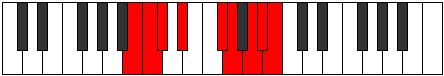

# Mode Rothyllic

## Links

- [Documentation](index.md)
- [Scales Index](Scales.md)
- [Modes Index](Modes.md)
- [Chords Index](Chords.md)

## Parent Scale

[Stacryllic](ScaleStacryllic.md)

## Number

[3479](https://ianring.com/musictheory/scales/3479)

## Interval Pattern

1, 1, 2, 3, 1, 2, 1, 1

## Chord Pattern

I, I⁺, ii⁰, ii, IV⁺, iv⁰, iv, IV, v⁰, v, V, VI⁺, vi⁰, vii⁰

## Perfection

- 4 Perfect notes
- 4 Perfect notes

## Perfection Profile

[true true false true true false false false]

## Permutations

| Tonic | Notes | Signature | Illustration | Audio |
|-------|-------|-----------|--------------|-------|
| [C](ModeCNaturalRothyllic.md) | C, C#, **D**, E, G, **G#**, **A#**, **B**, C | C |  | [midi](https://github.com/edipermadi/music/blob/main/docs/ModeCNaturalRothyllic.mid?raw=true) |
| [C#](ModeCSharpRothyllic.md) | C#, D, **D#**, F, G#, **A**, **B**, **C**, C# | C |  | [midi](https://github.com/edipermadi/music/blob/main/docs/ModeCSharpRothyllic.mid?raw=true) |
| [Db](ModeDFlatRothyllic.md) | Db, D, **Eb**, F, Ab, **A**, **B**, **C**, Db | C |  | [midi](https://github.com/edipermadi/music/blob/main/docs/ModeDFlatRothyllic.mid?raw=true) |
| [D](ModeDNaturalRothyllic.md) | D, D#, **E**, F#, A, **A#**, **C**, **C#**, D | C |  | [midi](https://github.com/edipermadi/music/blob/main/docs/ModeDNaturalRothyllic.mid?raw=true) |
| [D#](ModeDSharpRothyllic.md) | D#, E, **F**, G, A#, **B**, **C#**, **D**, D# | C |  | [midi](https://github.com/edipermadi/music/blob/main/docs/ModeDSharpRothyllic.mid?raw=true) |
| [Eb](ModeEFlatRothyllic.md) | Eb, E, **F**, G, Bb, **B**, **Db**, **D**, Eb | C |  | [midi](https://github.com/edipermadi/music/blob/main/docs/ModeEFlatRothyllic.mid?raw=true) |
| [E](ModeENaturalRothyllic.md) | E, F, **F#**, G#, B, **C**, **D**, **D#**, E | C |  | [midi](https://github.com/edipermadi/music/blob/main/docs/ModeENaturalRothyllic.mid?raw=true) |
| [F](ModeFNaturalRothyllic.md) | F, F#, **G**, A, C, **C#**, **D#**, **E**, F | C |  | [midi](https://github.com/edipermadi/music/blob/main/docs/ModeFNaturalRothyllic.mid?raw=true) |
| [F#](ModeFSharpRothyllic.md) | F#, G, **G#**, A#, C#, **D**, **E**, **F**, F# | C |  | [midi](https://github.com/edipermadi/music/blob/main/docs/ModeFSharpRothyllic.mid?raw=true) |
| [Gb](ModeGFlatRothyllic.md) | Gb, G, **Ab**, Bb, Db, **D**, **E**, **F**, Gb | C |  | [midi](https://github.com/edipermadi/music/blob/main/docs/ModeGFlatRothyllic.mid?raw=true) |
| [G](ModeGNaturalRothyllic.md) | G, G#, **A**, B, D, **D#**, **F**, **F#**, G | C |  | [midi](https://github.com/edipermadi/music/blob/main/docs/ModeGNaturalRothyllic.mid?raw=true) |
| [G#](ModeGSharpRothyllic.md) | G#, A, **A#**, C, D#, **E**, **F#**, **G**, G# | C |  | [midi](https://github.com/edipermadi/music/blob/main/docs/ModeGSharpRothyllic.mid?raw=true) |
| [Ab](ModeAFlatRothyllic.md) | Ab, A, **Bb**, C, Eb, **E**, **Gb**, **G**, Ab | C |  | [midi](https://github.com/edipermadi/music/blob/main/docs/ModeAFlatRothyllic.mid?raw=true) |
| [A](ModeANaturalRothyllic.md) | A, A#, **B**, C#, E, **F**, **G**, **G#**, A | C |  | [midi](https://github.com/edipermadi/music/blob/main/docs/ModeANaturalRothyllic.mid?raw=true) |
| [A#](ModeASharpRothyllic.md) | A#, B, **C**, D, F, **F#**, **G#**, **A**, A# | C |  | [midi](https://github.com/edipermadi/music/blob/main/docs/ModeASharpRothyllic.mid?raw=true) |
| [Bb](ModeBFlatRothyllic.md) | Bb, B, **C**, D, F, **Gb**, **Ab**, **A**, Bb | C |  | [midi](https://github.com/edipermadi/music/blob/main/docs/ModeBFlatRothyllic.mid?raw=true) |
| [B](ModeBNaturalRothyllic.md) | B, C, **C#**, D#, F#, **G**, **A**, **A#**, B | C |  | [midi](https://github.com/edipermadi/music/blob/main/docs/ModeBNaturalRothyllic.mid?raw=true) |
