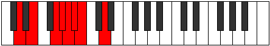
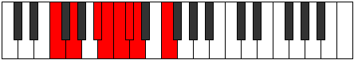
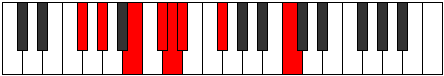
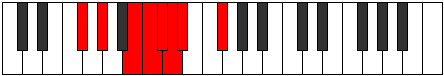

# Mode Rycrian

## Links

- [Documentation](index.md)
- [Scales Index](Scales.md)
- [Modes Index](Modes.md)
- [Chords Index](Chords.md)

## Parent Scale

[Morian](ScaleMorian.md)

## Number

[997](https://ianring.com/musictheory/scales/997)

## Perfection

- 4 Perfect notes
- 3 Perfect notes

## Perfection Profile

[true true true false true false false]

## Permutations

| Tonic | Notes | Signature | Illustration | Audio |
|-------|-------|-----------|--------------|-------|
| [C](ModeCNaturalRycrian.md) | C, D, E#, **F#**, G, **Ab**, **Bbb**, C | C |  | [midi](ModeCNaturalRycrian.mid) [ogg](ModeCNaturalRycrian.ogg) |
| [C#](ModeCSharpRycrian.md) | C#, D#, E##, **F##**, G#, **A**, **Bb**, C# | C |  | [midi](ModeCSharpRycrian.mid) [ogg](ModeCSharpRycrian.ogg) |
| [Db](ModeDFlatRycrian.md) | Db, Eb, F#, **G**, Ab, **Bbb**, **Cbb**, Db | C |  | [midi](ModeDFlatRycrian.mid) [ogg](ModeDFlatRycrian.ogg) |
| [D](ModeDNaturalRycrian.md) | D, E, F##, **G#**, A, **Bb**, **Cb**, D | C |  | [midi](ModeDNaturalRycrian.mid) [ogg](ModeDNaturalRycrian.ogg) |
| [D#](ModeDSharpRycrian.md) | D#, E#, F###, **G##**, A#, **B**, **C**, D# | C |  | [midi](ModeDSharpRycrian.mid) [ogg](ModeDSharpRycrian.ogg) |
| [Eb](ModeEFlatRycrian.md) | Eb, F, G#, **A**, Bb, **Cb**, **Dbb**, Eb | C |  | [midi](ModeEFlatRycrian.mid) [ogg](ModeEFlatRycrian.ogg) |
| [E](ModeENaturalRycrian.md) | E, F#, G##, **A#**, B, **C**, **Db**, E | C |  | [midi](ModeENaturalRycrian.mid) [ogg](ModeENaturalRycrian.ogg) |
| [F](ModeFNaturalRycrian.md) | F, G, A#, **B**, C, **Db**, **Ebb**, F | C |  | [midi](ModeFNaturalRycrian.mid) [ogg](ModeFNaturalRycrian.ogg) |
| [F#](ModeFSharpRycrian.md) | F#, G#, A##, **B#**, C#, **D**, **Eb**, F# | C |  | [midi](ModeFSharpRycrian.mid) [ogg](ModeFSharpRycrian.ogg) |
| [Gb](ModeGFlatRycrian.md) | Gb, Ab, B, **C**, Db, **Ebb**, **Fbb**, Gb | C |  | [midi](ModeGFlatRycrian.mid) [ogg](ModeGFlatRycrian.ogg) |
| [G](ModeGNaturalRycrian.md) | G, A, B#, **C#**, D, **Eb**, **Fb**, G | C |  | [midi](ModeGNaturalRycrian.mid) [ogg](ModeGNaturalRycrian.ogg) |
| [G#](ModeGSharpRycrian.md) | G#, A#, B##, **C##**, D#, **E**, **F**, G# | C |  | [midi](ModeGSharpRycrian.mid) [ogg](ModeGSharpRycrian.ogg) |
| [Ab](ModeAFlatRycrian.md) | Ab, Bb, C#, **D**, Eb, **Fb**, **Gbb**, Ab | C |  | [midi](ModeAFlatRycrian.mid) [ogg](ModeAFlatRycrian.ogg) |
| [A](ModeANaturalRycrian.md) | A, B, C##, **D#**, E, **F**, **Gb**, A | C |  | [midi](ModeANaturalRycrian.mid) [ogg](ModeANaturalRycrian.ogg) |
| [A#](ModeASharpRycrian.md) | A#, B#, C###, **D##**, E#, **F#**, **G**, A# | C |  | [midi](ModeASharpRycrian.mid) [ogg](ModeASharpRycrian.ogg) |
| [Bb](ModeBFlatRycrian.md) | Bb, C, D#, **E**, F, **Gb**, **Abb**, Bb | C |  | [midi](ModeBFlatRycrian.mid) [ogg](ModeBFlatRycrian.ogg) |
| [B](ModeBNaturalRycrian.md) | B, C#, D##, **E#**, F#, **G**, **Ab**, B | C |  | [midi](ModeBNaturalRycrian.mid) [ogg](ModeBNaturalRycrian.ogg) |
