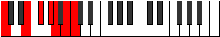
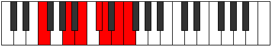

# Mode Rycrimic

## Links

- [Documentation](index.md)
- [Scales Index](Scales.md)
- [Modes Index](Modes.md)
- [Chords Index](Chords.md)

## Parent Scale

[Rycrimic](ScaleRycrimic.md)

## Number

[2897](https://ianring.com/musictheory/scales/2897)

## Perfection

- 3 Perfect notes
- 3 Perfect notes

## Perfection Profile

[false true false false true true]

## Permutations

| Tonic | Notes | Signature | Illustration | Audio |
|-------|-------|-----------|--------------|-------|
| [C](ModeCNaturalRycrimic.md) | **C**, D##, **E##**, **F###**, G##, A##, **C** | C |  | [midi](ModeCNaturalRycrimic.mid) [ogg](ModeCNaturalRycrimic.ogg) |
| [C#](ModeCSharpRycrimic.md) | **C#**, D###, **E###**, **Cbbb**, Cbb, Dbb, **C#** | C |  | [midi](ModeCSharpRycrimic.mid) [ogg](ModeCSharpRycrimic.ogg) |
| [Db](ModeDFlatRycrimic.md) | **Db**, E#, **F##**, **G##**, A#, B#, **Db** | C |  | [midi](ModeDFlatRycrimic.mid) [ogg](ModeDFlatRycrimic.ogg) |
| [D](ModeDNaturalRycrimic.md) | **D**, E##, **F###**, **G###**, A##, B##, **D** | C |  | [midi](ModeDNaturalRycrimic.mid) [ogg](ModeDNaturalRycrimic.ogg) |
| [D#](ModeDSharpRycrimic.md) | **D#**, E###, **Cbbb**, **Dbbb**, Dbb, Ebb, **D#** | C |  | [midi](ModeDSharpRycrimic.mid) [ogg](ModeDSharpRycrimic.ogg) |
| [Eb](ModeEFlatRycrimic.md) | **Eb**, F##, **G##**, **A##**, B#, C##, **Eb** | C |  | [midi](ModeEFlatRycrimic.mid) [ogg](ModeEFlatRycrimic.ogg) |
| [E](ModeENaturalRycrimic.md) | **E**, F###, **G###**, **A###**, B##, C###, **E** | C |  | [midi](ModeENaturalRycrimic.mid) [ogg](ModeENaturalRycrimic.ogg) |
| [F](ModeFNaturalRycrimic.md) | **F**, G##, **A##**, **B##**, C##, D##, **F** | C |  | [midi](ModeFNaturalRycrimic.mid) [ogg](ModeFNaturalRycrimic.ogg) |
| [F#](ModeFSharpRycrimic.md) | **F#**, G###, **A###**, **B###**, C###, D###, **F#** | C |  | [midi](ModeFSharpRycrimic.mid) [ogg](ModeFSharpRycrimic.ogg) |
| [Gb](ModeGFlatRycrimic.md) | **Gb**, A#, **B#**, **C##**, D#, E#, **Gb** | C |  | [midi](ModeGFlatRycrimic.mid) [ogg](ModeGFlatRycrimic.ogg) |
| [G](ModeGNaturalRycrimic.md) | **G**, A##, **B##**, **C###**, D##, E##, **G** | C |  | [midi](ModeGNaturalRycrimic.mid) [ogg](ModeGNaturalRycrimic.ogg) |
| [G#](ModeGSharpRycrimic.md) | **G#**, A###, **B###**, **D##**, E#, F##, **G#** | C |  | [midi](ModeGSharpRycrimic.mid) [ogg](ModeGSharpRycrimic.ogg) |
| [Ab](ModeAFlatRycrimic.md) | **Ab**, B#, **C##**, **D##**, E#, F##, **Ab** | C |  | [midi](ModeAFlatRycrimic.mid) [ogg](ModeAFlatRycrimic.ogg) |
| [A](ModeANaturalRycrimic.md) | **A**, B##, **C###**, **D###**, E##, F###, **A** | C |  | [midi](ModeANaturalRycrimic.mid) [ogg](ModeANaturalRycrimic.ogg) |
| [A#](ModeASharpRycrimic.md) | **A#**, B###, **D##**, **E##**, F##, G##, **A#** | C |  | [midi](ModeASharpRycrimic.mid) [ogg](ModeASharpRycrimic.ogg) |
| [Bb](ModeBFlatRycrimic.md) | **Bb**, C##, **D##**, **E##**, F##, G##, **Bb** | C |  | [midi](ModeBFlatRycrimic.mid) [ogg](ModeBFlatRycrimic.ogg) |
| [B](ModeBNaturalRycrimic.md) | **B**, C###, **D###**, **E###**, F###, G###, **B** | C |  | [midi](ModeBNaturalRycrimic.mid) [ogg](ModeBNaturalRycrimic.ogg) |
