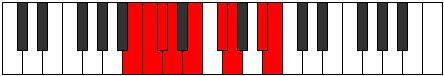

# Mode Rycryllic

## Links

- [Documentation](index.md)
- [Scales Index](Scales.md)
- [Modes Index](Modes.md)
- [Chords Index](Chords.md)

## Parent Scale

[Gythyllic](ScaleGythyllic.md)

## Number

[2479](https://ianring.com/musictheory/scales/2479)

## Perfection

- 5 Perfect notes
- 3 Perfect notes

## Perfection Profile

[true true false false true true true false]

## Permutations

| Tonic | Notes | Signature | Illustration | Audio |
|-------|-------|-----------|--------------|-------|
| [C](ModeCNaturalRycryllic.md) | C, C#, **D**, **D#**, F, G, G#, **B**, C | C |  | [midi](https://github.com/edipermadi/music/blob/main/docs/ModeCNaturalRycryllic.mid?raw=true) |
| [C#](ModeCSharpRycryllic.md) | C#, D, **D#**, **E**, F#, G#, A, **C**, C# | C |  | [midi](https://github.com/edipermadi/music/blob/main/docs/ModeCSharpRycryllic.mid?raw=true) |
| [Db](ModeDFlatRycryllic.md) | Db, D, **Eb**, **E**, Gb, Ab, A, **C**, Db | C |  | [midi](https://github.com/edipermadi/music/blob/main/docs/ModeDFlatRycryllic.mid?raw=true) |
| [D](ModeDNaturalRycryllic.md) | D, D#, **E**, **F**, G, A, A#, **C#**, D | C |  | [midi](https://github.com/edipermadi/music/blob/main/docs/ModeDNaturalRycryllic.mid?raw=true) |
| [D#](ModeDSharpRycryllic.md) | D#, E, **F**, **F#**, G#, A#, B, **D**, D# | C |  | [midi](https://github.com/edipermadi/music/blob/main/docs/ModeDSharpRycryllic.mid?raw=true) |
| [Eb](ModeEFlatRycryllic.md) | Eb, E, **F**, **Gb**, Ab, Bb, B, **D**, Eb | C |  | [midi](https://github.com/edipermadi/music/blob/main/docs/ModeEFlatRycryllic.mid?raw=true) |
| [E](ModeENaturalRycryllic.md) | E, F, **F#**, **G**, A, B, C, **D#**, E | C |  | [midi](https://github.com/edipermadi/music/blob/main/docs/ModeENaturalRycryllic.mid?raw=true) |
| [F](ModeFNaturalRycryllic.md) | F, F#, **G**, **G#**, A#, C, C#, **E**, F | C |  | [midi](https://github.com/edipermadi/music/blob/main/docs/ModeFNaturalRycryllic.mid?raw=true) |
| [F#](ModeFSharpRycryllic.md) | F#, G, **G#**, **A**, B, C#, D, **F**, F# | C |  | [midi](https://github.com/edipermadi/music/blob/main/docs/ModeFSharpRycryllic.mid?raw=true) |
| [Gb](ModeGFlatRycryllic.md) | Gb, G, **Ab**, **A**, B, Db, D, **F**, Gb | C |  | [midi](https://github.com/edipermadi/music/blob/main/docs/ModeGFlatRycryllic.mid?raw=true) |
| [G](ModeGNaturalRycryllic.md) | G, G#, **A**, **A#**, C, D, D#, **F#**, G | C |  | [midi](https://github.com/edipermadi/music/blob/main/docs/ModeGNaturalRycryllic.mid?raw=true) |
| [G#](ModeGSharpRycryllic.md) | G#, A, **A#**, **B**, C#, D#, E, **G**, G# | C |  | [midi](https://github.com/edipermadi/music/blob/main/docs/ModeGSharpRycryllic.mid?raw=true) |
| [Ab](ModeAFlatRycryllic.md) | Ab, A, **Bb**, **B**, Db, Eb, E, **G**, Ab | C |  | [midi](https://github.com/edipermadi/music/blob/main/docs/ModeAFlatRycryllic.mid?raw=true) |
| [A](ModeANaturalRycryllic.md) | A, A#, **B**, **C**, D, E, F, **G#**, A | C |  | [midi](https://github.com/edipermadi/music/blob/main/docs/ModeANaturalRycryllic.mid?raw=true) |
| [A#](ModeASharpRycryllic.md) | A#, B, **C**, **C#**, D#, F, F#, **A**, A# | C |  | [midi](https://github.com/edipermadi/music/blob/main/docs/ModeASharpRycryllic.mid?raw=true) |
| [Bb](ModeBFlatRycryllic.md) | Bb, B, **C**, **Db**, Eb, F, Gb, **A**, Bb | C |  | [midi](https://github.com/edipermadi/music/blob/main/docs/ModeBFlatRycryllic.mid?raw=true) |
| [B](ModeBNaturalRycryllic.md) | B, C, **C#**, **D**, E, F#, G, **A#**, B | C |  | [midi](https://github.com/edipermadi/music/blob/main/docs/ModeBNaturalRycryllic.mid?raw=true) |
