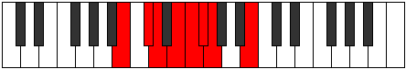

# Mode Rygian

## Links

- [Documentation](index.md)
- [Scales Index](Scales.md)
- [Modes Index](Modes.md)
- [Chords Index](Chords.md)

## Parent Scale

[Aeopian](ScaleAeopian.md)

## Number

[493](https://ianring.com/musictheory/scales/493)

## Perfection

- 4 Perfect notes
- 3 Perfect notes

## Perfection Profile

[true false false true false true true]

## Permutations

| Tonic | Notes | Signature | Illustration | Audio |
|-------|-------|-----------|--------------|-------|
| [C](ModeCNaturalRygian.md) | C, **D**, **Eb**, F, **Gb**, Abb, Bbbb, C | C |  | [midi](ModeCNaturalRygian.mid) [ogg](ModeCNaturalRygian.ogg) |
| [C#](ModeCSharpRygian.md) | C#, **D#**, **E**, F#, **G**, Ab, Bbb, C# | C |  | [midi](ModeCSharpRygian.mid) [ogg](ModeCSharpRygian.ogg) |
| [Db](ModeDFlatRygian.md) | Db, **Eb**, **Fb**, Gb, **Abb**, Bbbb, Cbbb, Db | C |  | [midi](ModeDFlatRygian.mid) [ogg](ModeDFlatRygian.ogg) |
| [D](ModeDNaturalRygian.md) | D, **E**, **F**, G, **Ab**, Bbb, Cbb, D | C |  | [midi](ModeDNaturalRygian.mid) [ogg](ModeDNaturalRygian.ogg) |
| [D#](ModeDSharpRygian.md) | D#, **E#**, **F#**, G#, **A**, Bb, Cb, D# | C |  | [midi](ModeDSharpRygian.mid) [ogg](ModeDSharpRygian.ogg) |
| [Eb](ModeEFlatRygian.md) | Eb, **F**, **Gb**, Ab, **Bbb**, Cbb, Dbbb, Eb | C |  | [midi](ModeEFlatRygian.mid) [ogg](ModeEFlatRygian.ogg) |
| [E](ModeENaturalRygian.md) | E, **F#**, **G**, A, **Bb**, Cb, Dbb, E | C |  | [midi](ModeENaturalRygian.mid) [ogg](ModeENaturalRygian.ogg) |
| [F](ModeFNaturalRygian.md) | F, **G**, **Ab**, Bb, **Cb**, Dbb, Ebbb, F | C |  | [midi](ModeFNaturalRygian.mid) [ogg](ModeFNaturalRygian.ogg) |
| [F#](ModeFSharpRygian.md) | F#, **G#**, **A**, B, **C**, Db, Ebb, F# | C |  | [midi](ModeFSharpRygian.mid) [ogg](ModeFSharpRygian.ogg) |
| [Gb](ModeGFlatRygian.md) | Gb, **Ab**, **Bbb**, Cb, **Dbb**, Ebbb, Fbbb, Gb | C |  | [midi](ModeGFlatRygian.mid) [ogg](ModeGFlatRygian.ogg) |
| [G](ModeGNaturalRygian.md) | G, **A**, **Bb**, C, **Db**, Ebb, Fbb, G | C |  | [midi](ModeGNaturalRygian.mid) [ogg](ModeGNaturalRygian.ogg) |
| [G#](ModeGSharpRygian.md) | G#, **A#**, **B**, C#, **D**, Eb, Fb, G# | C |  | [midi](ModeGSharpRygian.mid) [ogg](ModeGSharpRygian.ogg) |
| [Ab](ModeAFlatRygian.md) | Ab, **Bb**, **Cb**, Db, **Ebb**, Fbb, Gbbb, Ab | C |  | [midi](ModeAFlatRygian.mid) [ogg](ModeAFlatRygian.ogg) |
| [A](ModeANaturalRygian.md) | A, **B**, **C**, D, **Eb**, Fb, Gbb, A | C |  | [midi](ModeANaturalRygian.mid) [ogg](ModeANaturalRygian.ogg) |
| [A#](ModeASharpRygian.md) | A#, **B#**, **C#**, D#, **E**, F, Gb, A# | C |  | [midi](ModeASharpRygian.mid) [ogg](ModeASharpRygian.ogg) |
| [Bb](ModeBFlatRygian.md) | Bb, **C**, **Db**, Eb, **Fb**, Gbb, Abbb, Bb | C |  | [midi](ModeBFlatRygian.mid) [ogg](ModeBFlatRygian.ogg) |
| [B](ModeBNaturalRygian.md) | B, **C#**, **D**, E, **F**, Gb, Abb, B | C |  | [midi](ModeBNaturalRygian.mid) [ogg](ModeBNaturalRygian.ogg) |
