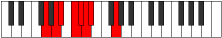

# Mode Rygian

## Links

- [Documentation](README.md)
- [Scales Index](Scales.md)
- [Modes Index](Modes.md)
- [Chords Index](Chords.md)

## Parent Scale

[Aeopian](ScaleAeopian.md)

## Number

[493](https://ianring.com/musictheory/scales/493)

## Luminosity

-1

## Transposition

2, 1, 2, 1, 1, 1, 4

## Chord Pattern

i⁰

## Perfection

- 4 Perfect notes
- 3 Perfect notes

## Perfection Profile

true, false, false, true, false, true, true

## Permutations

| Tonic | Notes | Signature | Illustration | Audio |
|-------|-------|-----------|--------------|-------|
| [C](ModeCNaturalRygian.md) | C, **D**, **Eb**, F, **Gb**, Abb, Bbbb, C | C |  | [midi](https://github.com/edipermadi/music/blob/main/docs/ModeCNaturalRygian.mid?raw=true) |
| [C#](ModeCSharpRygian.md) | C#, **D#**, **E**, F#, **G**, Ab, Bbb, C# | C |  | [midi](https://github.com/edipermadi/music/blob/main/docs/ModeCSharpRygian.mid?raw=true) |
| [Db](ModeDFlatRygian.md) | Db, **Eb**, **Fb**, Gb, **Abb**, Bbbb, Cbbb, Db | C |  | [midi](https://github.com/edipermadi/music/blob/main/docs/ModeDFlatRygian.mid?raw=true) |
| [D](ModeDNaturalRygian.md) | D, **E**, **F**, G, **Ab**, Bbb, Cbb, D | C |  | [midi](https://github.com/edipermadi/music/blob/main/docs/ModeDNaturalRygian.mid?raw=true) |
| [D#](ModeDSharpRygian.md) | D#, **E#**, **F#**, G#, **A**, Bb, Cb, D# | C |  | [midi](https://github.com/edipermadi/music/blob/main/docs/ModeDSharpRygian.mid?raw=true) |
| [Eb](ModeEFlatRygian.md) | Eb, **F**, **Gb**, Ab, **Bbb**, Cbb, Dbbb, Eb | C |  | [midi](https://github.com/edipermadi/music/blob/main/docs/ModeEFlatRygian.mid?raw=true) |
| [E](ModeENaturalRygian.md) | E, **F#**, **G**, A, **Bb**, Cb, Dbb, E | C |  | [midi](https://github.com/edipermadi/music/blob/main/docs/ModeENaturalRygian.mid?raw=true) |
| [F](ModeFNaturalRygian.md) | F, **G**, **Ab**, Bb, **Cb**, Dbb, Ebbb, F | C |  | [midi](https://github.com/edipermadi/music/blob/main/docs/ModeFNaturalRygian.mid?raw=true) |
| [F#](ModeFSharpRygian.md) | F#, **G#**, **A**, B, **C**, Db, Ebb, F# | C |  | [midi](https://github.com/edipermadi/music/blob/main/docs/ModeFSharpRygian.mid?raw=true) |
| [Gb](ModeGFlatRygian.md) | Gb, **Ab**, **Bbb**, Cb, **Dbb**, Ebbb, Fbbb, Gb | C |  | [midi](https://github.com/edipermadi/music/blob/main/docs/ModeGFlatRygian.mid?raw=true) |
| [G](ModeGNaturalRygian.md) | G, **A**, **Bb**, C, **Db**, Ebb, Fbb, G | C |  | [midi](https://github.com/edipermadi/music/blob/main/docs/ModeGNaturalRygian.mid?raw=true) |
| [G#](ModeGSharpRygian.md) | G#, **A#**, **B**, C#, **D**, Eb, Fb, G# | C |  | [midi](https://github.com/edipermadi/music/blob/main/docs/ModeGSharpRygian.mid?raw=true) |
| [Ab](ModeAFlatRygian.md) | Ab, **Bb**, **Cb**, Db, **Ebb**, Fbb, Gbbb, Ab | C |  | [midi](https://github.com/edipermadi/music/blob/main/docs/ModeAFlatRygian.mid?raw=true) |
| [A](ModeANaturalRygian.md) | A, **B**, **C**, D, **Eb**, Fb, Gbb, A | C |  | [midi](https://github.com/edipermadi/music/blob/main/docs/ModeANaturalRygian.mid?raw=true) |
| [A#](ModeASharpRygian.md) | A#, **B#**, **C#**, D#, **E**, F, Gb, A# | C |  | [midi](https://github.com/edipermadi/music/blob/main/docs/ModeASharpRygian.mid?raw=true) |
| [Bb](ModeBFlatRygian.md) | Bb, **C**, **Db**, Eb, **Fb**, Gbb, Abbb, Bb | C |  | [midi](https://github.com/edipermadi/music/blob/main/docs/ModeBFlatRygian.mid?raw=true) |
| [B](ModeBNaturalRygian.md) | B, **C#**, **D**, E, **F**, Gb, Abb, B | C |  | [midi](https://github.com/edipermadi/music/blob/main/docs/ModeBNaturalRygian.mid?raw=true) |
