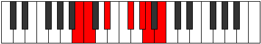

# Mode Rygimic

## Links

- [Documentation](README.md)
- [Scales Index](Scales.md)
- [Modes Index](Modes.md)
- [Chords Index](Chords.md)

## Parent Scale

[Thoptimic](ScaleThoptimic.md)

## Number

[1683](https://ianring.com/musictheory/scales/1683)

## Transposition

1, 3, 3, 2, 1, 2

## Chord Pattern

iv⁰, v

## Perfection

- 2 Perfect notes
- 4 Perfect notes

## Perfection Profile

true, false, false, false, true, false

## Permutations

| Tonic | Notes | Signature | Illustration | Audio |
|-------|-------|-----------|--------------|-------|
| [C](ModeCNaturalRygimic.md) | C, **Db**, **E**, **F##**, G##, **A#**, C | C |  | [midi](https://github.com/edipermadi/music/blob/main/docs/ModeCNaturalRygimic.mid?raw=true) |
| [C#](ModeCSharpRygimic.md) | C#, **D**, **E#**, **F###**, G###, **A##**, C# | C |  | [midi](https://github.com/edipermadi/music/blob/main/docs/ModeCSharpRygimic.mid?raw=true) |
| [Db](ModeDFlatRygimic.md) | Db, **Ebb**, **F**, **G#**, A#, **B**, Db | C |  | [midi](https://github.com/edipermadi/music/blob/main/docs/ModeDFlatRygimic.mid?raw=true) |
| [D](ModeDNaturalRygimic.md) | D, **Eb**, **F#**, **G##**, A##, **B#**, D | C |  | [midi](https://github.com/edipermadi/music/blob/main/docs/ModeDNaturalRygimic.mid?raw=true) |
| [D#](ModeDSharpRygimic.md) | D#, **E**, **F##**, **G###**, A###, **B##**, D# | C |  | [midi](https://github.com/edipermadi/music/blob/main/docs/ModeDSharpRygimic.mid?raw=true) |
| [Eb](ModeEFlatRygimic.md) | Eb, **Fb**, **G**, **A#**, B#, **C#**, Eb | C |  | [midi](https://github.com/edipermadi/music/blob/main/docs/ModeEFlatRygimic.mid?raw=true) |
| [E](ModeENaturalRygimic.md) | E, **F**, **G#**, **A##**, B##, **C##**, E | C |  | [midi](https://github.com/edipermadi/music/blob/main/docs/ModeENaturalRygimic.mid?raw=true) |
| [F](ModeFNaturalRygimic.md) | F, **Gb**, **A**, **B#**, C##, **D#**, F | C |  | [midi](https://github.com/edipermadi/music/blob/main/docs/ModeFNaturalRygimic.mid?raw=true) |
| [F#](ModeFSharpRygimic.md) | F#, **G**, **A#**, **B##**, C###, **D##**, F# | C |  | [midi](https://github.com/edipermadi/music/blob/main/docs/ModeFSharpRygimic.mid?raw=true) |
| [Gb](ModeGFlatRygimic.md) | Gb, **Abb**, **Bb**, **C#**, D#, **E**, Gb | C |  | [midi](https://github.com/edipermadi/music/blob/main/docs/ModeGFlatRygimic.mid?raw=true) |
| [G](ModeGNaturalRygimic.md) | G, **Ab**, **B**, **C##**, D##, **E#**, G | C |  | [midi](https://github.com/edipermadi/music/blob/main/docs/ModeGNaturalRygimic.mid?raw=true) |
| [G#](ModeGSharpRygimic.md) | G#, **A**, **B#**, **C###**, D###, **E##**, G# | C |  | [midi](https://github.com/edipermadi/music/blob/main/docs/ModeGSharpRygimic.mid?raw=true) |
| [Ab](ModeAFlatRygimic.md) | Ab, **Bbb**, **C**, **D#**, E#, **F#**, Ab | C |  | [midi](https://github.com/edipermadi/music/blob/main/docs/ModeAFlatRygimic.mid?raw=true) |
| [A](ModeANaturalRygimic.md) | A, **Bb**, **C#**, **D##**, E##, **F##**, A | C |  | [midi](https://github.com/edipermadi/music/blob/main/docs/ModeANaturalRygimic.mid?raw=true) |
| [A#](ModeASharpRygimic.md) | A#, **B**, **C##**, **D###**, E###, **F###**, A# | C |  | [midi](https://github.com/edipermadi/music/blob/main/docs/ModeASharpRygimic.mid?raw=true) |
| [Bb](ModeBFlatRygimic.md) | Bb, **Cb**, **D**, **E#**, F##, **G#**, Bb | C |  | [midi](https://github.com/edipermadi/music/blob/main/docs/ModeBFlatRygimic.mid?raw=true) |
| [B](ModeBNaturalRygimic.md) | B, **C**, **D#**, **E##**, F###, **G##**, B | C |  | [midi](https://github.com/edipermadi/music/blob/main/docs/ModeBNaturalRygimic.mid?raw=true) |
