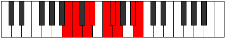

# Mode Rygyllic

## Links

- [Documentation](README.md)
- [Scales Index](Scales.md)
- [Modes Index](Modes.md)
- [Chords Index](Chords.md)

## Parent Scale

[Dydyllic](ScaleDydyllic.md)

## Number

[2523](https://ianring.com/musictheory/scales/2523)

## Luminosity

8

## Transposition

1, 2, 1, 2, 1, 1, 3, 1

## Chord Pattern

i⁰, ii⁰, iv, v⁰b3, VIb5, VII

## Perfection

- 6 Perfect notes
- 2 Perfect notes

## Perfection Profile

true, true, false, true, true, false, true, true

## Permutations

| Tonic | Notes | Signature | Illustration | Audio |
|-------|-------|-----------|--------------|-------|
| [C](ModeCNaturalRygyllic.md) | C, C#, **D#**, E, F#, **G**, G#, B, C | C |  | [midi](https://github.com/edipermadi/music/blob/main/docs/ModeCNaturalRygyllic.mid?raw=true) |
| [C#](ModeCSharpRygyllic.md) | C#, D, **E**, F, G, **G#**, A, C, C# | C |  | [midi](https://github.com/edipermadi/music/blob/main/docs/ModeCSharpRygyllic.mid?raw=true) |
| [Db](ModeDFlatRygyllic.md) | Db, D, **E**, F, G, **Ab**, A, C, Db | C |  | [midi](https://github.com/edipermadi/music/blob/main/docs/ModeDFlatRygyllic.mid?raw=true) |
| [D](ModeDNaturalRygyllic.md) | D, D#, **F**, F#, G#, **A**, A#, C#, D | C |  | [midi](https://github.com/edipermadi/music/blob/main/docs/ModeDNaturalRygyllic.mid?raw=true) |
| [D#](ModeDSharpRygyllic.md) | D#, E, **F#**, G, A, **A#**, B, D, D# | C |  | [midi](https://github.com/edipermadi/music/blob/main/docs/ModeDSharpRygyllic.mid?raw=true) |
| [Eb](ModeEFlatRygyllic.md) | Eb, E, **Gb**, G, A, **Bb**, B, D, Eb | C |  | [midi](https://github.com/edipermadi/music/blob/main/docs/ModeEFlatRygyllic.mid?raw=true) |
| [E](ModeENaturalRygyllic.md) | E, F, **G**, G#, A#, **B**, C, D#, E | C |  | [midi](https://github.com/edipermadi/music/blob/main/docs/ModeENaturalRygyllic.mid?raw=true) |
| [F](ModeFNaturalRygyllic.md) | F, F#, **G#**, A, B, **C**, C#, E, F | C |  | [midi](https://github.com/edipermadi/music/blob/main/docs/ModeFNaturalRygyllic.mid?raw=true) |
| [F#](ModeFSharpRygyllic.md) | F#, G, **A**, A#, C, **C#**, D, F, F# | C |  | [midi](https://github.com/edipermadi/music/blob/main/docs/ModeFSharpRygyllic.mid?raw=true) |
| [Gb](ModeGFlatRygyllic.md) | Gb, G, **A**, Bb, C, **Db**, D, F, Gb | C |  | [midi](https://github.com/edipermadi/music/blob/main/docs/ModeGFlatRygyllic.mid?raw=true) |
| [G](ModeGNaturalRygyllic.md) | G, G#, **A#**, B, C#, **D**, D#, F#, G | C |  | [midi](https://github.com/edipermadi/music/blob/main/docs/ModeGNaturalRygyllic.mid?raw=true) |
| [G#](ModeGSharpRygyllic.md) | G#, A, **B**, C, D, **D#**, E, G, G# | C |  | [midi](https://github.com/edipermadi/music/blob/main/docs/ModeGSharpRygyllic.mid?raw=true) |
| [Ab](ModeAFlatRygyllic.md) | Ab, A, **B**, C, D, **Eb**, E, G, Ab | C |  | [midi](https://github.com/edipermadi/music/blob/main/docs/ModeAFlatRygyllic.mid?raw=true) |
| [A](ModeANaturalRygyllic.md) | A, A#, **C**, C#, D#, **E**, F, G#, A | C |  | [midi](https://github.com/edipermadi/music/blob/main/docs/ModeANaturalRygyllic.mid?raw=true) |
| [A#](ModeASharpRygyllic.md) | A#, B, **C#**, D, E, **F**, F#, A, A# | C |  | [midi](https://github.com/edipermadi/music/blob/main/docs/ModeASharpRygyllic.mid?raw=true) |
| [Bb](ModeBFlatRygyllic.md) | Bb, B, **Db**, D, E, **F**, Gb, A, Bb | C |  | [midi](https://github.com/edipermadi/music/blob/main/docs/ModeBFlatRygyllic.mid?raw=true) |
| [B](ModeBNaturalRygyllic.md) | B, C, **D**, D#, F, **F#**, G, A#, B | C |  | [midi](https://github.com/edipermadi/music/blob/main/docs/ModeBNaturalRygyllic.mid?raw=true) |
