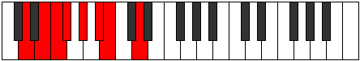
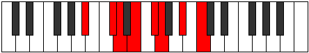
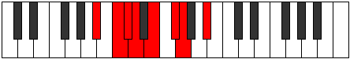

# Mode Rylian

## Links

- [Documentation](index.md)
- [Scales Index](Scales.md)
- [Modes Index](Modes.md)
- [Chords Index](Chords.md)

## Parent Scale

[Eporian](ScaleEporian.md)

## Number

[861](https://ianring.com/musictheory/scales/861)

## Perfection

- 3 Perfect notes
- 4 Perfect notes

## Perfection Profile

[false true false false false true true]

## Permutations

| Tonic | Notes | Signature | Illustration | Audio |
|-------|-------|-----------|--------------|-------|
| [C](ModeCNaturalRylian.md) | **C**, D, **Eb**, **Fb**, **Gb**, Ab, Bbb, **C** | C |  | [midi](ModeCNaturalRylian.mid) [ogg](ModeCNaturalRylian.ogg) |
| [C#](ModeCSharpRylian.md) | **C#**, D#, **E**, **F**, **G**, A, Bb, **C#** | C |  | [midi](ModeCSharpRylian.mid) [ogg](ModeCSharpRylian.ogg) |
| [Db](ModeDFlatRylian.md) | **Db**, Eb, **Fb**, **Gbb**, **Abb**, Bbb, Cbb, **Db** | C |  | [midi](ModeDFlatRylian.mid) [ogg](ModeDFlatRylian.ogg) |
| [D](ModeDNaturalRylian.md) | **D**, E, **F**, **Gb**, **Ab**, Bb, Cb, **D** | C |  | [midi](ModeDNaturalRylian.mid) [ogg](ModeDNaturalRylian.ogg) |
| [D#](ModeDSharpRylian.md) | **D#**, E#, **F#**, **G**, **A**, B, C, **D#** | C |  | [midi](ModeDSharpRylian.mid) [ogg](ModeDSharpRylian.ogg) |
| [Eb](ModeEFlatRylian.md) | **Eb**, F, **Gb**, **Abb**, **Bbb**, Cb, Dbb, **Eb** | C |  | [midi](ModeEFlatRylian.mid) [ogg](ModeEFlatRylian.ogg) |
| [E](ModeENaturalRylian.md) | **E**, F#, **G**, **Ab**, **Bb**, C, Db, **E** | C |  | [midi](ModeENaturalRylian.mid) [ogg](ModeENaturalRylian.ogg) |
| [F](ModeFNaturalRylian.md) | **F**, G, **Ab**, **Bbb**, **Cb**, Db, Ebb, **F** | C |  | [midi](ModeFNaturalRylian.mid) [ogg](ModeFNaturalRylian.ogg) |
| [F#](ModeFSharpRylian.md) | **F#**, G#, **A**, **Bb**, **C**, D, Eb, **F#** | C |  | [midi](ModeFSharpRylian.mid) [ogg](ModeFSharpRylian.ogg) |
| [Gb](ModeGFlatRylian.md) | **Gb**, Ab, **Bbb**, **Cbb**, **Dbb**, Ebb, Fbb, **Gb** | C |  | [midi](ModeGFlatRylian.mid) [ogg](ModeGFlatRylian.ogg) |
| [G](ModeGNaturalRylian.md) | **G**, A, **Bb**, **Cb**, **Db**, Eb, Fb, **G** | C |  | [midi](ModeGNaturalRylian.mid) [ogg](ModeGNaturalRylian.ogg) |
| [G#](ModeGSharpRylian.md) | **G#**, A#, **B**, **C**, **D**, E, F, **G#** | C |  | [midi](ModeGSharpRylian.mid) [ogg](ModeGSharpRylian.ogg) |
| [Ab](ModeAFlatRylian.md) | **Ab**, Bb, **Cb**, **Dbb**, **Ebb**, Fb, Gbb, **Ab** | C |  | [midi](ModeAFlatRylian.mid) [ogg](ModeAFlatRylian.ogg) |
| [A](ModeANaturalRylian.md) | **A**, B, **C**, **Db**, **Eb**, F, Gb, **A** | C |  | [midi](ModeANaturalRylian.mid) [ogg](ModeANaturalRylian.ogg) |
| [A#](ModeASharpRylian.md) | **A#**, B#, **C#**, **D**, **E**, F#, G, **A#** | C |  | [midi](ModeASharpRylian.mid) [ogg](ModeASharpRylian.ogg) |
| [Bb](ModeBFlatRylian.md) | **Bb**, C, **Db**, **Ebb**, **Fb**, Gb, Abb, **Bb** | C |  | [midi](ModeBFlatRylian.mid) [ogg](ModeBFlatRylian.ogg) |
| [B](ModeBNaturalRylian.md) | **B**, C#, **D**, **Eb**, **F**, G, Ab, **B** | C |  | [midi](ModeBNaturalRylian.mid) [ogg](ModeBNaturalRylian.ogg) |
