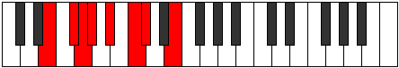
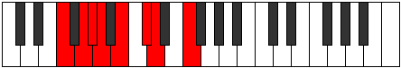

# Mode Rylian

## Links

- [Documentation](README.md)
- [Scales Index](Scales.md)
- [Modes Index](Modes.md)
- [Chords Index](Chords.md)

## Parent Scale

[Eporian](ScaleEporian.md)

## Number

[861](https://ianring.com/musictheory/scales/861)

## Luminosity

-1

## Transposition

2, 1, 1, 2, 2, 1, 3

## Chord Pattern

i⁰, ii⁰b3, iii⁰, IV⁺, VI

## Perfection

- 3 Perfect notes
- 4 Perfect notes

## Perfection Profile

false, true, false, false, false, true, true

## Permutations

| Tonic | Notes | Signature | Illustration | Audio |
|-------|-------|-----------|--------------|-------|
| [C](ModeCNaturalRylian.md) | **C**, D, **Eb**, **Fb**, **Gb**, Ab, Bbb, **C** | C |  | [midi](https://github.com/edipermadi/music/blob/main/docs/ModeCNaturalRylian.mid?raw=true) |
| [C#](ModeCSharpRylian.md) | **C#**, D#, **E**, **F**, **G**, A, Bb, **C#** | C |  | [midi](https://github.com/edipermadi/music/blob/main/docs/ModeCSharpRylian.mid?raw=true) |
| [Db](ModeDFlatRylian.md) | **Db**, Eb, **Fb**, **Gbb**, **Abb**, Bbb, Cbb, **Db** | C |  | [midi](https://github.com/edipermadi/music/blob/main/docs/ModeDFlatRylian.mid?raw=true) |
| [D](ModeDNaturalRylian.md) | **D**, E, **F**, **Gb**, **Ab**, Bb, Cb, **D** | C |  | [midi](https://github.com/edipermadi/music/blob/main/docs/ModeDNaturalRylian.mid?raw=true) |
| [D#](ModeDSharpRylian.md) | **D#**, E#, **F#**, **G**, **A**, B, C, **D#** | C |  | [midi](https://github.com/edipermadi/music/blob/main/docs/ModeDSharpRylian.mid?raw=true) |
| [Eb](ModeEFlatRylian.md) | **Eb**, F, **Gb**, **Abb**, **Bbb**, Cb, Dbb, **Eb** | C |  | [midi](https://github.com/edipermadi/music/blob/main/docs/ModeEFlatRylian.mid?raw=true) |
| [E](ModeENaturalRylian.md) | **E**, F#, **G**, **Ab**, **Bb**, C, Db, **E** | C |  | [midi](https://github.com/edipermadi/music/blob/main/docs/ModeENaturalRylian.mid?raw=true) |
| [F](ModeFNaturalRylian.md) | **F**, G, **Ab**, **Bbb**, **Cb**, Db, Ebb, **F** | C |  | [midi](https://github.com/edipermadi/music/blob/main/docs/ModeFNaturalRylian.mid?raw=true) |
| [F#](ModeFSharpRylian.md) | **F#**, G#, **A**, **Bb**, **C**, D, Eb, **F#** | C |  | [midi](https://github.com/edipermadi/music/blob/main/docs/ModeFSharpRylian.mid?raw=true) |
| [Gb](ModeGFlatRylian.md) | **Gb**, Ab, **Bbb**, **Cbb**, **Dbb**, Ebb, Fbb, **Gb** | C |  | [midi](https://github.com/edipermadi/music/blob/main/docs/ModeGFlatRylian.mid?raw=true) |
| [G](ModeGNaturalRylian.md) | **G**, A, **Bb**, **Cb**, **Db**, Eb, Fb, **G** | C |  | [midi](https://github.com/edipermadi/music/blob/main/docs/ModeGNaturalRylian.mid?raw=true) |
| [G#](ModeGSharpRylian.md) | **G#**, A#, **B**, **C**, **D**, E, F, **G#** | C |  | [midi](https://github.com/edipermadi/music/blob/main/docs/ModeGSharpRylian.mid?raw=true) |
| [Ab](ModeAFlatRylian.md) | **Ab**, Bb, **Cb**, **Dbb**, **Ebb**, Fb, Gbb, **Ab** | C |  | [midi](https://github.com/edipermadi/music/blob/main/docs/ModeAFlatRylian.mid?raw=true) |
| [A](ModeANaturalRylian.md) | **A**, B, **C**, **Db**, **Eb**, F, Gb, **A** | C |  | [midi](https://github.com/edipermadi/music/blob/main/docs/ModeANaturalRylian.mid?raw=true) |
| [A#](ModeASharpRylian.md) | **A#**, B#, **C#**, **D**, **E**, F#, G, **A#** | C |  | [midi](https://github.com/edipermadi/music/blob/main/docs/ModeASharpRylian.mid?raw=true) |
| [Bb](ModeBFlatRylian.md) | **Bb**, C, **Db**, **Ebb**, **Fb**, Gb, Abb, **Bb** | C |  | [midi](https://github.com/edipermadi/music/blob/main/docs/ModeBFlatRylian.mid?raw=true) |
| [B](ModeBNaturalRylian.md) | **B**, C#, **D**, **Eb**, **F**, G, Ab, **B** | C |  | [midi](https://github.com/edipermadi/music/blob/main/docs/ModeBNaturalRylian.mid?raw=true) |
