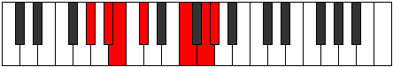

# Mode Rylimic

## Links

- [Documentation](index.md)
- [Scales Index](Scales.md)
- [Modes Index](Modes.md)
- [Chords Index](Chords.md)

## Parent Scale

[Manimic](ScaleManimic.md)

## Number

[2605](https://ianring.com/musictheory/scales/2605)

## Perfection

- 2 Perfect notes
- 4 Perfect notes

## Perfection Profile

[false true false true false false]

## Permutations

| Tonic | Notes | Signature | Illustration | Audio |
|-------|-------|-----------|--------------|-------|
| [C](ModeCNaturalRylimic.md) | **C**, D, **Eb**, F, **G##**, **A##**, **C** | C |  | [midi](ModeCNaturalRylimic.mid) [ogg](ModeCNaturalRylimic.ogg) |
| [C#](ModeCSharpRylimic.md) | **C#**, D#, **E**, F#, **G###**, **A###**, **C#** | C |  | [midi](ModeCSharpRylimic.mid) [ogg](ModeCSharpRylimic.ogg) |
| [Db](ModeDFlatRylimic.md) | **Db**, Eb, **Fb**, Gb, **A#**, **B#**, **Db** | C |  | [midi](ModeDFlatRylimic.mid) [ogg](ModeDFlatRylimic.ogg) |
| [D](ModeDNaturalRylimic.md) | **D**, E, **F**, G, **A##**, **B##**, **D** | C |  | [midi](ModeDNaturalRylimic.mid) [ogg](ModeDNaturalRylimic.ogg) |
| [D#](ModeDSharpRylimic.md) | **D#**, E#, **F#**, G#, **A###**, **B###**, **D#** | C |  | [midi](ModeDSharpRylimic.mid) [ogg](ModeDSharpRylimic.ogg) |
| [Eb](ModeEFlatRylimic.md) | **Eb**, F, **Gb**, Ab, **B#**, **C##**, **Eb** | C |  | [midi](ModeEFlatRylimic.mid) [ogg](ModeEFlatRylimic.ogg) |
| [E](ModeENaturalRylimic.md) | **E**, F#, **G**, A, **B##**, **C###**, **E** | C |  | [midi](ModeENaturalRylimic.mid) [ogg](ModeENaturalRylimic.ogg) |
| [F](ModeFNaturalRylimic.md) | **F**, G, **Ab**, Bb, **C##**, **D##**, **F** | C |  | [midi](ModeFNaturalRylimic.mid) [ogg](ModeFNaturalRylimic.ogg) |
| [F#](ModeFSharpRylimic.md) | **F#**, G#, **A**, B, **C###**, **D###**, **F#** | C |  | [midi](ModeFSharpRylimic.mid) [ogg](ModeFSharpRylimic.ogg) |
| [Gb](ModeGFlatRylimic.md) | **Gb**, Ab, **Bbb**, Cb, **D#**, **E#**, **Gb** | C |  | [midi](ModeGFlatRylimic.mid) [ogg](ModeGFlatRylimic.ogg) |
| [G](ModeGNaturalRylimic.md) | **G**, A, **Bb**, C, **D##**, **E##**, **G** | C |  | [midi](ModeGNaturalRylimic.mid) [ogg](ModeGNaturalRylimic.ogg) |
| [G#](ModeGSharpRylimic.md) | **G#**, A#, **B**, C#, **D###**, **E###**, **G#** | C |  | [midi](ModeGSharpRylimic.mid) [ogg](ModeGSharpRylimic.ogg) |
| [Ab](ModeAFlatRylimic.md) | **Ab**, Bb, **Cb**, Db, **E#**, **F##**, **Ab** | C |  | [midi](ModeAFlatRylimic.mid) [ogg](ModeAFlatRylimic.ogg) |
| [A](ModeANaturalRylimic.md) | **A**, B, **C**, D, **E##**, **F###**, **A** | C |  | [midi](ModeANaturalRylimic.mid) [ogg](ModeANaturalRylimic.ogg) |
| [A#](ModeASharpRylimic.md) | **A#**, B#, **C#**, D#, **E###**, **Cbbb**, **A#** | C |  | [midi](ModeASharpRylimic.mid) [ogg](ModeASharpRylimic.ogg) |
| [Bb](ModeBFlatRylimic.md) | **Bb**, C, **Db**, Eb, **F##**, **G##**, **Bb** | C |  | [midi](ModeBFlatRylimic.mid) [ogg](ModeBFlatRylimic.ogg) |
| [B](ModeBNaturalRylimic.md) | **B**, C#, **D**, E, **F###**, **G###**, **B** | C |  | [midi](ModeBNaturalRylimic.mid) [ogg](ModeBNaturalRylimic.ogg) |
