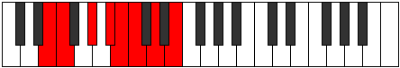
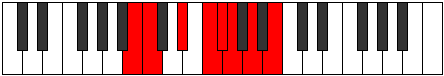

# Mode Rynian

## Links

- [Documentation](index.md)
- [Scales Index](Scales.md)
- [Modes Index](Modes.md)
- [Chords Index](Chords.md)

## Parent Scale

[Eporian](ScaleEporian.md)

## Number

[1491](https://ianring.com/musictheory/scales/1491)

## Perfection

- 3 Perfect notes
- 4 Perfect notes

## Perfection Profile

[true true false true false false false]

## Permutations

| Tonic | Notes | Signature | Illustration | Audio |
|-------|-------|-----------|--------------|-------|
| [C](ModeCNaturalRynian.md) | C, Db, **E**, F#, **G**, **Ab**, **Bb**, C | C |  | [midi](ModeCNaturalRynian.mid) [ogg](ModeCNaturalRynian.ogg) |
| [C#](ModeCSharpRynian.md) | C#, D, **E#**, F##, **G#**, **A**, **B**, C# | C |  | [midi](ModeCSharpRynian.mid) [ogg](ModeCSharpRynian.ogg) |
| [Db](ModeDFlatRynian.md) | Db, Ebb, **F**, G, **Ab**, **Bbb**, **Cb**, Db | C |  | [midi](ModeDFlatRynian.mid) [ogg](ModeDFlatRynian.ogg) |
| [D](ModeDNaturalRynian.md) | D, Eb, **F#**, G#, **A**, **Bb**, **C**, D | C |  | [midi](ModeDNaturalRynian.mid) [ogg](ModeDNaturalRynian.ogg) |
| [D#](ModeDSharpRynian.md) | D#, E, **F##**, G##, **A#**, **B**, **C#**, D# | C |  | [midi](ModeDSharpRynian.mid) [ogg](ModeDSharpRynian.ogg) |
| [Eb](ModeEFlatRynian.md) | Eb, Fb, **G**, A, **Bb**, **Cb**, **Db**, Eb | C |  | [midi](ModeEFlatRynian.mid) [ogg](ModeEFlatRynian.ogg) |
| [E](ModeENaturalRynian.md) | E, F, **G#**, A#, **B**, **C**, **D**, E | C |  | [midi](ModeENaturalRynian.mid) [ogg](ModeENaturalRynian.ogg) |
| [F](ModeFNaturalRynian.md) | F, Gb, **A**, B, **C**, **Db**, **Eb**, F | C |  | [midi](ModeFNaturalRynian.mid) [ogg](ModeFNaturalRynian.ogg) |
| [F#](ModeFSharpRynian.md) | F#, G, **A#**, B#, **C#**, **D**, **E**, F# | C |  | [midi](ModeFSharpRynian.mid) [ogg](ModeFSharpRynian.ogg) |
| [Gb](ModeGFlatRynian.md) | Gb, Abb, **Bb**, C, **Db**, **Ebb**, **Fb**, Gb | C |  | [midi](ModeGFlatRynian.mid) [ogg](ModeGFlatRynian.ogg) |
| [G](ModeGNaturalRynian.md) | G, Ab, **B**, C#, **D**, **Eb**, **F**, G | C |  | [midi](ModeGNaturalRynian.mid) [ogg](ModeGNaturalRynian.ogg) |
| [G#](ModeGSharpRynian.md) | G#, A, **B#**, C##, **D#**, **E**, **F#**, G# | C |  | [midi](ModeGSharpRynian.mid) [ogg](ModeGSharpRynian.ogg) |
| [Ab](ModeAFlatRynian.md) | Ab, Bbb, **C**, D, **Eb**, **Fb**, **Gb**, Ab | C |  | [midi](ModeAFlatRynian.mid) [ogg](ModeAFlatRynian.ogg) |
| [A](ModeANaturalRynian.md) | A, Bb, **C#**, D#, **E**, **F**, **G**, A | C |  | [midi](ModeANaturalRynian.mid) [ogg](ModeANaturalRynian.ogg) |
| [A#](ModeASharpRynian.md) | A#, B, **C##**, D##, **E#**, **F#**, **G#**, A# | C |  | [midi](ModeASharpRynian.mid) [ogg](ModeASharpRynian.ogg) |
| [Bb](ModeBFlatRynian.md) | Bb, Cb, **D**, E, **F**, **Gb**, **Ab**, Bb | C |  | [midi](ModeBFlatRynian.mid) [ogg](ModeBFlatRynian.ogg) |
| [B](ModeBNaturalRynian.md) | B, C, **D#**, E#, **F#**, **G**, **A**, B | C |  | [midi](ModeBNaturalRynian.mid) [ogg](ModeBNaturalRynian.ogg) |
