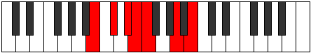

# Mode Rynimic

## Links

- [Documentation](index.md)
- [Scales Index](Scales.md)
- [Modes Index](Modes.md)
- [Chords Index](Chords.md)

## Parent Scale

[Katanimic](ScaleKatanimic.md)

## Number

[1141](https://ianring.com/musictheory/scales/1141)

## Perfection

- 2 Perfect notes
- 4 Perfect notes

## Perfection Profile

[false false false true false true]

## Permutations

| Tonic | Notes | Signature | Illustration | Audio |
|-------|-------|-----------|--------------|-------|
| [C](ModeCNaturalRynimic.md) | **C**, **D**, **E**, F, **Gb**, A#, **C** | C |  | [midi](ModeCNaturalRynimic.mid) [ogg](ModeCNaturalRynimic.ogg) |
| [C#](ModeCSharpRynimic.md) | **C#**, **D#**, **E#**, F#, **G**, A##, **C#** | C |  | [midi](ModeCSharpRynimic.mid) [ogg](ModeCSharpRynimic.ogg) |
| [Db](ModeDFlatRynimic.md) | **Db**, **Eb**, **F**, Gb, **Abb**, B, **Db** | C |  | [midi](ModeDFlatRynimic.mid) [ogg](ModeDFlatRynimic.ogg) |
| [D](ModeDNaturalRynimic.md) | **D**, **E**, **F#**, G, **Ab**, B#, **D** | C |  | [midi](ModeDNaturalRynimic.mid) [ogg](ModeDNaturalRynimic.ogg) |
| [D#](ModeDSharpRynimic.md) | **D#**, **E#**, **F##**, G#, **A**, B##, **D#** | C |  | [midi](ModeDSharpRynimic.mid) [ogg](ModeDSharpRynimic.ogg) |
| [Eb](ModeEFlatRynimic.md) | **Eb**, **F**, **G**, Ab, **Bbb**, C#, **Eb** | C |  | [midi](ModeEFlatRynimic.mid) [ogg](ModeEFlatRynimic.ogg) |
| [E](ModeENaturalRynimic.md) | **E**, **F#**, **G#**, A, **Bb**, C##, **E** | C |  | [midi](ModeENaturalRynimic.mid) [ogg](ModeENaturalRynimic.ogg) |
| [F](ModeFNaturalRynimic.md) | **F**, **G**, **A**, Bb, **Cb**, D#, **F** | C |  | [midi](ModeFNaturalRynimic.mid) [ogg](ModeFNaturalRynimic.ogg) |
| [F#](ModeFSharpRynimic.md) | **F#**, **G#**, **A#**, B, **C**, D##, **F#** | C |  | [midi](ModeFSharpRynimic.mid) [ogg](ModeFSharpRynimic.ogg) |
| [Gb](ModeGFlatRynimic.md) | **Gb**, **Ab**, **Bb**, Cb, **Dbb**, E, **Gb** | C |  | [midi](ModeGFlatRynimic.mid) [ogg](ModeGFlatRynimic.ogg) |
| [G](ModeGNaturalRynimic.md) | **G**, **A**, **B**, C, **Db**, E#, **G** | C |  | [midi](ModeGNaturalRynimic.mid) [ogg](ModeGNaturalRynimic.ogg) |
| [G#](ModeGSharpRynimic.md) | **G#**, **A#**, **B#**, C#, **D**, E##, **G#** | C |  | [midi](ModeGSharpRynimic.mid) [ogg](ModeGSharpRynimic.ogg) |
| [Ab](ModeAFlatRynimic.md) | **Ab**, **Bb**, **C**, Db, **Ebb**, F#, **Ab** | C |  | [midi](ModeAFlatRynimic.mid) [ogg](ModeAFlatRynimic.ogg) |
| [A](ModeANaturalRynimic.md) | **A**, **B**, **C#**, D, **Eb**, F##, **A** | C |  | [midi](ModeANaturalRynimic.mid) [ogg](ModeANaturalRynimic.ogg) |
| [A#](ModeASharpRynimic.md) | **A#**, **B#**, **C##**, D#, **E**, F###, **A#** | C |  | [midi](ModeASharpRynimic.mid) [ogg](ModeASharpRynimic.ogg) |
| [Bb](ModeBFlatRynimic.md) | **Bb**, **C**, **D**, Eb, **Fb**, G#, **Bb** | C |  | [midi](ModeBFlatRynimic.mid) [ogg](ModeBFlatRynimic.ogg) |
| [B](ModeBNaturalRynimic.md) | **B**, **C#**, **D#**, E, **F**, G##, **B** | C |  | [midi](ModeBNaturalRynimic.mid) [ogg](ModeBNaturalRynimic.ogg) |
