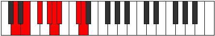

# Mode Ryphian

## Links

- [Documentation](index.md)
- [Scales Index](Scales.md)
- [Modes Index](Modes.md)
- [Chords Index](Chords.md)

## Parent Scale

[Golian](ScaleGolian.md)

## Number

[2517](https://ianring.com/musictheory/scales/2517)

## Perfection

- 4 Perfect notes
- 3 Perfect notes

## Perfection Profile

[true false true false true false true]

## Permutations

| Tonic | Notes | Signature | Illustration | Audio |
|-------|-------|-----------|--------------|-------|
| [C](ModeCNaturalRyphian.md) | C, **D**, E, **F#**, G, **Ab**, B, C | C |  | [midi](ModeCNaturalRyphian.mid) [ogg](ModeCNaturalRyphian.ogg) |
| [C#](ModeCSharpRyphian.md) | C#, **D#**, E#, **F##**, G#, **A**, B#, C# | C |  | [midi](ModeCSharpRyphian.mid) [ogg](ModeCSharpRyphian.ogg) |
| [Db](ModeDFlatRyphian.md) | Db, **Eb**, F, **G**, Ab, **Bbb**, C, Db | C |  | [midi](ModeDFlatRyphian.mid) [ogg](ModeDFlatRyphian.ogg) |
| [D](ModeDNaturalRyphian.md) | D, **E**, F#, **G#**, A, **Bb**, C#, D | C |  | [midi](ModeDNaturalRyphian.mid) [ogg](ModeDNaturalRyphian.ogg) |
| [D#](ModeDSharpRyphian.md) | D#, **E#**, F##, **G##**, A#, **B**, C##, D# | C |  | [midi](ModeDSharpRyphian.mid) [ogg](ModeDSharpRyphian.ogg) |
| [Eb](ModeEFlatRyphian.md) | Eb, **F**, G, **A**, Bb, **Cb**, D, Eb | C |  | [midi](ModeEFlatRyphian.mid) [ogg](ModeEFlatRyphian.ogg) |
| [E](ModeENaturalRyphian.md) | E, **F#**, G#, **A#**, B, **C**, D#, E | C |  | [midi](ModeENaturalRyphian.mid) [ogg](ModeENaturalRyphian.ogg) |
| [F](ModeFNaturalRyphian.md) | F, **G**, A, **B**, C, **Db**, E, F | C |  | [midi](ModeFNaturalRyphian.mid) [ogg](ModeFNaturalRyphian.ogg) |
| [F#](ModeFSharpRyphian.md) | F#, **G#**, A#, **B#**, C#, **D**, E#, F# | C |  | [midi](ModeFSharpRyphian.mid) [ogg](ModeFSharpRyphian.ogg) |
| [Gb](ModeGFlatRyphian.md) | Gb, **Ab**, Bb, **C**, Db, **Ebb**, F, Gb | C |  | [midi](ModeGFlatRyphian.mid) [ogg](ModeGFlatRyphian.ogg) |
| [G](ModeGNaturalRyphian.md) | G, **A**, B, **C#**, D, **Eb**, F#, G | C |  | [midi](ModeGNaturalRyphian.mid) [ogg](ModeGNaturalRyphian.ogg) |
| [G#](ModeGSharpRyphian.md) | G#, **A#**, B#, **C##**, D#, **E**, F##, G# | C |  | [midi](ModeGSharpRyphian.mid) [ogg](ModeGSharpRyphian.ogg) |
| [Ab](ModeAFlatRyphian.md) | Ab, **Bb**, C, **D**, Eb, **Fb**, G, Ab | C |  | [midi](ModeAFlatRyphian.mid) [ogg](ModeAFlatRyphian.ogg) |
| [A](ModeANaturalRyphian.md) | A, **B**, C#, **D#**, E, **F**, G#, A | C |  | [midi](ModeANaturalRyphian.mid) [ogg](ModeANaturalRyphian.ogg) |
| [A#](ModeASharpRyphian.md) | A#, **B#**, C##, **D##**, E#, **F#**, G##, A# | C |  | [midi](ModeASharpRyphian.mid) [ogg](ModeASharpRyphian.ogg) |
| [Bb](ModeBFlatRyphian.md) | Bb, **C**, D, **E**, F, **Gb**, A, Bb | C |  | [midi](ModeBFlatRyphian.mid) [ogg](ModeBFlatRyphian.ogg) |
| [B](ModeBNaturalRyphian.md) | B, **C#**, D#, **E#**, F#, **G**, A#, B | C |  | [midi](ModeBNaturalRyphian.mid) [ogg](ModeBNaturalRyphian.ogg) |
