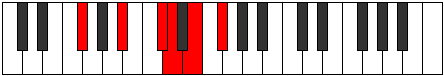

# Mode Ryphitonic

## Links

- [Documentation](index.md)
- [Scales Index](Scales.md)
- [Modes Index](Modes.md)
- [Chords Index](Chords.md)

## Parent Scale

[Ryphitonic](ScaleRyphitonic.md)

## Number

[1425](https://ianring.com/musictheory/scales/1425)

## Perfection

- 1 Perfect notes
- 4 Perfect notes

## Perfection Profile

[true false false false false]

## Permutations

| Tonic | Notes | Signature | Illustration | Audio |
|-------|-------|-----------|--------------|-------|
| [C](ModeCNaturalRyphitonic.md) | C, **E**, **G**, **G#**, **A#**, C | C |  | [midi](ModeCNaturalRyphitonic.mid) [ogg](ModeCNaturalRyphitonic.ogg) |
| [C#](ModeCSharpRyphitonic.md) | C#, **F**, **G#**, **A**, **B**, C# | C |  | [midi](ModeCSharpRyphitonic.mid) [ogg](ModeCSharpRyphitonic.ogg) |
| [Db](ModeDFlatRyphitonic.md) | Db, **F**, **Ab**, **A**, **B**, Db | C |  | [midi](ModeDFlatRyphitonic.mid) [ogg](ModeDFlatRyphitonic.ogg) |
| [D](ModeDNaturalRyphitonic.md) | D, **F#**, **A**, **A#**, **C**, D | C |  | [midi](ModeDNaturalRyphitonic.mid) [ogg](ModeDNaturalRyphitonic.ogg) |
| [D#](ModeDSharpRyphitonic.md) | D#, **G**, **A#**, **B**, **C#**, D# | C |  | [midi](ModeDSharpRyphitonic.mid) [ogg](ModeDSharpRyphitonic.ogg) |
| [Eb](ModeEFlatRyphitonic.md) | Eb, **G**, **Bb**, **B**, **Db**, Eb | C |  | [midi](ModeEFlatRyphitonic.mid) [ogg](ModeEFlatRyphitonic.ogg) |
| [E](ModeENaturalRyphitonic.md) | E, **G#**, **B**, **C**, **D**, E | C |  | [midi](ModeENaturalRyphitonic.mid) [ogg](ModeENaturalRyphitonic.ogg) |
| [F](ModeFNaturalRyphitonic.md) | F, **A**, **C**, **C#**, **D#**, F | C |  | [midi](ModeFNaturalRyphitonic.mid) [ogg](ModeFNaturalRyphitonic.ogg) |
| [F#](ModeFSharpRyphitonic.md) | F#, **A#**, **C#**, **D**, **E**, F# | C |  | [midi](ModeFSharpRyphitonic.mid) [ogg](ModeFSharpRyphitonic.ogg) |
| [Gb](ModeGFlatRyphitonic.md) | Gb, **Bb**, **Db**, **D**, **E**, Gb | C |  | [midi](ModeGFlatRyphitonic.mid) [ogg](ModeGFlatRyphitonic.ogg) |
| [G](ModeGNaturalRyphitonic.md) | G, **B**, **D**, **D#**, **F**, G | C |  | [midi](ModeGNaturalRyphitonic.mid) [ogg](ModeGNaturalRyphitonic.ogg) |
| [G#](ModeGSharpRyphitonic.md) | G#, **C**, **D#**, **E**, **F#**, G# | C |  | [midi](ModeGSharpRyphitonic.mid) [ogg](ModeGSharpRyphitonic.ogg) |
| [Ab](ModeAFlatRyphitonic.md) | Ab, **C**, **Eb**, **E**, **Gb**, Ab | C |  | [midi](ModeAFlatRyphitonic.mid) [ogg](ModeAFlatRyphitonic.ogg) |
| [A](ModeANaturalRyphitonic.md) | A, **C#**, **E**, **F**, **G**, A | C |  | [midi](ModeANaturalRyphitonic.mid) [ogg](ModeANaturalRyphitonic.ogg) |
| [A#](ModeASharpRyphitonic.md) | A#, **D**, **F**, **F#**, **G#**, A# | C |  | [midi](ModeASharpRyphitonic.mid) [ogg](ModeASharpRyphitonic.ogg) |
| [Bb](ModeBFlatRyphitonic.md) | Bb, **D**, **F**, **Gb**, **Ab**, Bb | C |  | [midi](ModeBFlatRyphitonic.mid) [ogg](ModeBFlatRyphitonic.ogg) |
| [B](ModeBNaturalRyphitonic.md) | B, **D#**, **F#**, **G**, **A**, B | C |  | [midi](ModeBNaturalRyphitonic.mid) [ogg](ModeBNaturalRyphitonic.ogg) |
