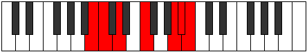

# Mode Ryrimic

## Links

- [Documentation](index.md)
- [Scales Index](Scales.md)
- [Modes Index](Modes.md)
- [Chords Index](Chords.md)

## Parent Scale

[Kytrimic](ScaleKytrimic.md)

## Number

[3147](https://ianring.com/musictheory/scales/3147)

## Perfection

- 3 Perfect notes
- 3 Perfect notes

## Perfection Profile

[false false true true false true]

## Permutations

| Tonic | Notes | Signature | Illustration | Audio |
|-------|-------|-----------|--------------|-------|
| [C](ModeCNaturalRyrimic.md) | **C**, **Db**, Eb, F#, **G###**, A##, **C** | C |  | [midi](https://github.com/edipermadi/music/blob/main/docs/ModeCNaturalRyrimic.mid?raw=true) |
| [C#](ModeCSharpRyrimic.md) | **C#**, **D**, E, F##, **Cb**, Dbb, **C#** | C |  | [midi](https://github.com/edipermadi/music/blob/main/docs/ModeCSharpRyrimic.mid?raw=true) |
| [Db](ModeDFlatRyrimic.md) | **Db**, **Ebb**, Fb, G, **A##**, B#, **Db** | C |  | [midi](https://github.com/edipermadi/music/blob/main/docs/ModeDFlatRyrimic.mid?raw=true) |
| [D](ModeDNaturalRyrimic.md) | **D**, **Eb**, F, G#, **A###**, B##, **D** | C |  | [midi](https://github.com/edipermadi/music/blob/main/docs/ModeDNaturalRyrimic.mid?raw=true) |
| [D#](ModeDSharpRyrimic.md) | **D#**, **E**, F#, G##, **Db**, Ebb, **D#** | C |  | [midi](https://github.com/edipermadi/music/blob/main/docs/ModeDSharpRyrimic.mid?raw=true) |
| [Eb](ModeEFlatRyrimic.md) | **Eb**, **Fb**, Gb, A, **B##**, C##, **Eb** | C |  | [midi](https://github.com/edipermadi/music/blob/main/docs/ModeEFlatRyrimic.mid?raw=true) |
| [E](ModeENaturalRyrimic.md) | **E**, **F**, G, A#, **B###**, C###, **E** | C |  | [midi](https://github.com/edipermadi/music/blob/main/docs/ModeENaturalRyrimic.mid?raw=true) |
| [F](ModeFNaturalRyrimic.md) | **F**, **Gb**, Ab, B, **C###**, D##, **F** | C |  | [midi](https://github.com/edipermadi/music/blob/main/docs/ModeFNaturalRyrimic.mid?raw=true) |
| [F#](ModeFSharpRyrimic.md) | **F#**, **G**, A, B#, **D##**, E#, **F#** | C |  | [midi](https://github.com/edipermadi/music/blob/main/docs/ModeFSharpRyrimic.mid?raw=true) |
| [Gb](ModeGFlatRyrimic.md) | **Gb**, **Abb**, Bbb, C, **D##**, E#, **Gb** | C |  | [midi](https://github.com/edipermadi/music/blob/main/docs/ModeGFlatRyrimic.mid?raw=true) |
| [G](ModeGNaturalRyrimic.md) | **G**, **Ab**, Bb, C#, **D###**, E##, **G** | C |  | [midi](https://github.com/edipermadi/music/blob/main/docs/ModeGNaturalRyrimic.mid?raw=true) |
| [G#](ModeGSharpRyrimic.md) | **G#**, **A**, B, C##, **E##**, F##, **G#** | C |  | [midi](https://github.com/edipermadi/music/blob/main/docs/ModeGSharpRyrimic.mid?raw=true) |
| [Ab](ModeAFlatRyrimic.md) | **Ab**, **Bbb**, Cb, D, **E##**, F##, **Ab** | C |  | [midi](https://github.com/edipermadi/music/blob/main/docs/ModeAFlatRyrimic.mid?raw=true) |
| [A](ModeANaturalRyrimic.md) | **A**, **Bb**, C, D#, **E###**, F###, **A** | C |  | [midi](https://github.com/edipermadi/music/blob/main/docs/ModeANaturalRyrimic.mid?raw=true) |
| [A#](ModeASharpRyrimic.md) | **A#**, **B**, C#, D##, **F###**, G##, **A#** | C |  | [midi](https://github.com/edipermadi/music/blob/main/docs/ModeASharpRyrimic.mid?raw=true) |
| [Bb](ModeBFlatRyrimic.md) | **Bb**, **Cb**, Db, E, **F###**, G##, **Bb** | C |  | [midi](https://github.com/edipermadi/music/blob/main/docs/ModeBFlatRyrimic.mid?raw=true) |
| [B](ModeBNaturalRyrimic.md) | **B**, **C**, D, E#, **Cbbb**, Cbb, **B** | C |  | [midi](https://github.com/edipermadi/music/blob/main/docs/ModeBNaturalRyrimic.mid?raw=true) |
