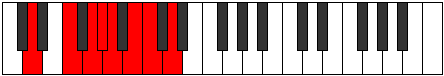

# Mode Rythian

## Links

- [Documentation](README.md)
- [Scales Index](Scales.md)
- [Modes Index](Modes.md)
- [Chords Index](Chords.md)

## Parent Scale

[Rythian](ScaleRythian.md)

## Number

[1769](https://ianring.com/musictheory/scales/1769)

## Transposition

3, 2, 1, 1, 2, 1, 2

## Chord Pattern

ii⁰, ii⁰, iv⁰, iv⁰

## Perfection

- 4 Perfect notes
- 3 Perfect notes

## Perfection Profile

[true true true false false false true]

## Permutations

| Tonic | Notes | Signature | Illustration | Audio |
|-------|-------|-----------|--------------|-------|
| [C](ModeCNaturalRythian.md) | C, D#, E#, **F#**, **G**, **A**, Bb, C | C |  | [midi](https://github.com/edipermadi/music/blob/main/docs/ModeCNaturalRythian.mid?raw=true) |
| [C#](ModeCSharpRythian.md) | C#, D##, E##, **F##**, **G#**, **A#**, B, C# | C |  | [midi](https://github.com/edipermadi/music/blob/main/docs/ModeCSharpRythian.mid?raw=true) |
| [Db](ModeDFlatRythian.md) | Db, E, F#, **G**, **Ab**, **Bb**, Cb, Db | C |  | [midi](https://github.com/edipermadi/music/blob/main/docs/ModeDFlatRythian.mid?raw=true) |
| [D](ModeDNaturalRythian.md) | D, E#, F##, **G#**, **A**, **B**, C, D | C |  | [midi](https://github.com/edipermadi/music/blob/main/docs/ModeDNaturalRythian.mid?raw=true) |
| [D#](ModeDSharpRythian.md) | D#, E##, F###, **G##**, **A#**, **B#**, C#, D# | C |  | [midi](https://github.com/edipermadi/music/blob/main/docs/ModeDSharpRythian.mid?raw=true) |
| [Eb](ModeEFlatRythian.md) | Eb, F#, G#, **A**, **Bb**, **C**, Db, Eb | C |  | [midi](https://github.com/edipermadi/music/blob/main/docs/ModeEFlatRythian.mid?raw=true) |
| [E](ModeENaturalRythian.md) | E, F##, G##, **A#**, **B**, **C#**, D, E | C |  | [midi](https://github.com/edipermadi/music/blob/main/docs/ModeENaturalRythian.mid?raw=true) |
| [F](ModeFNaturalRythian.md) | F, G#, A#, **B**, **C**, **D**, Eb, F | C |  | [midi](https://github.com/edipermadi/music/blob/main/docs/ModeFNaturalRythian.mid?raw=true) |
| [F#](ModeFSharpRythian.md) | F#, G##, A##, **B#**, **C#**, **D#**, E, F# | C |  | [midi](https://github.com/edipermadi/music/blob/main/docs/ModeFSharpRythian.mid?raw=true) |
| [Gb](ModeGFlatRythian.md) | Gb, A, B, **C**, **Db**, **Eb**, Fb, Gb | C |  | [midi](https://github.com/edipermadi/music/blob/main/docs/ModeGFlatRythian.mid?raw=true) |
| [G](ModeGNaturalRythian.md) | G, A#, B#, **C#**, **D**, **E**, F, G | C |  | [midi](https://github.com/edipermadi/music/blob/main/docs/ModeGNaturalRythian.mid?raw=true) |
| [G#](ModeGSharpRythian.md) | G#, A##, B##, **C##**, **D#**, **E#**, F#, G# | C |  | [midi](https://github.com/edipermadi/music/blob/main/docs/ModeGSharpRythian.mid?raw=true) |
| [Ab](ModeAFlatRythian.md) | Ab, B, C#, **D**, **Eb**, **F**, Gb, Ab | C |  | [midi](https://github.com/edipermadi/music/blob/main/docs/ModeAFlatRythian.mid?raw=true) |
| [A](ModeANaturalRythian.md) | A, B#, C##, **D#**, **E**, **F#**, G, A | C |  | [midi](https://github.com/edipermadi/music/blob/main/docs/ModeANaturalRythian.mid?raw=true) |
| [A#](ModeASharpRythian.md) | A#, B##, C###, **D##**, **E#**, **F##**, G#, A# | C |  | [midi](https://github.com/edipermadi/music/blob/main/docs/ModeASharpRythian.mid?raw=true) |
| [Bb](ModeBFlatRythian.md) | Bb, C#, D#, **E**, **F**, **G**, Ab, Bb | C |  | [midi](https://github.com/edipermadi/music/blob/main/docs/ModeBFlatRythian.mid?raw=true) |
| [B](ModeBNaturalRythian.md) | B, C##, D##, **E#**, **F#**, **G#**, A, B | C |  | [midi](https://github.com/edipermadi/music/blob/main/docs/ModeBNaturalRythian.mid?raw=true) |
