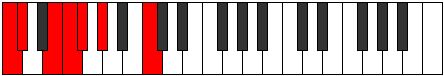
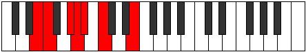
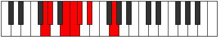
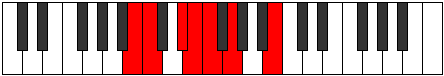

# Mode Rythimic

## Links

- [Documentation](index.md)
- [Scales Index](Scales.md)
- [Modes Index](Modes.md)
- [Chords Index](Chords.md)

## Parent Scale

[Thogimic](ScaleThogimic.md)

## Number

[371](https://ianring.com/musictheory/scales/371)

## Perfection

- 3 Perfect notes
- 3 Perfect notes

## Perfection Profile

[false true false true true false]

## Permutations

| Tonic | Notes | Signature | Illustration | Audio |
|-------|-------|-----------|--------------|-------|
| [C](ModeCNaturalRythimic.md) | **C**, Db, **E**, F, Gb, **Ab**, **C** | C |  | [midi](ModeCNaturalRythimic.mid) [ogg](ModeCNaturalRythimic.ogg) |
| [C#](ModeCSharpRythimic.md) | **C#**, D, **E#**, F#, G, **A**, **C#** | C |  | [midi](ModeCSharpRythimic.mid) [ogg](ModeCSharpRythimic.ogg) |
| [Db](ModeDFlatRythimic.md) | **Db**, Ebb, **F**, Gb, Abb, **Bbb**, **Db** | C |  | [midi](ModeDFlatRythimic.mid) [ogg](ModeDFlatRythimic.ogg) |
| [D](ModeDNaturalRythimic.md) | **D**, Eb, **F#**, G, Ab, **Bb**, **D** | C |  | [midi](ModeDNaturalRythimic.mid) [ogg](ModeDNaturalRythimic.ogg) |
| [D#](ModeDSharpRythimic.md) | **D#**, E, **F##**, G#, A, **B**, **D#** | C |  | [midi](ModeDSharpRythimic.mid) [ogg](ModeDSharpRythimic.ogg) |
| [Eb](ModeEFlatRythimic.md) | **Eb**, Fb, **G**, Ab, Bbb, **Cb**, **Eb** | C |  | [midi](ModeEFlatRythimic.mid) [ogg](ModeEFlatRythimic.ogg) |
| [E](ModeENaturalRythimic.md) | **E**, F, **G#**, A, Bb, **C**, **E** | C |  | [midi](ModeENaturalRythimic.mid) [ogg](ModeENaturalRythimic.ogg) |
| [F](ModeFNaturalRythimic.md) | **F**, Gb, **A**, Bb, Cb, **Db**, **F** | C |  | [midi](ModeFNaturalRythimic.mid) [ogg](ModeFNaturalRythimic.ogg) |
| [F#](ModeFSharpRythimic.md) | **F#**, G, **A#**, B, C, **D**, **F#** | C |  | [midi](ModeFSharpRythimic.mid) [ogg](ModeFSharpRythimic.ogg) |
| [Gb](ModeGFlatRythimic.md) | **Gb**, Abb, **Bb**, Cb, Dbb, **Ebb**, **Gb** | C |  | [midi](ModeGFlatRythimic.mid) [ogg](ModeGFlatRythimic.ogg) |
| [G](ModeGNaturalRythimic.md) | **G**, Ab, **B**, C, Db, **Eb**, **G** | C |  | [midi](ModeGNaturalRythimic.mid) [ogg](ModeGNaturalRythimic.ogg) |
| [G#](ModeGSharpRythimic.md) | **G#**, A, **B#**, C#, D, **E**, **G#** | C |  | [midi](ModeGSharpRythimic.mid) [ogg](ModeGSharpRythimic.ogg) |
| [Ab](ModeAFlatRythimic.md) | **Ab**, Bbb, **C**, Db, Ebb, **Fb**, **Ab** | C |  | [midi](ModeAFlatRythimic.mid) [ogg](ModeAFlatRythimic.ogg) |
| [A](ModeANaturalRythimic.md) | **A**, Bb, **C#**, D, Eb, **F**, **A** | C |  | [midi](ModeANaturalRythimic.mid) [ogg](ModeANaturalRythimic.ogg) |
| [A#](ModeASharpRythimic.md) | **A#**, B, **C##**, D#, E, **F#**, **A#** | C |  | [midi](ModeASharpRythimic.mid) [ogg](ModeASharpRythimic.ogg) |
| [Bb](ModeBFlatRythimic.md) | **Bb**, Cb, **D**, Eb, Fb, **Gb**, **Bb** | C |  | [midi](ModeBFlatRythimic.mid) [ogg](ModeBFlatRythimic.ogg) |
| [B](ModeBNaturalRythimic.md) | **B**, C, **D#**, E, F, **G**, **B** | C |  | [midi](ModeBNaturalRythimic.mid) [ogg](ModeBNaturalRythimic.ogg) |
