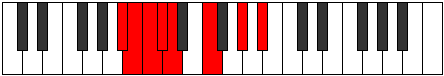

# Mode Sadian

## Links

- [Documentation](README.md)
- [Scales Index](Scales.md)
- [Modes Index](Modes.md)
- [Chords Index](Chords.md)

## Parent Scale

[Bonian](ScaleBonian.md)

## Number

[1183](https://ianring.com/musictheory/scales/1183)

## Luminosity

-1

## Transposition

1, 1, 1, 1, 3, 3, 2

## Chord Pattern

ii⁰b3

## Perfection

- 3 Perfect notes
- 4 Perfect notes

## Perfection Profile

true, false, false, true, false, true, false

## Permutations

| Tonic | Notes | Signature | Illustration | Audio |
|-------|-------|-----------|--------------|-------|
| [C](ModeCNaturalSadian.md) | C, **Db**, **Ebb**, Fbb, **Gbbb**, Abb, **Bb**, C | C |  | [midi](https://github.com/edipermadi/music/blob/main/docs/ModeCNaturalSadian.mid?raw=true) |
| [C#](ModeCSharpSadian.md) | C#, **D**, **Eb**, Fb, **Gbb**, Ab, **B**, C# | C |  | [midi](https://github.com/edipermadi/music/blob/main/docs/ModeCSharpSadian.mid?raw=true) |
| [Db](ModeDFlatSadian.md) | Db, **Ebb**, **Fbb**, Gbbb, **D###**, F###, **Cb**, Db | C |  | [midi](https://github.com/edipermadi/music/blob/main/docs/ModeDFlatSadian.mid?raw=true) |
| [D](ModeDNaturalSadian.md) | D, **Eb**, **Fb**, Gbb, **Abbb**, Bbb, **C**, D | C |  | [midi](https://github.com/edipermadi/music/blob/main/docs/ModeDNaturalSadian.mid?raw=true) |
| [D#](ModeDSharpSadian.md) | D#, **E**, **F**, Gb, **Abb**, Bb, **C#**, D# | C |  | [midi](https://github.com/edipermadi/music/blob/main/docs/ModeDSharpSadian.mid?raw=true) |
| [Eb](ModeEFlatSadian.md) | Eb, **Fb**, **Gbb**, Abbb, **E###**, Cbb, **Db**, Eb | C |  | [midi](https://github.com/edipermadi/music/blob/main/docs/ModeEFlatSadian.mid?raw=true) |
| [E](ModeENaturalSadian.md) | E, **F**, **Gb**, Abb, **Bbbb**, Cb, **D**, E | C |  | [midi](https://github.com/edipermadi/music/blob/main/docs/ModeENaturalSadian.mid?raw=true) |
| [F](ModeFNaturalSadian.md) | F, **Gb**, **Abb**, Bbbb, **Cbbb**, Dbb, **Eb**, F | C |  | [midi](https://github.com/edipermadi/music/blob/main/docs/ModeFNaturalSadian.mid?raw=true) |
| [F#](ModeFSharpSadian.md) | F#, **G**, **Ab**, Bbb, **Cbb**, Db, **E**, F# | C |  | [midi](https://github.com/edipermadi/music/blob/main/docs/ModeFSharpSadian.mid?raw=true) |
| [Gb](ModeGFlatSadian.md) | Gb, **Abb**, **Bbbb**, Cbbb, **Cbb**, Db, **E**, Gb | C |  | [midi](https://github.com/edipermadi/music/blob/main/docs/ModeGFlatSadian.mid?raw=true) |
| [G](ModeGNaturalSadian.md) | G, **Ab**, **Bbb**, Cbb, **Dbbb**, Ebb, **F**, G | C |  | [midi](https://github.com/edipermadi/music/blob/main/docs/ModeGNaturalSadian.mid?raw=true) |
| [G#](ModeGSharpSadian.md) | G#, **A**, **Bb**, Cb, **Dbb**, Eb, **F#**, G# | C |  | [midi](https://github.com/edipermadi/music/blob/main/docs/ModeGSharpSadian.mid?raw=true) |
| [Ab](ModeAFlatSadian.md) | Ab, **Bbb**, **Cbb**, Dbbb, **Dbb**, Eb, **F#**, Ab | C |  | [midi](https://github.com/edipermadi/music/blob/main/docs/ModeAFlatSadian.mid?raw=true) |
| [A](ModeANaturalSadian.md) | A, **Bb**, **Cb**, Dbb, **Ebbb**, Fb, **G**, A | C |  | [midi](https://github.com/edipermadi/music/blob/main/docs/ModeANaturalSadian.mid?raw=true) |
| [A#](ModeASharpSadian.md) | A#, **B**, **C**, Db, **Ebb**, F, **G#**, A# | C |  | [midi](https://github.com/edipermadi/music/blob/main/docs/ModeASharpSadian.mid?raw=true) |
| [Bb](ModeBFlatSadian.md) | Bb, **Cb**, **Dbb**, Ebbb, **Fbbb**, Gbb, **Ab**, Bb | C |  | [midi](https://github.com/edipermadi/music/blob/main/docs/ModeBFlatSadian.mid?raw=true) |
| [B](ModeBNaturalSadian.md) | B, **C**, **Db**, Ebb, **Fbb**, Gb, **A**, B | C |  | [midi](https://github.com/edipermadi/music/blob/main/docs/ModeBNaturalSadian.mid?raw=true) |
