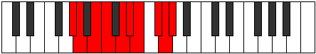

# Mode Sadygic

## Links

- [Documentation](index.md)
- [Scales Index](Scales.md)
- [Modes Index](Modes.md)
- [Chords Index](Chords.md)

## Parent Scale

[Epyrygic](ScaleEpyrygic.md)

## Number

[3547](https://ianring.com/musictheory/scales/3547)

## Interval Pattern

1, 2, 1, 2, 1, 1, 2, 1, 1

## Chord Pattern

i⁰, i, I, I⁺, ii⁰, ii, iii, III, III⁺, IV⁺, iv⁰, iv, IV, V, vi⁰, VI⁺, VII, VII⁺, vii, viii⁰, IX, IX⁺

## Perfection

- 7 Perfect notes
- 2 Perfect notes

## Perfection Profile

[true true true true true false true false true]

## Permutations

| Tonic | Notes | Signature | Illustration | Audio |
|-------|-------|-----------|--------------|-------|
| [C](ModeCNaturalSadygic.md) | C, C#, D#, E, F#, **G**, G#, **A#**, B, C | C |  | [midi](https://github.com/edipermadi/music/blob/main/docs/ModeCNaturalSadygic.mid?raw=true) |
| [C#](ModeCSharpSadygic.md) | C#, D, E, F, G, **G#**, A, **B**, C, C# | C |  | [midi](https://github.com/edipermadi/music/blob/main/docs/ModeCSharpSadygic.mid?raw=true) |
| [Db](ModeDFlatSadygic.md) | Db, D, E, F, G, **Ab**, A, **B**, C, Db | C |  | [midi](https://github.com/edipermadi/music/blob/main/docs/ModeDFlatSadygic.mid?raw=true) |
| [D](ModeDNaturalSadygic.md) | D, D#, F, F#, G#, **A**, A#, **C**, C#, D | C |  | [midi](https://github.com/edipermadi/music/blob/main/docs/ModeDNaturalSadygic.mid?raw=true) |
| [D#](ModeDSharpSadygic.md) | D#, E, F#, G, A, **A#**, B, **C#**, D, D# | C |  | [midi](https://github.com/edipermadi/music/blob/main/docs/ModeDSharpSadygic.mid?raw=true) |
| [Eb](ModeEFlatSadygic.md) | Eb, E, Gb, G, A, **Bb**, B, **Db**, D, Eb | C |  | [midi](https://github.com/edipermadi/music/blob/main/docs/ModeEFlatSadygic.mid?raw=true) |
| [E](ModeENaturalSadygic.md) | E, F, G, G#, A#, **B**, C, **D**, D#, E | C |  | [midi](https://github.com/edipermadi/music/blob/main/docs/ModeENaturalSadygic.mid?raw=true) |
| [F](ModeFNaturalSadygic.md) | F, F#, G#, A, B, **C**, C#, **D#**, E, F | C |  | [midi](https://github.com/edipermadi/music/blob/main/docs/ModeFNaturalSadygic.mid?raw=true) |
| [F#](ModeFSharpSadygic.md) | F#, G, A, A#, C, **C#**, D, **E**, F, F# | C |  | [midi](https://github.com/edipermadi/music/blob/main/docs/ModeFSharpSadygic.mid?raw=true) |
| [Gb](ModeGFlatSadygic.md) | Gb, G, A, Bb, C, **Db**, D, **E**, F, Gb | C |  | [midi](https://github.com/edipermadi/music/blob/main/docs/ModeGFlatSadygic.mid?raw=true) |
| [G](ModeGNaturalSadygic.md) | G, G#, A#, B, C#, **D**, D#, **F**, F#, G | C |  | [midi](https://github.com/edipermadi/music/blob/main/docs/ModeGNaturalSadygic.mid?raw=true) |
| [G#](ModeGSharpSadygic.md) | G#, A, B, C, D, **D#**, E, **F#**, G, G# | C |  | [midi](https://github.com/edipermadi/music/blob/main/docs/ModeGSharpSadygic.mid?raw=true) |
| [Ab](ModeAFlatSadygic.md) | Ab, A, B, C, D, **Eb**, E, **Gb**, G, Ab | C |  | [midi](https://github.com/edipermadi/music/blob/main/docs/ModeAFlatSadygic.mid?raw=true) |
| [A](ModeANaturalSadygic.md) | A, A#, C, C#, D#, **E**, F, **G**, G#, A | C |  | [midi](https://github.com/edipermadi/music/blob/main/docs/ModeANaturalSadygic.mid?raw=true) |
| [A#](ModeASharpSadygic.md) | A#, B, C#, D, E, **F**, F#, **G#**, A, A# | C |  | [midi](https://github.com/edipermadi/music/blob/main/docs/ModeASharpSadygic.mid?raw=true) |
| [Bb](ModeBFlatSadygic.md) | Bb, B, Db, D, E, **F**, Gb, **Ab**, A, Bb | C |  | [midi](https://github.com/edipermadi/music/blob/main/docs/ModeBFlatSadygic.mid?raw=true) |
| [B](ModeBNaturalSadygic.md) | B, C, D, D#, F, **F#**, G, **A**, A#, B | C |  | [midi](https://github.com/edipermadi/music/blob/main/docs/ModeBNaturalSadygic.mid?raw=true) |
