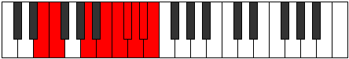

# Mode Sadyllic

## Links

- [Documentation](README.md)
- [Scales Index](Scales.md)
- [Modes Index](Modes.md)
- [Chords Index](Chords.md)

## Parent Scale

[Stycryllic](ScaleStycryllic.md)

## Number

[4003](https://ianring.com/musictheory/scales/4003)

## Interval Pattern

1, 4, 2, 1, 1, 1, 1, 1

## Chord Pattern

## Perfection

- 4 Perfect notes
- 4 Perfect notes

## Perfection Profile

[true true true false false false true false]

## Permutations

| Tonic | Notes | Signature | Illustration | Audio |
|-------|-------|-----------|--------------|-------|
| [C](ModeCNaturalSadyllic.md) | C, C#, F, **G**, **G#**, **A**, A#, **B**, C | C |  | [midi](https://github.com/edipermadi/music/blob/main/docs/ModeCNaturalSadyllic.mid?raw=true) |
| [C#](ModeCSharpSadyllic.md) | C#, D, F#, **G#**, **A**, **A#**, B, **C**, C# | C |  | [midi](https://github.com/edipermadi/music/blob/main/docs/ModeCSharpSadyllic.mid?raw=true) |
| [Db](ModeDFlatSadyllic.md) | Db, D, Gb, **Ab**, **A**, **Bb**, B, **C**, Db | C |  | [midi](https://github.com/edipermadi/music/blob/main/docs/ModeDFlatSadyllic.mid?raw=true) |
| [D](ModeDNaturalSadyllic.md) | D, D#, G, **A**, **A#**, **B**, C, **C#**, D | C |  | [midi](https://github.com/edipermadi/music/blob/main/docs/ModeDNaturalSadyllic.mid?raw=true) |
| [D#](ModeDSharpSadyllic.md) | D#, E, G#, **A#**, **B**, **C**, C#, **D**, D# | C |  | [midi](https://github.com/edipermadi/music/blob/main/docs/ModeDSharpSadyllic.mid?raw=true) |
| [Eb](ModeEFlatSadyllic.md) | Eb, E, Ab, **Bb**, **B**, **C**, Db, **D**, Eb | C |  | [midi](https://github.com/edipermadi/music/blob/main/docs/ModeEFlatSadyllic.mid?raw=true) |
| [E](ModeENaturalSadyllic.md) | E, F, A, **B**, **C**, **C#**, D, **D#**, E | C |  | [midi](https://github.com/edipermadi/music/blob/main/docs/ModeENaturalSadyllic.mid?raw=true) |
| [F](ModeFNaturalSadyllic.md) | F, F#, A#, **C**, **C#**, **D**, D#, **E**, F | C |  | [midi](https://github.com/edipermadi/music/blob/main/docs/ModeFNaturalSadyllic.mid?raw=true) |
| [F#](ModeFSharpSadyllic.md) | F#, G, B, **C#**, **D**, **D#**, E, **F**, F# | C |  | [midi](https://github.com/edipermadi/music/blob/main/docs/ModeFSharpSadyllic.mid?raw=true) |
| [Gb](ModeGFlatSadyllic.md) | Gb, G, B, **Db**, **D**, **Eb**, E, **F**, Gb | C |  | [midi](https://github.com/edipermadi/music/blob/main/docs/ModeGFlatSadyllic.mid?raw=true) |
| [G](ModeGNaturalSadyllic.md) | G, G#, C, **D**, **D#**, **E**, F, **F#**, G | C |  | [midi](https://github.com/edipermadi/music/blob/main/docs/ModeGNaturalSadyllic.mid?raw=true) |
| [G#](ModeGSharpSadyllic.md) | G#, A, C#, **D#**, **E**, **F**, F#, **G**, G# | C |  | [midi](https://github.com/edipermadi/music/blob/main/docs/ModeGSharpSadyllic.mid?raw=true) |
| [Ab](ModeAFlatSadyllic.md) | Ab, A, Db, **Eb**, **E**, **F**, Gb, **G**, Ab | C |  | [midi](https://github.com/edipermadi/music/blob/main/docs/ModeAFlatSadyllic.mid?raw=true) |
| [A](ModeANaturalSadyllic.md) | A, A#, D, **E**, **F**, **F#**, G, **G#**, A | C |  | [midi](https://github.com/edipermadi/music/blob/main/docs/ModeANaturalSadyllic.mid?raw=true) |
| [A#](ModeASharpSadyllic.md) | A#, B, D#, **F**, **F#**, **G**, G#, **A**, A# | C |  | [midi](https://github.com/edipermadi/music/blob/main/docs/ModeASharpSadyllic.mid?raw=true) |
| [Bb](ModeBFlatSadyllic.md) | Bb, B, Eb, **F**, **Gb**, **G**, Ab, **A**, Bb | C |  | [midi](https://github.com/edipermadi/music/blob/main/docs/ModeBFlatSadyllic.mid?raw=true) |
| [B](ModeBNaturalSadyllic.md) | B, C, E, **F#**, **G**, **G#**, A, **A#**, B | C |  | [midi](https://github.com/edipermadi/music/blob/main/docs/ModeBNaturalSadyllic.mid?raw=true) |
