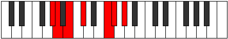
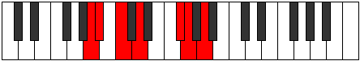

# Mode Sagimic

## Links

- [Documentation](index.md)
- [Scales Index](Scales.md)
- [Modes Index](Modes.md)
- [Chords Index](Chords.md)

## Parent Scale

[Modimic](ScaleModimic.md)

## Number

[1579](https://ianring.com/musictheory/scales/1579)

## Perfection

- 3 Perfect notes
- 3 Perfect notes

## Perfection Profile

[false false true true false true]

## Permutations

| Tonic | Notes | Signature | Illustration | Audio |
|-------|-------|-----------|--------------|-------|
| [C](ModeCNaturalSagimic.md) | **C**, **Db**, Eb, F, **G##**, A#, **C** | C |  | [midi](ModeCNaturalSagimic.mid) [ogg](ModeCNaturalSagimic.ogg) |
| [C#](ModeCSharpSagimic.md) | **C#**, **D**, E, F#, **G###**, A##, **C#** | C |  | [midi](ModeCSharpSagimic.mid) [ogg](ModeCSharpSagimic.ogg) |
| [Db](ModeDFlatSagimic.md) | **Db**, **Ebb**, Fb, Gb, **A#**, B, **Db** | C |  | [midi](ModeDFlatSagimic.mid) [ogg](ModeDFlatSagimic.ogg) |
| [D](ModeDNaturalSagimic.md) | **D**, **Eb**, F, G, **A##**, B#, **D** | C |  | [midi](ModeDNaturalSagimic.mid) [ogg](ModeDNaturalSagimic.ogg) |
| [D#](ModeDSharpSagimic.md) | **D#**, **E**, F#, G#, **A###**, B##, **D#** | C |  | [midi](ModeDSharpSagimic.mid) [ogg](ModeDSharpSagimic.ogg) |
| [Eb](ModeEFlatSagimic.md) | **Eb**, **Fb**, Gb, Ab, **B#**, C#, **Eb** | C |  | [midi](ModeEFlatSagimic.mid) [ogg](ModeEFlatSagimic.ogg) |
| [E](ModeENaturalSagimic.md) | **E**, **F**, G, A, **B##**, C##, **E** | C |  | [midi](ModeENaturalSagimic.mid) [ogg](ModeENaturalSagimic.ogg) |
| [F](ModeFNaturalSagimic.md) | **F**, **Gb**, Ab, Bb, **C##**, D#, **F** | C |  | [midi](ModeFNaturalSagimic.mid) [ogg](ModeFNaturalSagimic.ogg) |
| [F#](ModeFSharpSagimic.md) | **F#**, **G**, A, B, **C###**, D##, **F#** | C |  | [midi](ModeFSharpSagimic.mid) [ogg](ModeFSharpSagimic.ogg) |
| [Gb](ModeGFlatSagimic.md) | **Gb**, **Abb**, Bbb, Cb, **D#**, E, **Gb** | C |  | [midi](ModeGFlatSagimic.mid) [ogg](ModeGFlatSagimic.ogg) |
| [G](ModeGNaturalSagimic.md) | **G**, **Ab**, Bb, C, **D##**, E#, **G** | C |  | [midi](ModeGNaturalSagimic.mid) [ogg](ModeGNaturalSagimic.ogg) |
| [G#](ModeGSharpSagimic.md) | **G#**, **A**, B, C#, **D###**, E##, **G#** | C |  | [midi](ModeGSharpSagimic.mid) [ogg](ModeGSharpSagimic.ogg) |
| [Ab](ModeAFlatSagimic.md) | **Ab**, **Bbb**, Cb, Db, **E#**, F#, **Ab** | C |  | [midi](ModeAFlatSagimic.mid) [ogg](ModeAFlatSagimic.ogg) |
| [A](ModeANaturalSagimic.md) | **A**, **Bb**, C, D, **E##**, F##, **A** | C |  | [midi](ModeANaturalSagimic.mid) [ogg](ModeANaturalSagimic.ogg) |
| [A#](ModeASharpSagimic.md) | **A#**, **B**, C#, D#, **E###**, F###, **A#** | C |  | [midi](ModeASharpSagimic.mid) [ogg](ModeASharpSagimic.ogg) |
| [Bb](ModeBFlatSagimic.md) | **Bb**, **Cb**, Db, Eb, **F##**, G#, **Bb** | C |  | [midi](ModeBFlatSagimic.mid) [ogg](ModeBFlatSagimic.ogg) |
| [B](ModeBNaturalSagimic.md) | **B**, **C**, D, E, **F###**, G##, **B** | C |  | [midi](ModeBNaturalSagimic.mid) [ogg](ModeBNaturalSagimic.ogg) |
