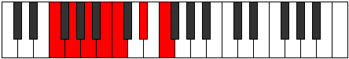
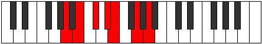
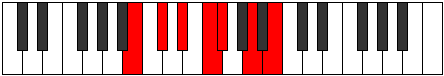

# Mode Salimic

## Links

- [Documentation](index.md)
- [Scales Index](Scales.md)
- [Modes Index](Modes.md)
- [Chords Index](Chords.md)

## Parent Scale

[Aeragimic](ScaleAeragimic.md)

## Number

[1237](https://ianring.com/musictheory/scales/1237)

## Perfection

- 2 Perfect notes
- 4 Perfect notes

## Perfection Profile

[true false false false true false]

## Permutations

| Tonic | Notes | Signature | Illustration | Audio |
|-------|-------|-----------|--------------|-------|
| [C](ModeCNaturalSalimic.md) | C, **D**, **E**, **F#**, G, **A#**, C | C |  | [midi](ModeCNaturalSalimic.mid) [ogg](ModeCNaturalSalimic.ogg) |
| [C#](ModeCSharpSalimic.md) | C#, **D#**, **E#**, **F##**, G#, **A##**, C# | C |  | [midi](ModeCSharpSalimic.mid) [ogg](ModeCSharpSalimic.ogg) |
| [Db](ModeDFlatSalimic.md) | Db, **Eb**, **F**, **G**, Ab, **B**, Db | C |  | [midi](ModeDFlatSalimic.mid) [ogg](ModeDFlatSalimic.ogg) |
| [D](ModeDNaturalSalimic.md) | D, **E**, **F#**, **G#**, A, **B#**, D | C |  | [midi](ModeDNaturalSalimic.mid) [ogg](ModeDNaturalSalimic.ogg) |
| [D#](ModeDSharpSalimic.md) | D#, **E#**, **F##**, **G##**, A#, **B##**, D# | C |  | [midi](ModeDSharpSalimic.mid) [ogg](ModeDSharpSalimic.ogg) |
| [Eb](ModeEFlatSalimic.md) | Eb, **F**, **G**, **A**, Bb, **C#**, Eb | C |  | [midi](ModeEFlatSalimic.mid) [ogg](ModeEFlatSalimic.ogg) |
| [E](ModeENaturalSalimic.md) | E, **F#**, **G#**, **A#**, B, **C##**, E | C |  | [midi](ModeENaturalSalimic.mid) [ogg](ModeENaturalSalimic.ogg) |
| [F](ModeFNaturalSalimic.md) | F, **G**, **A**, **B**, C, **D#**, F | C |  | [midi](ModeFNaturalSalimic.mid) [ogg](ModeFNaturalSalimic.ogg) |
| [F#](ModeFSharpSalimic.md) | F#, **G#**, **A#**, **B#**, C#, **D##**, F# | C |  | [midi](ModeFSharpSalimic.mid) [ogg](ModeFSharpSalimic.ogg) |
| [Gb](ModeGFlatSalimic.md) | Gb, **Ab**, **Bb**, **C**, Db, **E**, Gb | C |  | [midi](ModeGFlatSalimic.mid) [ogg](ModeGFlatSalimic.ogg) |
| [G](ModeGNaturalSalimic.md) | G, **A**, **B**, **C#**, D, **E#**, G | C |  | [midi](ModeGNaturalSalimic.mid) [ogg](ModeGNaturalSalimic.ogg) |
| [G#](ModeGSharpSalimic.md) | G#, **A#**, **B#**, **C##**, D#, **E##**, G# | C |  | [midi](ModeGSharpSalimic.mid) [ogg](ModeGSharpSalimic.ogg) |
| [Ab](ModeAFlatSalimic.md) | Ab, **Bb**, **C**, **D**, Eb, **F#**, Ab | C |  | [midi](ModeAFlatSalimic.mid) [ogg](ModeAFlatSalimic.ogg) |
| [A](ModeANaturalSalimic.md) | A, **B**, **C#**, **D#**, E, **F##**, A | C |  | [midi](ModeANaturalSalimic.mid) [ogg](ModeANaturalSalimic.ogg) |
| [A#](ModeASharpSalimic.md) | A#, **B#**, **C##**, **D##**, E#, **F###**, A# | C |  | [midi](ModeASharpSalimic.mid) [ogg](ModeASharpSalimic.ogg) |
| [Bb](ModeBFlatSalimic.md) | Bb, **C**, **D**, **E**, F, **G#**, Bb | C |  | [midi](ModeBFlatSalimic.mid) [ogg](ModeBFlatSalimic.ogg) |
| [B](ModeBNaturalSalimic.md) | B, **C#**, **D#**, **E#**, F#, **G##**, B | C |  | [midi](ModeBNaturalSalimic.mid) [ogg](ModeBNaturalSalimic.ogg) |
