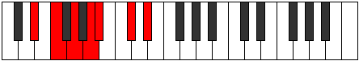

# Mode Salimic

## Links

- [Documentation](README.md)
- [Scales Index](Scales.md)
- [Modes Index](Modes.md)
- [Chords Index](Chords.md)

## Parent Scale

[Aeragimic](ScaleAeragimic.md)

## Number

[1237](https://ianring.com/musictheory/scales/1237)

## Transposition

2, 2, 2, 1, 3, 2

## Chord Pattern

I, II⁺, IV⁺, VI⁺

## Perfection

- 2 Perfect notes
- 4 Perfect notes

## Perfection Profile

true, false, false, false, true, false

## Permutations

| Tonic | Notes | Signature | Illustration | Audio |
|-------|-------|-----------|--------------|-------|
| [C](ModeCNaturalSalimic.md) | C, **D**, **E**, **F#**, G, **A#**, C | C |  | [midi](https://github.com/edipermadi/music/blob/main/docs/ModeCNaturalSalimic.mid?raw=true) |
| [C#](ModeCSharpSalimic.md) | C#, **D#**, **E#**, **F##**, G#, **A##**, C# | C |  | [midi](https://github.com/edipermadi/music/blob/main/docs/ModeCSharpSalimic.mid?raw=true) |
| [Db](ModeDFlatSalimic.md) | Db, **Eb**, **F**, **G**, Ab, **B**, Db | C |  | [midi](https://github.com/edipermadi/music/blob/main/docs/ModeDFlatSalimic.mid?raw=true) |
| [D](ModeDNaturalSalimic.md) | D, **E**, **F#**, **G#**, A, **B#**, D | C |  | [midi](https://github.com/edipermadi/music/blob/main/docs/ModeDNaturalSalimic.mid?raw=true) |
| [D#](ModeDSharpSalimic.md) | D#, **E#**, **F##**, **G##**, A#, **B##**, D# | C |  | [midi](https://github.com/edipermadi/music/blob/main/docs/ModeDSharpSalimic.mid?raw=true) |
| [Eb](ModeEFlatSalimic.md) | Eb, **F**, **G**, **A**, Bb, **C#**, Eb | C |  | [midi](https://github.com/edipermadi/music/blob/main/docs/ModeEFlatSalimic.mid?raw=true) |
| [E](ModeENaturalSalimic.md) | E, **F#**, **G#**, **A#**, B, **C##**, E | C |  | [midi](https://github.com/edipermadi/music/blob/main/docs/ModeENaturalSalimic.mid?raw=true) |
| [F](ModeFNaturalSalimic.md) | F, **G**, **A**, **B**, C, **D#**, F | C |  | [midi](https://github.com/edipermadi/music/blob/main/docs/ModeFNaturalSalimic.mid?raw=true) |
| [F#](ModeFSharpSalimic.md) | F#, **G#**, **A#**, **B#**, C#, **D##**, F# | C |  | [midi](https://github.com/edipermadi/music/blob/main/docs/ModeFSharpSalimic.mid?raw=true) |
| [Gb](ModeGFlatSalimic.md) | Gb, **Ab**, **Bb**, **C**, Db, **E**, Gb | C |  | [midi](https://github.com/edipermadi/music/blob/main/docs/ModeGFlatSalimic.mid?raw=true) |
| [G](ModeGNaturalSalimic.md) | G, **A**, **B**, **C#**, D, **E#**, G | C |  | [midi](https://github.com/edipermadi/music/blob/main/docs/ModeGNaturalSalimic.mid?raw=true) |
| [G#](ModeGSharpSalimic.md) | G#, **A#**, **B#**, **C##**, D#, **E##**, G# | C |  | [midi](https://github.com/edipermadi/music/blob/main/docs/ModeGSharpSalimic.mid?raw=true) |
| [Ab](ModeAFlatSalimic.md) | Ab, **Bb**, **C**, **D**, Eb, **F#**, Ab | C |  | [midi](https://github.com/edipermadi/music/blob/main/docs/ModeAFlatSalimic.mid?raw=true) |
| [A](ModeANaturalSalimic.md) | A, **B**, **C#**, **D#**, E, **F##**, A | C |  | [midi](https://github.com/edipermadi/music/blob/main/docs/ModeANaturalSalimic.mid?raw=true) |
| [A#](ModeASharpSalimic.md) | A#, **B#**, **C##**, **D##**, E#, **F###**, A# | C |  | [midi](https://github.com/edipermadi/music/blob/main/docs/ModeASharpSalimic.mid?raw=true) |
| [Bb](ModeBFlatSalimic.md) | Bb, **C**, **D**, **E**, F, **G#**, Bb | C |  | [midi](https://github.com/edipermadi/music/blob/main/docs/ModeBFlatSalimic.mid?raw=true) |
| [B](ModeBNaturalSalimic.md) | B, **C#**, **D#**, **E#**, F#, **G##**, B | C |  | [midi](https://github.com/edipermadi/music/blob/main/docs/ModeBNaturalSalimic.mid?raw=true) |
