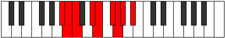

# Mode Salyllic

## Links

- [Documentation](index.md)
- [Scales Index](Scales.md)
- [Modes Index](Modes.md)
- [Chords Index](Chords.md)

## Parent Scale

[Thyptyllic](ScaleThyptyllic.md)

## Number

[1895](https://ianring.com/musictheory/scales/1895)

## Perfection

- 5 Perfect notes
- 3 Perfect notes

## Perfection Profile

[false true true true true false false true]

## Permutations

| Tonic | Notes | Signature | Illustration | Audio |
|-------|-------|-----------|--------------|-------|
| [C](ModeCNaturalSalyllic.md) | **C**, C#, D, F, F#, **G#**, **A**, A#, **C** | C |  | [midi](ModeCNaturalSalyllic.mid) [ogg](ModeCNaturalSalyllic.ogg) |
| [C#](ModeCSharpSalyllic.md) | **C#**, D, D#, F#, G, **A**, **A#**, B, **C#** | C |  | [midi](ModeCSharpSalyllic.mid) [ogg](ModeCSharpSalyllic.ogg) |
| [Db](ModeDFlatSalyllic.md) | **Db**, D, Eb, Gb, G, **A**, **Bb**, B, **Db** | C |  | [midi](ModeDFlatSalyllic.mid) [ogg](ModeDFlatSalyllic.ogg) |
| [D](ModeDNaturalSalyllic.md) | **D**, D#, E, G, G#, **A#**, **B**, C, **D** | C |  | [midi](ModeDNaturalSalyllic.mid) [ogg](ModeDNaturalSalyllic.ogg) |
| [D#](ModeDSharpSalyllic.md) | **D#**, E, F, G#, A, **B**, **C**, C#, **D#** | C |  | [midi](ModeDSharpSalyllic.mid) [ogg](ModeDSharpSalyllic.ogg) |
| [Eb](ModeEFlatSalyllic.md) | **Eb**, E, F, Ab, A, **B**, **C**, Db, **Eb** | C |  | [midi](ModeEFlatSalyllic.mid) [ogg](ModeEFlatSalyllic.ogg) |
| [E](ModeENaturalSalyllic.md) | **E**, F, F#, A, A#, **C**, **C#**, D, **E** | C |  | [midi](ModeENaturalSalyllic.mid) [ogg](ModeENaturalSalyllic.ogg) |
| [F](ModeFNaturalSalyllic.md) | **F**, F#, G, A#, B, **C#**, **D**, D#, **F** | C |  | [midi](ModeFNaturalSalyllic.mid) [ogg](ModeFNaturalSalyllic.ogg) |
| [F#](ModeFSharpSalyllic.md) | **F#**, G, G#, B, C, **D**, **D#**, E, **F#** | C |  | [midi](ModeFSharpSalyllic.mid) [ogg](ModeFSharpSalyllic.ogg) |
| [Gb](ModeGFlatSalyllic.md) | **Gb**, G, Ab, B, C, **D**, **Eb**, E, **Gb** | C |  | [midi](ModeGFlatSalyllic.mid) [ogg](ModeGFlatSalyllic.ogg) |
| [G](ModeGNaturalSalyllic.md) | **G**, G#, A, C, C#, **D#**, **E**, F, **G** | C |  | [midi](ModeGNaturalSalyllic.mid) [ogg](ModeGNaturalSalyllic.ogg) |
| [G#](ModeGSharpSalyllic.md) | **G#**, A, A#, C#, D, **E**, **F**, F#, **G#** | C |  | [midi](ModeGSharpSalyllic.mid) [ogg](ModeGSharpSalyllic.ogg) |
| [Ab](ModeAFlatSalyllic.md) | **Ab**, A, Bb, Db, D, **E**, **F**, Gb, **Ab** | C |  | [midi](ModeAFlatSalyllic.mid) [ogg](ModeAFlatSalyllic.ogg) |
| [A](ModeANaturalSalyllic.md) | **A**, A#, B, D, D#, **F**, **F#**, G, **A** | C |  | [midi](ModeANaturalSalyllic.mid) [ogg](ModeANaturalSalyllic.ogg) |
| [A#](ModeASharpSalyllic.md) | **A#**, B, C, D#, E, **F#**, **G**, G#, **A#** | C |  | [midi](ModeASharpSalyllic.mid) [ogg](ModeASharpSalyllic.ogg) |
| [Bb](ModeBFlatSalyllic.md) | **Bb**, B, C, Eb, E, **Gb**, **G**, Ab, **Bb** | C |  | [midi](ModeBFlatSalyllic.mid) [ogg](ModeBFlatSalyllic.ogg) |
| [B](ModeBNaturalSalyllic.md) | **B**, C, C#, E, F, **G**, **G#**, A, **B** | C |  | [midi](ModeBNaturalSalyllic.mid) [ogg](ModeBNaturalSalyllic.ogg) |
