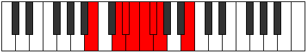

# Mode Sanian

## Links

- [Documentation](index.md)
- [Scales Index](Scales.md)
- [Modes Index](Modes.md)
- [Chords Index](Chords.md)

## Parent Scale

[Thadian](ScaleThadian.md)

## Number

[505](https://ianring.com/musictheory/scales/505)

## Perfection

- 3 Perfect notes
- 4 Perfect notes

## Perfection Profile

[true false false true false false true]

## Permutations

| Tonic | Notes | Signature | Illustration | Audio |
|-------|-------|-----------|--------------|-------|
| [C](ModeCNaturalSanian.md) | C, **D#**, **E**, F, **Gb**, **Abb**, Bbbb, C | C |  | [midi](ModeCNaturalSanian.mid) [ogg](ModeCNaturalSanian.ogg) |
| [C#](ModeCSharpSanian.md) | C#, **D##**, **E#**, F#, **G**, **Ab**, Bbb, C# | C |  | [midi](ModeCSharpSanian.mid) [ogg](ModeCSharpSanian.ogg) |
| [Db](ModeDFlatSanian.md) | Db, **E**, **F**, Gb, **Abb**, **Bbbb**, Cbbb, Db | C |  | [midi](ModeDFlatSanian.mid) [ogg](ModeDFlatSanian.ogg) |
| [D](ModeDNaturalSanian.md) | D, **E#**, **F#**, G, **Ab**, **Bbb**, Cbb, D | C |  | [midi](ModeDNaturalSanian.mid) [ogg](ModeDNaturalSanian.ogg) |
| [D#](ModeDSharpSanian.md) | D#, **E##**, **F##**, G#, **A**, **Bb**, Cb, D# | C |  | [midi](ModeDSharpSanian.mid) [ogg](ModeDSharpSanian.ogg) |
| [Eb](ModeEFlatSanian.md) | Eb, **F#**, **G**, Ab, **Bbb**, **Cbb**, Dbbb, Eb | C |  | [midi](ModeEFlatSanian.mid) [ogg](ModeEFlatSanian.ogg) |
| [E](ModeENaturalSanian.md) | E, **F##**, **G#**, A, **Bb**, **Cb**, Dbb, E | C |  | [midi](ModeENaturalSanian.mid) [ogg](ModeENaturalSanian.ogg) |
| [F](ModeFNaturalSanian.md) | F, **G#**, **A**, Bb, **Cb**, **Dbb**, Ebbb, F | C |  | [midi](ModeFNaturalSanian.mid) [ogg](ModeFNaturalSanian.ogg) |
| [F#](ModeFSharpSanian.md) | F#, **G##**, **A#**, B, **C**, **Db**, Ebb, F# | C |  | [midi](ModeFSharpSanian.mid) [ogg](ModeFSharpSanian.ogg) |
| [Gb](ModeGFlatSanian.md) | Gb, **A**, **Bb**, Cb, **Dbb**, **Ebbb**, Fbbb, Gb | C |  | [midi](ModeGFlatSanian.mid) [ogg](ModeGFlatSanian.ogg) |
| [G](ModeGNaturalSanian.md) | G, **A#**, **B**, C, **Db**, **Ebb**, Fbb, G | C |  | [midi](ModeGNaturalSanian.mid) [ogg](ModeGNaturalSanian.ogg) |
| [G#](ModeGSharpSanian.md) | G#, **A##**, **B#**, C#, **D**, **Eb**, Fb, G# | C |  | [midi](ModeGSharpSanian.mid) [ogg](ModeGSharpSanian.ogg) |
| [Ab](ModeAFlatSanian.md) | Ab, **B**, **C**, Db, **Ebb**, **Fbb**, Gbbb, Ab | C |  | [midi](ModeAFlatSanian.mid) [ogg](ModeAFlatSanian.ogg) |
| [A](ModeANaturalSanian.md) | A, **B#**, **C#**, D, **Eb**, **Fb**, Gbb, A | C |  | [midi](ModeANaturalSanian.mid) [ogg](ModeANaturalSanian.ogg) |
| [A#](ModeASharpSanian.md) | A#, **B##**, **C##**, D#, **E**, **F**, Gb, A# | C |  | [midi](ModeASharpSanian.mid) [ogg](ModeASharpSanian.ogg) |
| [Bb](ModeBFlatSanian.md) | Bb, **C#**, **D**, Eb, **Fb**, **Gbb**, Abbb, Bb | C |  | [midi](ModeBFlatSanian.mid) [ogg](ModeBFlatSanian.ogg) |
| [B](ModeBNaturalSanian.md) | B, **C##**, **D#**, E, **F**, **Gb**, Abb, B | C |  | [midi](ModeBNaturalSanian.mid) [ogg](ModeBNaturalSanian.ogg) |
